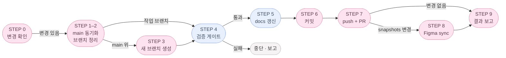

# dwee

_**D**aily **W**ellness for **E**very**E**ssence._

> 내 몸의 리듬을 부드럽게 기록해요.

여성의 생리 주기와 컨디션을 함께 기록하는 가벼운 웰니스 앱입니다.
무거운 의료 앱 대신, 매일 3탭 안에 끝나는 가벼운 기록과 rule-based 인사이트를 지향합니다.

- 배포: https://dwee-neon.vercel.app/
- 단계: **v1.0 (MVP1 완료)** — 로컬 기록·예측·인사이트 + Supabase 인증·클라우드 동기화까지 포함. 다음 단계는 아래 로드맵 참고.

---

## 📱 핵심 화면


---

## ✨ 핵심 가치

### MVP1 (v1.0)

1. **생리 시작/종료 기록** — 캘린더에서 1~2탭으로 기록
2. **평균 주기 기반 예측** — 데이터가 쌓이면 다음 예상일 추정
3. **오늘의 컨디션 기록** — 기분 / 에너지 / 통증 / 붓기 / 식욕 / 피부 + 메모
4. **다이어리 캘린더** — 기록·예측·일정·스티커·공휴일을 한 눈에
5. **rule-based 인사이트** — 단언 대신 "추정", 데이터 부족 시엔 "아직 예측하기 어려워요"
6. **Supabase 인증** — 첫 진입 `/login` 게이트, Apple/Google OAuth 또는 명시적 익명 세션. 로그인 시 로컬 데이터 1회 마이그레이션
7. **클라우드 동기화** — 로컬(IndexedDB) 우선, 로그인 사용자는 Supabase 로 전환
8. **매거진** — 주기 관련 아티클 + 북마크 + 퍼스널 체형 진단(서버측 Vision)

문구는 항상 추정형으로, 의료적·다이어트 유도 표현은 사용하지 않습니다.
(상세 카피 규칙: [`/.claude/rules/health-copy.md`](./.claude/rules/health-copy.md))

---

## 🚫 명시적 제외 (추가하지 않습니다)

- AI 챗봇, 실제 푸시
- Apple Health / Google Fit 연동
- 체중·칼로리·운동·다이어트 유도 (주기 단계별 영양/음식 제안은 허용)
- 임신·피임·성생활·커뮤니티
- 클라이언트측 ML/AI 라이브러리 (rule-based only). 단, 명시적 사용자 트리거가 있는 매거진 진단 등은 서버측 외부 LLM API 허용 — 결과 톤은 "추정/참고용" 유지.

---

## 🧰 기술 스택

| 영역         | 선택                                                                   |
| ------------ | ---------------------------------------------------------------------- |
| 프레임워크   | Next.js 15 (App Router) + React 19                                     |
| 언어         | TypeScript (strict)                                                    |
| 모바일       | Capacitor 6 (iOS)                                                      |
| 상태         | Zustand (+ persist)                                                    |
| 저장         | IndexedDB (`idb-keyval`, 로컬) + Supabase (원격) via Repository 추상화 |
| 인증         | Supabase Auth (익명 세션)                                              |
| 스타일       | Tailwind CSS                                                           |
| 폼           | react-hook-form                                                        |
| 날짜         | date-fns                                                               |
| i18n         | 자체 사전 (`src/i18n/locales/{ko,en}.ts`) + `useT()`                   |
| 패키지매니저 | pnpm 9                                                                 |

---

## 🛠 하네스 엔지니어링 (`.claude/`)

작업 환경 자체를 코드처럼 버전 관리합니다. `.claude/` 는 Claude Code 가 매 세션 자동 로드하는 하네스로, 팀 전체가 같은 규약·도구를 공유합니다.

```
.claude/
├── agents/                  서브에이전트 정의 (역할별 system prompt + 도구 권한)
│   ├── requirement-planner.md       모호한 요청 → 요구사항/STEP 계획
│   ├── senior-code-craftsman.md     클린 아키텍처·strict TS·i18n·타입체크까지 책임지는 구현 에이전트
│   ├── docs-diagram-curator.md      README/문서/Mermaid 다이어그램 관리
│   └── unit-test-author.md          domain/lib 순수 함수에 대한 Vitest 테스트 + cases.md 작성
│
├── commands/                커스텀 슬래시 커맨드
│   └── commit.md            /commit — 브랜치 관리 + 검증 게이트 + curator + PR (상세 ↓)
│
├── rules/                   도메인별 규약 (CLAUDE.md 가 80줄 넘으면 여기로 이전)
│   ├── cycle-logic.md       주기 도메인 계산 규칙
│   ├── health-copy.md       헬스 카피 톤 / 의료 단언 금지
│   ├── modals.md            모달·다이얼로그·바텀시트 작성 규칙 (훅 2개 필수, 백드롭, a11y, z-index)
│   ├── screens.md           화면 분리 / hydrate 패턴
│   └── storage.md           Repository · Adapter 패턴
│
├── agent-memory/            에이전트별 persistent memory (인스턴스 간 학습 누적)
└── settings.local.json      로컬 권한 설정 (gitignore)
```

- 진입점: 루트 [`CLAUDE.md`](./CLAUDE.md) — 단일 source of truth. `AGENTS.md`, `.cursorrules` 생성 금지.
- 새 컨벤션은 코드와 함께 PR — 같은 실수 2회 발생 시 `CLAUDE.md` 또는 `.claude/rules/` 에 한 줄 추가.
- 에이전트가 학습한 패턴은 `agent-memory/` 에 누적되어 다음 세션에 자동 활용.

**`/commit` 가 자동으로 해주는 것**

브랜치 정리 → 검증 게이트 (`lint → typecheck → test:unit`) → e2e (`pnpm test:e2e` 별도) → 단위 테스트 보강 → 문서 갱신 → PR 생성 → Figma 동기화 → 결과 보고. 상세 절차는 [`.claude/commands/commit.md`](./.claude/commands/commit.md) 참조.

`test:e2e` 는 5개 phase × 2개 locale(en/ko) 매트릭스로 시각 스냅샷을 찍습니다. 현재 커버리지:

| spec | 화면 | 비고 |
|------|------|------|
| `tests/home.spec.ts` | 홈 | Figma "Snapshots (ko)" 자동 동기화 대상 |
| `tests/customize.spec.ts` | 홈 커스터마이즈 | e2e baseline 전용 |
| `tests/log.spec.ts` | 주기리포트(/log) | e2e baseline 전용 |
| `tests/magazine.spec.ts` | 매거진 | e2e baseline 전용 |
| `tests/photo-edit.spec.ts` | 사진 편집 | **skipped** — Playwright WebKit이 IndexedDB에 Blob을 저장할 때 null DOMException을 던지는 Playwright-only 버그. 실제 Safari/WKWebView·Chromium은 정상 동작. |



---

## 🚀 시작하기

### 사전 요구

- Node.js 20.19.0 (`.nvmrc` 참고 — `nvm use` 또는 `fnm use`)
- Corepack 활성화: `corepack enable && corepack prepare pnpm@9.12.0 --activate`

### 환경 변수

```bash
cp .env.example .env.local
# NEXT_PUBLIC_SUPABASE_URL, NEXT_PUBLIC_SUPABASE_ANON_KEY 채우기
# NEXT_PUBLIC_SITE_URL — OG 메타데이터 base URL (배포 시 실제 도메인으로 교체)
```

`.env.local` 이 비어 있어도 dev/build 는 통과합니다(placeholder fallback). 단 익명 로그인은 실패하며 `auth.error.missingConfig` 토스트가 뜹니다.

### Edge Functions 설정 — 선택사항

상세 절차는 [`supabase/README.md`](./supabase/README.md#edge-functions) 참고.

**체형 진단 (`body-type-analyze`)** — OpenAI API 키 필요:
```bash
supabase secrets set OPENAI_API_KEY=sk-...
supabase functions deploy body-type-analyze
```

**회원 탈퇴 (`delete-account`)** — 환경 변수는 Supabase가 자동 주입:
```bash
supabase functions deploy delete-account
```

**스티커 누끼 (`sticker-cutout`)** — remove.bg API 키 필요:
```bash
supabase secrets set REMOVE_BG_API_KEY=...
supabase db push                          # 0012 마이그레이션
supabase functions deploy sticker-cutout
```

### 로컬 개발

```bash
pnpm install
pnpm dev          # http://localhost:3000
```

### 빌드 / 검증

```bash
pnpm build              # Next.js production build
pnpm typecheck          # tsc --noEmit (strict)
pnpm lint               # eslint
pnpm format             # prettier --write
pnpm test               # lint → typecheck → unit (e2e 는 별도: pnpm test:e2e)
pnpm test:unit          # Vitest (src/domain, src/lib 순수 함수)
pnpm test:e2e           # Playwright 시각 스냅샷 + 런타임 에러 가드
pnpm test:e2e:update    # baseline PNG 갱신 (의도된 UI 변경 후)
```

### iOS (Capacitor)

```bash
pnpm cap:sync     # next build && cap sync
pnpm cap:ios      # Xcode 열기
```

`@capacitor/camera` 플러그인을 사용하므로 `ios/App/App/Info.plist` 에 아래 키가 없으면 앱스토어 심사 및 런타임에서 거부됩니다.

```xml
<key>NSPhotoLibraryUsageDescription</key>
<string>홈 화면 사진을 선택하기 위해 사진 라이브러리에 접근합니다.</string>
```

`cap sync` 는 이 키를 자동으로 추가하지 않습니다. Xcode 에서 수동으로 추가하거나 `ios/App/App/Info.plist` 를 직접 편집하세요.

---

## 🗂 폴더 구조

```
src/
├── app/                          Next.js App Router
│   ├── (auth)/                   로그인 (풀스크린, 탭바 없음)
│   │   └── login/
│   ├── (app)/                    인증 후 메인 (AppShell + BottomTabNav)
│   │   ├── page.tsx              홈
│   │   ├── log/                  다이어리(기본) + 주기리포트 — segmented toggle 전환 (캘린더 포함)
│   │   ├── magazine/             매거진 글 목록
│   │   └── settings/             마이페이지 + 서브 라우트 (language/notifications/qna/terms/privacy — 실장; notices — stub)
│   └── (fullscreen)/             몰입형 편집 화면 (풀스크린, 탭바 없음)
│       ├── home/customize/       홈 커스터마이즈 + 사진 편집
│       ├── log/customize/        다이어리 스티커 라이브러리 + 배치 편집
│       ├── settings/account/     계정 편집 (AccountEditScreen — 닉네임 수정, 익명 유저 bounce)
│       ├── settings/withdraw/    회원탈퇴 사유 수집 (WithdrawReasonScreen — 262:3527)
│       ├── foods/[id]/           음식 상세 (홈 음식 칩 탭 진입, 20개 프리렌더)
│       └── magazine/
│           ├── [slug]/           글 상세 (풀스크린)
│           ├── bookmarks/        북마크 목록
│           └── personal-body-type/
│               ├── diagnose/     퍼스널 체형 진단 플로우
│               │   └── result/   진단 결과 (별도 라우트)
│               └── share/[type]/ 체형별 OG 공유 랜딩 (로그인 게이트 예외, 세션 있으면 매거진 목록으로 리다이렉트)
│
├── components/
│   ├── app/                      AppShell, BottomTabNav, HomeScreen, HomeHero, 카드 등
│   ├── home-customize/           HomeCustomizeScreen, PhotoLayout, TextSettingsSection 등
│   ├── magazine/                 MagazineScreen, ArticleScreen, ArticleSectionView, BookmarkToggleButton, BookmarksScreen 등
│   ├── diagnose/                 DiagnoseScreen (상태머신·슬롯 picker), PhotoPreviewView (선택 직후 미리보기), DiagnoseResultScreen, DiagnoseResultTopBar, ReportView, ShareTestBar, ShareLandingRedirect
│   ├── diary/                    DiaryScreen, DiaryHeader, LogViewToggle, DiaryMonthGrid, DiaryDayCell, DiaryWeekEventLayer, EventFormSheet (+ EventConditionSection) 등
│   ├── diary-customize/          DiaryCustomizeScreen, StickerLibrarySheet, PhotoImportModal, PlacedStickerLayer 등
│   ├── report/                   CycleReportScreen, StatusBadge, CycleChart, RecentCyclesCard 등
│   ├── auth/                     LoginScreen, AuthGuard
│   ├── my-page/                  MyPageScreen, AuthCard, CycleSummaryCard, MyTestsCard, PreferencesCard, SupportCard, AccountManagementCard, AccountEditScreen, WithdrawConfirmDialog, WithdrawReasonScreen, NotificationsScreen, TermsScreen, PrivacyScreen, QnaScreen
│   └── ui/                       Button, Toast, ChoiceGroup, PageContainer
│
├── store/                        Zustand: period / condition / settings / media / auth / bookmark / event / diarySticker / diaryPlacement
│
├── data/                         어댑터 패턴
│   ├── repositories/             인터페이스 (Period / Condition / Settings / Media / Bookmark / Event / EventCategory / DiarySticker / DiaryStickerPlacement / BodyTypeReport)
│   ├── adapters/indexeddb/       로컬 구현 (idb-keyval, schema v10, 현재 wiring)
│   ├── adapters/supabase/        원격 구현 (Supabase JS, 인증 사용자에게 wiring 완료)
│   └── index.ts                  단일 진입점
│
├── content/                      정적 콘텐츠 원문
│   ├── legal/                    이용약관 · 개인정보처리방침 원문 (한국어, locale 무관)
│   └── foods/                    홈 음식 상세 아티클 (`articles-en`/`articles-ko`, en 원문 · ko 번역, `home.foods` 사전 id 와 1:1 대응)
│
├── domain/
│   ├── cycle/                    순수 함수: aggregate, predictor, phase, fertile window
│   └── home/                     decor 타입·상수 (PhotoCount, TextPosition 등)
├── lib/
│   ├── date/                     날짜 유틸
│   ├── insight/                  rule-based 인사이트 생성
│   └── cn.ts                     clsx + tailwind-merge
│
├── hooks/                        재사용 커스텀 훅
│   ├── useBodyScrollLock.ts      모달 오픈 시 body 스크롤 잠금 (count-based, 중첩 OK)
│   ├── useEscToClose.ts          Esc 키로 모달 닫기
│   └── useScrollRestore.ts       목록 화면 스크롤 위치 세션 보존 (하이드레이션 대비 프레임 재시도)
├── i18n/                         ko / en 사전 + useT()
├── constants/                    공용 상수 (copy 등)
├── dev/                          개발/테스트 전용 시드 헬퍼 (프로덕션 번들 제외)
│   ├── DevBridge.tsx             e2e 테스트용 window 브릿지 (dev only)
│   ├── ensureAnon.ts             e2e 익명 세션 보장 헬퍼
│   ├── seedForPhase.ts           Playwright phase 시드 (window.__dweeSeedPhase)
│   └── seedPhotos.ts             Playwright 사진 시드 (window.__dweeSeedPhotos)
└── types/                        도메인 타입
```

---

## 🏛 아키텍처 원칙

```
app/  ──▶  store/  ──▶  data/repositories/  ──┬──▶  data/adapters/indexeddb/   (로컬, 현재 wiring)
                                              └──▶  data/adapters/supabase/    (원격, 인증 사용자)

domain/cycle/, lib/insight/   ← 부수효과 없는 순수 함수, 어디서든 호출 가능
constants/, types/            ← 어디서든 import 가능
```

- **단방향 의존성**: 화살표는 한 방향. 역방향 import 금지.
- **어댑터 패턴**: 같은 Repository 인터페이스를 IndexedDB / Supabase 두 어댑터가 구현. 위 레이어는 한 줄도 수정하지 않고 갈아끼움.
- **순수 도메인**: `domain/cycle/`, `lib/insight/`는 외부 호출/저장 없이 입력→출력만.
- **단일 진입점**: store는 어댑터를 직접 import 하지 않고 `@/data` 한 곳만 import.

상세: [`docs/architecture/data-layer.md`](./docs/architecture/data-layer.md)

---

## 🌐 i18n

- **Source of truth: en (en-US)**. 메인 타겟 시장 미국. 한국어 사전은 `Dictionary` 타입(`typeof en`)으로 강제 → en 키 누락 시 컴파일 에러.
- 카피는 en 사전에 먼저 자연스러운 en-US 톤으로 작성하고, ko 는 그 번역물.
- 사용자 노출 텍스트는 **항상** `useT()` 훅 경유. 인라인 영어/한국어 문자열 금지.
- 첫 진입 시 디바이스 locale 감지 (`navigator.language` 가 `ko`로 시작하면 한국어, 그 외엔 en), 이후엔 사용자 설정 우선.

```ts
// 사용 예
const t = useT();
return <h1>{t.home.nextPeriodTitle}</h1>;
```

신규 문구는 `src/i18n/locales/en.ts` 에 먼저 추가 (source) → `ko.ts` 에 번역으로 추가. 카피 톤은 [`.claude/rules/health-copy.md`](./.claude/rules/health-copy.md) 참고.

---

## 🗺 진행 상태 (Roadmap)

### MVP1 — 완료 (v1.0)

**기반**
- [x] 정의 / 하네스 / 아키텍처 / 공통 타입·유틸 / Storage 추상화 / Zustand stores / UI 컴포넌트 / i18n
- [x] 화면 구현 (Onboarding · Home · Log · Calendar · Insights · Settings) + 샘플 데이터 / edge case / 리팩토링

**인증·동기화**
- [x] Supabase 기반 셋업 — auth store, 익명 로그인, 어댑터 wiring (`data/index.ts` 분기), Apple/Google OAuth, 로컬→클라우드 1회 마이그레이션, `AuthGuard` 첫 진입 게이트, 로그아웃 후 `/login` 복귀 + 스토어 rehydrate
- [x] 계정 관리 — 회원 탈퇴 (`delete-account` Edge Function, 2단계 확인 + 사유 수집 `withdrawal_feedbacks`, migration 0011), 계정 편집(`/settings/account`)

**다이어리**
- [x] Diary & Event 도메인 — `/log` 를 Diary/Report 토글로 전환, EventCategory(내장 4종 + 사용자 추가) + EventLog(제목/메모/기간/카테고리/생리마크), 생리마크 ↔ PeriodLog 자동 연동. migrations 0006–0007
- [x] 통합 입력 시트 — `+` 와 날짜 탭 모두 `EventFormSheet` 하나로(생리 토글 + 컨디션 섹션 포함). 일정 유형은 접힌 행 → 펼침 목록(기본 "친구"), 삭제는 `DeleteEventDialog`
- [x] 주간 이벤트 바 — 여러 날짜에 걸친 일정을 한 줄 바로 표시 (`domain/event/weekLanes`)
- [x] 스티커 커스터마이즈 — 앨범/카메라 → 누끼(`sticker-cutout`) 또는 사진 그대로 → 캘린더 위 drag/resize/rotate. `/log/customize`, `DraggableBottomSheet`, 기본 스티커 시드(버전 관리). migrations 0008–0009, 0012
- [x] 다이어리 탭 스티커 탭 → 꾸미기 — 스티커가 일정 바보다 위 레이어라 겹친 곳은 스티커가 탭을 가로챔. 탭하면 `/log/customize` 로 이동해 해당 스티커를 바로 선택 상태로 열고 라이브러리 시트는 `peek`. `diaryFocusStore.visibleMonth` 를 다이어리·꾸미기가 공유해 보던 달을 유지(로그 탭 재탭 시에만 오늘 달로 리셋). 앨범 선택은 라이브러리 `+` 팝오버와 카메라 앨범 아이콘이 `usePhotoLibraryPicker` 훅(네이티브 `Camera.pickImages` / 웹 file input 폴백) 하나로 통합
- [x] 공휴일 표시 — 한국·미국 공휴일을 날짜 아래 라벨로 (`domain/holiday`, 한국 음력 표 2025–2030 + 대체공휴일 규칙). 마이페이지 `/settings/holidays` 토글, 기본은 앱 언어 따라 자동. migration 0014

**홈**
- [x] 홈 커스터마이즈 — 비파괴 사진 편집(`PhotoTransform`), 드래프트 모드 + `commitPhotoDraft()`, 슬롯 삭제, 종료 경로 드래프트 정리(`CustomizeDraftGuard`). IndexedDB v10, migration 0010
- [x] 음식 상세 화면 — 주기별 추천 음식 칩 → `/foods/[id]` 읽기 전용 아티클 20편(`src/content/foods/`, en 원문 + ko 번역, 텍스트 없는 원본 히어로 사진 위에 헤드라인을 오버레이)

**마이페이지**
- [x] Figma 015 기반 MyPage — 인증 카드, 주기 요약, 환경설정(알림·언어·공휴일)·고객지원 카드, 로그아웃 확인 다이얼로그, 법적 문서(약관·개인정보처리방침), Q&A, 알림 설정(마스터 + 3항목 + 시기 휠), `MyPageBackLink` + 스크롤 복원

**매거진**
- [x] 인프라 — `/magazine` 목록, `ArticleScreen`, 글 데이터 모듈(`src/data/magazine/articles.ts`), 아티클 4편, 북마크(`/magazine/bookmarks`)
- [x] 퍼스널 체형 진단 — `/magazine/personal-body-type/diagnose` 플로우(동의 → 사진 선택·미리보기 → 분석 → 결과). Edge Function `body-type-analyze`(OpenAI Vision, 사진 미저장, 일 10회, 1회 재시도). 결과 화면은 체형 탭(LLM 리딩) + 스타일 가이드 탭(유형별 정적 콘텐츠). 결과는 `BodyTypeReportRepository` 로 보관(migration 0013), 체형별 공유 링크는 `AuthGuard` 예외

### 다음

- [ ] 백그라운드 sync / 충돌 해결 / 다기기 검증
- [ ] 푸시 알림 인프라 (알림 설정은 로컬 저장까지만 구현)
- [ ] 매거진 콘텐츠 운영 / 추가 진단 종류
