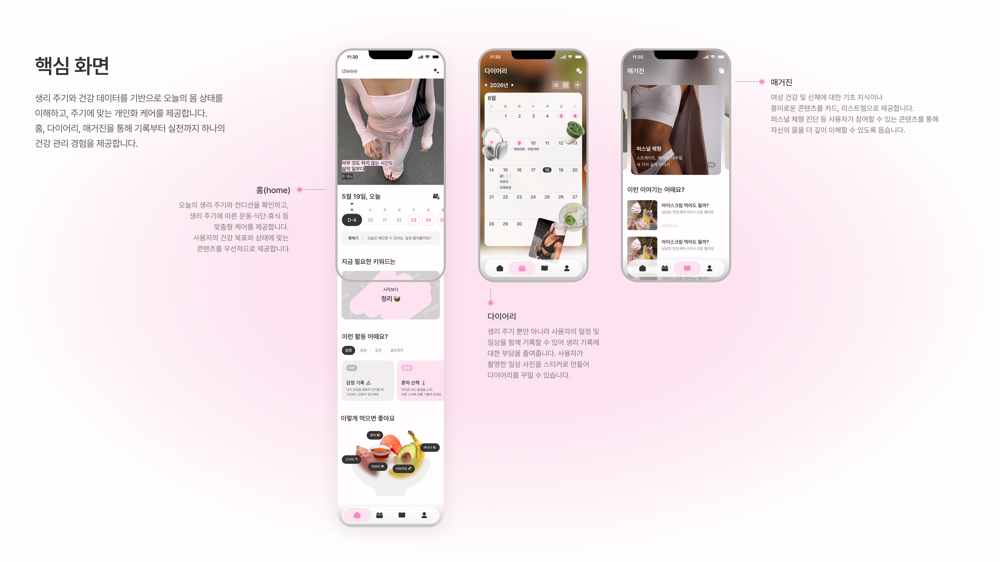
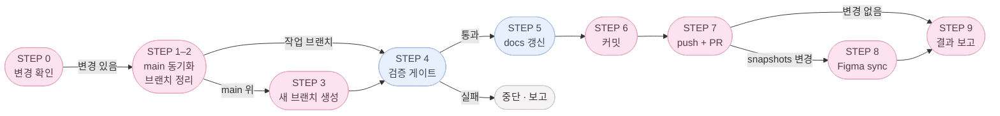

# dwee

_**D**aily **W**ellness for **E**very**E**ssence._

> 내 몸의 리듬을 부드럽게 기록해요.

여성의 생리 주기와 컨디션을 함께 기록하는 가벼운 웰니스 앱입니다.
무거운 의료 앱 대신, 매일 3탭 안에 끝나는 가벼운 기록과 rule-based 인사이트를 지향합니다.

- 배포: https://dwee-neon.vercel.app/
- 단계: **MVP2 — 서버 연동·인증 도입** (MVP1 핵심 플로우는 완료, 잔여 polish 는 MVP2 와 병행)

---

## 📱 핵심 화면



---

## ✨ 핵심 가치

### MVP1 (완료)

1. **생리 시작/종료 기록** — 캘린더에서 1~2탭으로 기록
2. **평균 주기 기반 예측** — 데이터가 쌓이면 다음 예상일 추정
3. **오늘의 컨디션 기록** — 기분 / 에너지 / 통증 / 붓기 / 식욕 / 피부 + 메모
4. **캘린더 확인** — 기록·예측·국면(phase)을 한 눈에
5. **rule-based 인사이트** — 단언 대신 "추정", 데이터 부족 시엔 "아직 예측하기 어려워요"

### MVP2 (진행 중)

6. **Supabase 인증** — 첫 진입 시 `/login` 강제 게이트. "로그인 없이 계속"은 익명 세션을 명시적으로 발급(자동 발급 아님). Apple/Google OAuth 로그인 시 로컬 데이터 1회 마이그레이션 후 클라우드 전환. 로그아웃 시 로컬 캐시 초기화 후 `/login` 복귀.
7. **클라우드 동기화** — 로컬(IndexedDB) 우선 + 백그라운드 sync (hybrid)
8. **다기기 사용** — 같은 계정으로 여러 기기 패턴 유지

문구는 항상 추정형으로, 의료적·다이어트 유도 표현은 사용하지 않습니다.
(상세 카피 규칙: [`/.claude/rules/health-copy.md`](./.claude/rules/health-copy.md))

---

## 🚫 명시적 제외 (추가하지 않습니다)

- AI 챗봇, 실제 푸시
- Apple Health / Google Fit 연동
- 체중·칼로리·운동·다이어트 유도 (주기 단계별 영양/음식 제안은 허용)
- 임신·피임·성생활·커뮤니티
- 클라이언트측 ML/AI 라이브러리 (rule-based only). 단, 명시적 사용자 트리거가 있는 매거진 진단 등은 서버측 외부 LLM API 허용 — 결과 톤은 "추정/참고용" 유지.

---

## 🧰 기술 스택

| 영역         | 선택                                                                   |
| ------------ | ---------------------------------------------------------------------- |
| 프레임워크   | Next.js 15 (App Router) + React 19                                     |
| 언어         | TypeScript (strict)                                                    |
| 모바일       | Capacitor 6 (iOS)                                                      |
| 상태         | Zustand (+ persist)                                                    |
| 저장         | IndexedDB (`idb-keyval`, 로컬) + Supabase (원격) via Repository 추상화 |
| 인증         | Supabase Auth (익명 세션)                                              |
| 스타일       | Tailwind CSS                                                           |
| 폼           | react-hook-form                                                        |
| 날짜         | date-fns                                                               |
| i18n         | 자체 사전 (`src/i18n/locales/{ko,en}.ts`) + `useT()`                   |
| 패키지매니저 | pnpm 9                                                                 |

---

## 🛠 하네스 엔지니어링 (`.claude/`)

작업 환경 자체를 코드처럼 버전 관리합니다. `.claude/` 는 Claude Code 가 매 세션 자동 로드하는 하네스로, 팀 전체가 같은 규약·도구를 공유합니다.

```
.claude/
├── agents/                  서브에이전트 정의 (역할별 system prompt + 도구 권한)
│   ├── requirement-planner.md       모호한 요청 → 요구사항/STEP 계획
│   ├── senior-code-craftsman.md     클린 아키텍처·strict TS·i18n·타입체크까지 책임지는 구현 에이전트
│   ├── docs-diagram-curator.md      README/문서/Mermaid 다이어그램 관리
│   └── unit-test-author.md          domain/lib 순수 함수에 대한 Vitest 테스트 + cases.md 작성
│
├── commands/                커스텀 슬래시 커맨드
│   └── commit.md            /commit — 브랜치 관리 + 검증 게이트 + curator + PR (상세 ↓)
│
├── rules/                   도메인별 규약 (CLAUDE.md 가 80줄 넘으면 여기로 이전)
│   ├── cycle-logic.md       주기 도메인 계산 규칙
│   ├── health-copy.md       헬스 카피 톤 / 의료 단언 금지
│   ├── modals.md            모달·다이얼로그·바텀시트 작성 규칙 (훅 2개 필수, 백드롭, a11y, z-index)
│   ├── screens.md           화면 분리 / hydrate 패턴
│   └── storage.md           Repository · Adapter 패턴
│
├── agent-memory/            에이전트별 persistent memory (인스턴스 간 학습 누적)
└── settings.local.json      로컬 권한 설정 (gitignore)
```

- 진입점: 루트 [`CLAUDE.md`](./CLAUDE.md) — 단일 source of truth. `AGENTS.md`, `.cursorrules` 생성 금지.
- 새 컨벤션은 코드와 함께 PR — 같은 실수 2회 발생 시 `CLAUDE.md` 또는 `.claude/rules/` 에 한 줄 추가.
- 에이전트가 학습한 패턴은 `agent-memory/` 에 누적되어 다음 세션에 자동 활용.

**`/commit` 가 자동으로 해주는 것**

브랜치 정리 → 검증 게이트 (`lint → typecheck → test:unit`) → e2e (`pnpm test:e2e` 별도) → 단위 테스트 보강 → 문서 갱신 → PR 생성 → Figma 동기화 → 결과 보고. 상세 절차는 [`.claude/commands/commit.md`](./.claude/commands/commit.md) 참조.

`test:e2e` 는 5개 phase × 2개 locale(en/ko) 매트릭스로 시각 스냅샷을 찍습니다. 현재 커버리지:

| spec | 화면 | 비고 |
|------|------|------|
| `tests/home.spec.ts` | 홈 | Figma "Snapshots (ko)" 자동 동기화 대상 |
| `tests/customize.spec.ts` | 홈 커스터마이즈 | e2e baseline 전용 |
| `tests/log.spec.ts` | 주기리포트(/log) | e2e baseline 전용 |
| `tests/magazine.spec.ts` | 매거진 | e2e baseline 전용 |
| `tests/photo-edit.spec.ts` | 사진 편집 | **skipped** — Playwright WebKit이 IndexedDB에 Blob을 저장할 때 null DOMException을 던지는 Playwright-only 버그. 실제 Safari/WKWebView·Chromium은 정상 동작. |



---

## 🚀 시작하기

### 사전 요구

- Node.js 20.19.0 (`.nvmrc` 참고 — `nvm use` 또는 `fnm use`)
- Corepack 활성화: `corepack enable && corepack prepare pnpm@9.12.0 --activate`

### 환경 변수

```bash
cp .env.example .env.local
# NEXT_PUBLIC_SUPABASE_URL, NEXT_PUBLIC_SUPABASE_ANON_KEY 채우기
# NEXT_PUBLIC_SITE_URL — OG 메타데이터 base URL (배포 시 실제 도메인으로 교체)
```

`.env.local` 이 비어 있어도 dev/build 는 통과합니다(placeholder fallback). 단 익명 로그인은 실패하며 `auth.error.missingConfig` 토스트가 뜹니다.

### Edge Functions 설정 — 선택사항

상세 절차는 [`supabase/README.md`](./supabase/README.md#edge-functions) 참고.

**체형 진단 (`body-type-analyze`)** — OpenAI API 키 필요:
```bash
supabase secrets set OPENAI_API_KEY=sk-...
supabase functions deploy body-type-analyze
```

**회원 탈퇴 (`delete-account`)** — 환경 변수는 Supabase가 자동 주입:
```bash
supabase functions deploy delete-account
```

**스티커 누끼 (`sticker-cutout`)** — remove.bg API 키 필요:
```bash
supabase secrets set REMOVE_BG_API_KEY=...
supabase db push                          # 0012 마이그레이션
supabase functions deploy sticker-cutout
```

### 로컬 개발

```bash
pnpm install
pnpm dev          # http://localhost:3000
```

### 빌드 / 검증

```bash
pnpm build              # Next.js production build
pnpm typecheck          # tsc --noEmit (strict)
pnpm lint               # eslint
pnpm format             # prettier --write
pnpm test               # lint → typecheck → unit (e2e 는 별도: pnpm test:e2e)
pnpm test:unit          # Vitest (src/domain, src/lib 순수 함수)
pnpm test:e2e           # Playwright 시각 스냅샷 + 런타임 에러 가드
pnpm test:e2e:update    # baseline PNG 갱신 (의도된 UI 변경 후)
```

### iOS (Capacitor)

```bash
pnpm cap:sync     # next build && cap sync
pnpm cap:ios      # Xcode 열기
```

`@capacitor/camera` 플러그인을 사용하므로 `ios/App/App/Info.plist` 에 아래 키가 없으면 앱스토어 심사 및 런타임에서 거부됩니다.

```xml
<key>NSPhotoLibraryUsageDescription</key>
<string>홈 화면 사진을 선택하기 위해 사진 라이브러리에 접근합니다.</string>
```

`cap sync` 는 이 키를 자동으로 추가하지 않습니다. Xcode 에서 수동으로 추가하거나 `ios/App/App/Info.plist` 를 직접 편집하세요.

---

## 🗂 폴더 구조

```
src/
├── app/                          Next.js App Router
│   ├── (auth)/                   로그인 (풀스크린, 탭바 없음)
│   │   └── login/
│   ├── (app)/                    인증 후 메인 (AppShell + BottomTabNav)
│   │   ├── page.tsx              홈
│   │   ├── log/                  다이어리(기본) + 주기리포트 — segmented toggle 전환 (캘린더 포함)
│   │   ├── magazine/             매거진 글 목록
│   │   └── settings/             마이페이지 + 서브 라우트 (language/notifications/qna/terms/privacy — 실장; notices — stub)
│   └── (fullscreen)/             몰입형 편집 화면 (풀스크린, 탭바 없음)
│       ├── home/customize/       홈 커스터마이즈 + 사진 편집
│       ├── log/customize/        다이어리 스티커 라이브러리 + 배치 편집
│       ├── settings/account/     계정 편집 (AccountEditScreen — 닉네임 수정, 익명 유저 bounce)
│       ├── settings/withdraw/    회원탈퇴 사유 수집 (WithdrawReasonScreen — 015_10~14)
│       ├── foods/[id]/           음식 상세 (홈 음식 칩 탭 진입, 20개 프리렌더)
│       └── magazine/
│           ├── [slug]/           글 상세 (풀스크린)
│           ├── bookmarks/        북마크 목록
│           └── personal-body-type/
│               ├── diagnose/     퍼스널 체형 진단 플로우
│               │   └── result/   진단 결과 (별도 라우트)
│               └── share/[type]/ 체형별 OG 공유 랜딩 (로그인 게이트 예외, 세션 있으면 매거진 목록으로 리다이렉트)
│
├── components/
│   ├── app/                      AppShell, BottomTabNav, HomeScreen, HomeHero, 카드 등
│   ├── home-customize/           HomeCustomizeScreen, PhotoLayout, TextSettingsSection 등
│   ├── magazine/                 MagazineScreen, ArticleScreen, ArticleSectionView, BookmarkToggleButton, BookmarksScreen 등
│   ├── diagnose/                 DiagnoseScreen (상태머신·슬롯 picker), PhotoPreviewView (선택 직후 미리보기), DiagnoseResultScreen, DiagnoseResultTopBar, ReportView, ShareTestBar, ShareLandingRedirect
│   ├── diary/                    DiaryScreen, DiaryHeader, LogViewToggle, DiaryMonthGrid, DayDetailSheet, EventFormSheet (+ EventConditionSection) 등
│   ├── diary-customize/          DiaryCustomizeScreen, StickerLibrarySheet, PhotoImportModal, PlacedStickerLayer 등
│   ├── report/                   CycleReportScreen, StatusBadge, CycleChart, RecentCyclesCard 등
│   ├── auth/                     LoginScreen, AuthGuard
│   ├── my-page/                  MyPageScreen, AuthCard, CycleSummaryCard, MyTestsCard, PreferencesCard, SupportCard, AccountManagementCard, AccountEditScreen, WithdrawConfirmDialog, WithdrawReasonScreen, NotificationsScreen, TermsScreen, PrivacyScreen, QnaScreen
│   └── ui/                       Button, Toast, ChoiceGroup, PageContainer
│
├── store/                        Zustand: period / condition / settings / media / auth / bookmark / event / diarySticker / diaryPlacement
│
├── data/                         어댑터 패턴
│   ├── repositories/             인터페이스 (Period / Condition / Settings / Media / Bookmark / Event / EventCategory / DiarySticker / DiaryStickerPlacement / BodyTypeReport)
│   ├── adapters/indexeddb/       로컬 구현 (idb-keyval, schema v10, 현재 wiring)
│   ├── adapters/supabase/        원격 구현 (Supabase JS, 인증 사용자에게 wiring 완료)
│   └── index.ts                  단일 진입점
│
├── content/                      정적 원문 콘텐츠 (locale 무관, 한국어 원문 그대로 렌더)
│   ├── legal/                    이용약관 · 개인정보처리방침 원문
│   └── foods/                    홈 음식 상세 아티클 원문 (`home.foods` 사전 id 와 1:1 대응)
│
├── domain/
│   ├── cycle/                    순수 함수: aggregate, predictor, phase, fertile window
│   └── home/                     decor 타입·상수 (PhotoCount, TextPosition 등)
├── lib/
│   ├── date/                     날짜 유틸
│   ├── insight/                  rule-based 인사이트 생성
│   └── cn.ts                     clsx + tailwind-merge
│
├── hooks/                        재사용 커스텀 훅
│   ├── useBodyScrollLock.ts      모달 오픈 시 body 스크롤 잠금 (count-based, 중첩 OK)
│   ├── useEscToClose.ts          Esc 키로 모달 닫기
│   └── useScrollRestore.ts       목록 화면 스크롤 위치 세션 보존 (하이드레이션 대비 프레임 재시도)
├── i18n/                         ko / en 사전 + useT()
├── constants/                    공용 상수 (copy 등)
├── dev/                          개발/테스트 전용 시드 헬퍼 (프로덕션 번들 제외)
│   ├── DevBridge.tsx             e2e 테스트용 window 브릿지 (dev only)
│   ├── ensureAnon.ts             e2e 익명 세션 보장 헬퍼
│   ├── seedForPhase.ts           Playwright phase 시드 (window.__dweeSeedPhase)
│   └── seedPhotos.ts             Playwright 사진 시드 (window.__dweeSeedPhotos)
└── types/                        도메인 타입
```

---

## 🏛 아키텍처 원칙

```
app/  ──▶  store/  ──▶  data/repositories/  ──┬──▶  data/adapters/indexeddb/   (로컬, 현재 wiring)
                                              └──▶  data/adapters/supabase/    (원격, 인증 사용자)

domain/cycle/, lib/insight/   ← 부수효과 없는 순수 함수, 어디서든 호출 가능
constants/, types/            ← 어디서든 import 가능
```

- **단방향 의존성**: 화살표는 한 방향. 역방향 import 금지.
- **어댑터 패턴**: 같은 Repository 인터페이스를 IndexedDB / Supabase 두 어댑터가 구현. 위 레이어는 한 줄도 수정하지 않고 갈아끼움.
- **순수 도메인**: `domain/cycle/`, `lib/insight/`는 외부 호출/저장 없이 입력→출력만.
- **단일 진입점**: store는 어댑터를 직접 import 하지 않고 `@/data` 한 곳만 import.

상세: [`docs/architecture/data-layer.md`](./docs/architecture/data-layer.md)

---

## 🌐 i18n

- **Source of truth: en (en-US)**. 메인 타겟 시장 미국. 한국어 사전은 `Dictionary` 타입(`typeof en`)으로 강제 → en 키 누락 시 컴파일 에러.
- 카피는 en 사전에 먼저 자연스러운 en-US 톤으로 작성하고, ko 는 그 번역물.
- 사용자 노출 텍스트는 **항상** `useT()` 훅 경유. 인라인 영어/한국어 문자열 금지.
- 첫 진입 시 디바이스 locale 감지 (`navigator.language` 가 `ko`로 시작하면 한국어, 그 외엔 en), 이후엔 사용자 설정 우선.

```ts
// 사용 예
const t = useT();
return <h1>{t.home.nextPeriodTitle}</h1>;
```

신규 문구는 `src/i18n/locales/en.ts` 에 먼저 추가 (source) → `ko.ts` 에 번역으로 추가. 카피 톤은 [`.claude/rules/health-copy.md`](./.claude/rules/health-copy.md) 참고.

---

## 🗺 진행 상태 (Roadmap)

### MVP1 — 완료

- [x] STEP 0~8 — 정의 / 하네스 / 아키텍처 / 공통 타입·유틸 / Storage 추상화 / Zustand stores / 화면 골격 / UI 컴포넌트 / i18n
- [x] STEP 9 — 화면별 실제 구현 (Onboarding · Home · Log · Calendar · Insights · Settings)
- [x] STEP 10~11 — 샘플 데이터 / edge case / 리팩토링

### MVP2 — 진행 중

- [x] **MVP2.1 — Supabase 기반 셋업** (auth store, 익명 로그인, 어댑터 src/ 이동)
- [x] **MVP2.2 — Supabase 어댑터 wiring + 로그인 게이트** (`data/index.ts` 분기 완료, Apple/Google OAuth 활성화, 로컬→클라우드 1회 마이그레이션, `AuthGuard` 첫 진입 강제, 로그아웃 후 `/login` 복귀, 4 스토어 rehydrate)
- [x] **MVP2.3 — Diary & Event 도메인** — `/log` 탭을 Diary(기본)/Report segmented toggle 구조로 전환. EventCategory (built-in 4종 + 사용자 추가) + EventLog (제목/메모/날짜범위/카테고리/생리마크 토글) 도메인 신설. 생리마크 ON/OFF 시 PeriodLog 자동 생성/삭제. Supabase migrations 0006–0007. IndexedDB schema v9.
- [x] **MVP2.4 — Diary 스티커 커스터마이즈** — `DiarySticker` (앨범 import + 카메라 촬영 + 1:1/4:3 crop) + `DiaryStickerPlacement` (캘린더 위 drag/resize/rotate/delete). `/log/customize` 풀스크린 라우트. `CameraSheet` (Capacitor Camera), `StickerScanScreen` + `CutoutConfirmScreen` (rembg 누끼 확인 → 저장), `DeleteStickersDialog` (다중 삭제), `DraggableBottomSheet` (2-snap 라이브러리). `DiaryStickerViewLayer`로 다이어리 탭 캘린더 위 배치를 read-only 렌더. 기본 스티커 5개 시드 (`public/stickers/default/`, `ensureDefaultStickersSeeded()`). `CycleChart` y-축 스케일은 `domain/cycle/chartScale.ts` 순수 함수로 분리. Supabase migrations 0008–0009.
- [x] **MVP2.5 — 계정 관리** — 회원 탈퇴 엔드-투-엔드 구현. `delete-account` Edge Function (media 버킷 재귀 삭제 → `auth.admin.deleteUser`, cascade 로 DB 행 자동 삭제). 탈퇴 흐름을 2단계로 개편: `WithdrawConfirmDialog` (015_9) 확인 → `/settings/withdraw` 의 `WithdrawReasonScreen` (015_10~14) 에서 사유 1개 이상 선택 후 탈퇴. 사유는 `withdrawal_feedbacks` 테이블에 익명(user_id 없음) insert — 삭제 cascade 후에도 잔존하여 분석 가능. 응답 유실 시 세션 재확인으로 하드닝. 마이페이지에서 평균 생리 주기 편집 UI·시드 데이터 주입 UI 제거(도메인 로직·e2e 시드는 유지). Supabase migration 0011.
- [x] **MVP2.6 — 마이페이지 (MyPage)** — `/settings` 를 Figma 015_1/015_2 기반 MyPage 로 전면 교체. 인증 상태별 AuthCard (비로그인 → /login CTA, 로그인 → 닉네임+이메일 → /settings/account), 주기 요약 카드 (`classifyCycleStatus` 재사용 + 상태 chip), 환경설정·고객지원 카드. 로그아웃은 `LogoutConfirmDialog` (핑크 배지)로 대체 — 확인 후 `appToast` 큐에 메시지 적재 → `router.push('/login')` 즉시 이동 → 백그라운드 `signOut()` 순으로 진행해 빈 화면 대기 없음. `/login` 마운트 시 top-confirm Toast 노출. 언어 설정 화면 (`/settings/language`) 실장 — 2개 라디오 행, 탭 즉시 locale 전환. 계정 편집 화면 (`/settings/account`, fullscreen): 닉네임 수정 → `supabase.auth.updateUser`, 익명 유저 자동 bounce. 서브 라우트 4개(notices/qna/terms/privacy) 스텁 유지. i18n `myPage.*` 서브트리 신설 (`signOutDialog.*`, `signOutToast`, `language.*` 포함); `nav.settings` 레이블 → "My page / 마이페이지".
- [x] **MVP2.6-polish — 마이페이지 서브 페이지 실장 + 레이아웃 정리** — `MyTestsCard` (나의 테스트: 체형 분석 결과 또는 CTA; 최초엔 sessionStorage 기반이었으나 이후 Repository 로 이관 — 아래 M2.1 항목 참고) 신설. 알림 설정 화면 (`/settings/notifications`): 마스터 토글 + 3개 항목 토글(생리 예정/생리 지연/가임기) + 3행 휠 피커(알림 시간 0~14일 전); IndexedDB 저장(푸시 인프라 미구현). 법적 문서 실장 (한국 관할): `/settings/terms` (이용약관 제1~15조 + 부칙), `/settings/privacy` (개인정보처리방침 제1~17조 + 부칙); `src/content/legal/` 모듈로 구조화. Q&A 화면(`/settings/qna`): 정적 지원 이메일 + 클립보드 복사 + 상단 토스트. 레이아웃 폴리시: 배경색 `bg-brand-gray200`, 카드 간격 20px, 행 높이 56px, 섹션 제목 `font-semibold`. OG 메타데이터 (`og:title/og:image/og:locale`) 루트 `layout.tsx` 에 추가 — `NEXT_PUBLIC_SITE_URL` 기반. 홈 히어로 기본 이미지 (`public/home/default-hero.jpg`) — 첫 진입 전 회색 플레이스홀더 대체. 후속 정리: 공지사항/Q&A/약관/개인정보처리방침 배경을 `bg-brand-gray50` → `bg-brand-gray200` 으로 통일하고 약관·개인정보 본문을 Q&A 와 같은 흰 카드로 감쌈; 뒤로가기 버튼은 배경과 구분되도록 `bg-brand-gray300` 으로 조정. 마이페이지 하위 화면 공통 뒤로가기를 `MyPageBackLink` 컴포넌트로 통합(`router.back()` 우선, 딥링크 진입 시에만 `/settings` push)하고 `useScrollRestore` 훅으로 마이페이지 목록 스크롤 위치를 세션 동안 보존. `AppShell` 의 `pb-24` 를 각 탭 화면(Home/Magazine) 자체 여백으로 이동 — 부모 `<main>` 에 두면 자식 배경 밖이라 하단에 회색 띠가 노출되던 버그 수정.
- [x] **홈 커스터마이즈 개편** — 비파괴 사진 편집: 슬롯마다 `PhotoTransform` 메타데이터 저장, 원본 blob 덮어쓰기 금지. 드래프트 모드: 모든 변경을 draft* 필드에 버퍼링 → 홈 꾸미기의 "편집 완료" 시 `commitPhotoDraft()` 일괄 반영. `picksConfirmed` 게이트: edit-photos 그리드에서 "편집 완료" 탭 후에만 홈 꾸미기의 "편집 완료" 활성. 슬롯별 사진 삭제(× 버튼). `DiscardDraftDialog` (dirty 뒤로가기). `TransformedPhoto` 공유 렌더 컴포넌트. 텍스트 커스터마이즈 일시 비활성. `CustomizeDraftGuard` 레이아웃 래퍼: 브라우저 뒤로가기·탭 닫기 등 모든 종료 경로에서 잔여 드래프트 자동 정리 (이전에는 누수 발생). IndexedDB schema v10; Supabase migration 0010.
- [x] **홈 음식 상세 화면** — "이렇게 먹으면 좋아요" 섹션의 음식 칩(사진이 아니라 이름+이모지 pill만 탭 가능)을 누르면 `/foods/[id]` (fullscreen)로 이동해 해당 음식이 왜 좋은지 설명하는 읽기 전용 화면(`FoodArticleScreen`)을 보여준다. 매거진 아티클과는 별개 구현 — 북마크·공유 없음. 콘텐츠 20개(4개 주기 × 5개 음식)는 Figma `음식 상세` 시안(425:1969) 원문을 그대로 옮긴 `src/content/foods/articles-ko.ts` — `content/legal/`과 같은 한국어 원문 전용 모듈이라 en 사용자도 한국어 본문을 본다. 콘텐츠 키는 `home.foods` 사전의 음식 id 와 1:1 대응해 id 변경 시 양쪽을 함께 고쳐야 한다. `generateStaticParams`로 20개 전부 프리렌더; 사진 시안이 없는 unknown phase(EmojiBowl)의 칩은 아직 링크로 전환되지 않았다.
- [x] **매거진 공유 링크 로그인 예외 (2026-09-09)** — `AuthGuard` 에 `PUBLIC_PREFIXES` 화이트리스트를 추가해 `/magazine/personal-body-type/share` 하위는 세션 없이도 통과하도록 함 — "첫 진입 강제 `/login` 게이트" 정책의 첫 예외. `ShareLandingRedirect` 도 함께 조정: 목적지를 아티클 → 매거진 목록(`/magazine`)으로 바꾸고, 세션이 있을 때만 자동 이동(세션 없이 넘기면 `/magazine` 도 게이트 뒤라 결국 `/login` 으로 튕기기 때문 — 그 경우엔 화면에 머무르며 링크만 보여줌).
- [x] **다이어리 커스터마이즈 폴리시 (2026-09-09)** — 앨범 임포트(`PhotoImportModal`)를 2단계로 재편: 모드(누끼/사진 그대로) 먼저 선택(누끼 기본), "사진 그대로"를 고를 때만 신설 풀스크린 `PhotoRatioScreen` 에서 비율 선택. 카메라 촬영은 기존대로 촬영 전 비율+모드 동시 선택. `DraggableBottomSheet` 개편: 스티커 라이브러리 시트 전체 표면이 드래그 대상이 되고(핸들만이 아님), `open`/`onDismiss` props 로 캘린더 바깥 탭 시 시트를 완전히 숨길 수 있음. 기본 스티커 시딩이 `DEFAULT_STICKER_SET_VERSION` 으로 버전 관리되고 백엔드별(local/remote:userId)로 스코프됨 — 새로 로그인한 계정도 기본 스티커를 받고, 아트워크가 바뀌면(라이브러리가 비어 있는 한) 재시드됨; `rehydrateAll` 이 `diaryStickerStore` 도 함께 rehydrate. 잠재 버그 수정: `pt-safe`/`pb-safe` 유틸리티 클래스가 실제로는 `globals.css` 어디에도 정의돼 있지 않아 안전영역 여백이 계속 무시되고 있었음 — 전역 유틸리티로 정의해 고침.
- [x] **다이어리 통합 입력 시트 (2026-09-09)** — `+` 버튼의 [생리 추가]/[일정 추가] 2-메뉴 팝오버(`AddQuickSheet`)를 제거하고 `EventFormSheet` add 모드가 바로 열리도록 통합. add/edit 두 모드 모두 생리 토글 + 신규 `EventConditionSection`(기분/에너지/통증/붓기/식욕/피부 — `ConditionRow`의 새 `outline` variant 재사용, 시작 날짜 기준 `conditionStore.upsert`)을 포함하는 하나의 폼. `conditionStore.upsert`는 리포지토리가 레코드 전체를 교체(REPLACE)하는 것을 보완해 기존 필드(memo 등)와 병합 후 저장하도록 보강. 편집 모드 삭제 버튼은 "일정 및 기록 삭제"로 바뀌었고(신규 `BinIcon`, `brand.red`), 삭제 시 연결된 생리 기록도 함께 해제(`unlinkPeriodMark`)하되 컨디션 로그는 보존. 마이페이지 뒤로가기 버튼을 `BackIcon` 40px 원형으로 통일하고 `MyPageToggle`을 Figma 규격(50×24, ON 시 Pink/100)에 맞춰 `disabled` prop 을 추가(다이어리 시트도 재사용). 알림 시기 휠 피커를 `YearMonthWheelPicker`에서 공용 `WheelColumn`으로 추출 — 기존 scroll-padding 버그도 함께 제거.
- [ ] MVP2.7~ — 백그라운드 sync / 충돌 해결 / 다기기 검증

### 매거진 (MVP 병행)

- [x] **M2.0 — 인프라** — 매거진 라우트 (`/magazine` 목록), ArticleScreen/ArticleSectionView, 글 데이터 모듈 (`src/data/magazine/articles.ts`)
- [x] **M2.1 — 퍼스널 체형 진단** — 풀스크린 진단 플로우 (`/magazine/personal-body-type/diagnose`), DiagnoseScreen (인트로: 진입 즉시 AI 이용안내 동의 모달 + 탭 불가 촬영 가이드 3슬롯 + 하단 "사진 선택" 버튼 다중 선택(앞→옆→뒤) → loading → result 라우트 | error), 결과 화면 분리 (`/diagnose/result`, DiagnoseResultScreen — 체형·스타일 가이드 2탭, 탭바 sticky), Supabase Edge Function `body-type-analyze` (OpenAI gpt-4o Vision, 사진 저장 X, 일 10회 rate limit, 자동 1회 재시도). 진단 플로우 강화: 요청별 `AbortController`로 in-flight 취소 지원, loading 중 `beforeunload` 경고, `mountedRef`로 React StrictMode 더블마운트 방지. Edge Function 프롬프트에 체형별 참조 블록 추가(keyTraits 5개). PNG 리포트 내보내기 기능은 Figma 재설계 후 결과 화면에서 제거됨. 결과 화면 상/하단 개편: `DiagnoseResultTopBar` 상단 고정바(뒤로가기 + 다시하기, 카드 sticky 탭바가 아래로 지나가면 배경 전환)가 기존 절대배치 뒤로가기 버튼을 대체하고 다시하기 동작도 화면 하단에서 여기로 이동; 하단엔 `ShareTestBar` 고정 바가 `navigator.share` 또는 클립보드 복사 폴백으로 테스트를 공유. 공유 링크는 아티클이 아니라 체형별 정적 라우트 `/magazine/personal-body-type/share/[type]` (`generateStaticParams` 3종) — `output: 'export'` 라 쿼리스트링으로 `og:image` 를 바꿀 수 없어 타입별 실제 경로가 필요했음; 사람이 열면 `ShareLandingRedirect` 가 즉시 아티클로 리다이렉트하고 크롤러만 메타를 읽음 (2026-09-09 시점 동작 — 목적지·조건이 이후 바뀜, 아래 "매거진 공유 링크 로그인 예외" 항목 참고). 사진 선택 개편: 네이티브(Capacitor)에서는 `Camera.pickImages` 로 OS 앨범을 바로 열고(홈 꾸미기 사진 피커와 동일 패턴), 웹은 `<input type="file">` 폴백 — 공용 로직은 `useBodyPhotoPicker` 훅으로 분리. 선택 직후 `PhotoPreviewView` 전체화면 미리보기 단계([사진 변경하기] / [체형 진단 시작하기])를 거쳐야 분석이 시작됨. 결과 보관을 `sessionStorage` 에서 `BodyTypeReportRepository` (IndexedDB/Supabase, 사용자당 1행 jsonb, RLS 익명 차단) 로 이관 — Supabase migration `0013_body_type_reports.sql`. `rehydrateAll` 대상에 `bodyTypeReportStore` 추가(총 5 스토어), `anonToRemote` 마이그레이션이 익명 상태에서 진단한 결과를 첫 로그인 시 원격으로 올림(원격에 이미 있으면 덮어쓰지 않음). 기존 브라우저(local/sessionStorage) 저장 결과는 최초 hydrate 시 한 번 Repository 로 끌어올린 뒤 지움.
- [x] **M2.2 — 추가 매거진 글 + 북마크** — 아티클 3편 추가 (cycle-phases, cycle-length-35-days, period-supplements), BookmarkRepository/IndexedDBBookmarkAdapter/bookmarkStore, BookmarksScreen (`/magazine/bookmarks`), 글 상세 풀스크린 이동 (`/magazine/[slug]`)
- [ ] M2.3~ — 추가 진단 종류 확장 / 매거진 콘텐츠 운영
