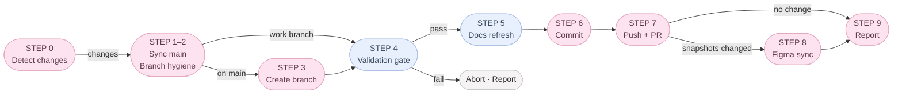

# dwee — Local-First Wellness Tracker

A local-first menstrual cycle and condition tracker — built as a sandbox for
clean architecture, type-safe i18n, and incremental cloud sync.

[Live demo](https://dwee-neon.vercel.app/) · [Architecture notes](./docs/architecture/data-layer.md) · [Engineering harness](#engineering-harness-claude)

---

## Engineering Highlights

- **Local-first architecture.** IndexedDB is the primary store; Supabase is an opt-in remote adapter behind the same Repository interface.
- **Repository + Adapter pattern.** Stores depend on an interface, not a backend. Swapping IndexedDB for Supabase is a one-line change in `data/index.ts`.
- **Pure domain layer.** `domain/cycle/*` and `lib/insight/*` are side-effect-free, fully Vitest-covered, callable from any layer.
- **Type-safe i18n.** `Dictionary = typeof en` makes a missing translation a TypeScript error, not a runtime fallback.
- **Visual regression matrix.** Playwright snapshots across 5 cycle phases × 2 locales, with a documented WebKit/IndexedDB driver bug isolated to one targeted skip.
- **Server-side AI guardrails.** A Supabase Edge Function fronts OpenAI Vision for body-type analysis — no image persistence, per-user rate limit, prompts swappable without shipping a new bundle.

---

## Why I Built This

I wanted a sandbox to practice the engineering patterns I care about —
local-first storage, swap-in remote adapters, pure domain logic, type-safe
i18n, and visual regression testing — on a domain where data privacy genuinely
matters. The app must work fully offline; records should never leave the
device without an explicit decision.

---

## System Architecture

```
                 ┌────────────┐
   UI (Next.js)  │   app/     │
                 └─────┬──────┘
                       ▼
                 ┌────────────┐    Zustand stores (hydrate / loading / error)
                 │  store/    │    No direct adapter import
                 └─────┬──────┘
                       ▼
        ┌──────────────────────────┐    Repository interfaces
        │ data/repositories/       │    Period · Condition · Settings · Media · Bookmark
        └────────┬───────────┬─────┘
                 │           │
       ┌─────────▼──┐   ┌────▼──────────┐
       │ IndexedDB  │   │ Supabase      │
       │ adapter    │   │ adapter       │
       │ (default)  │   │ (opt-in)      │
       └────────────┘   └───────────────┘

   domain/cycle/, lib/insight/   ← pure functions, callable from any layer
```

Dependency direction is strictly one-way. Stores import `@/data` only — never an
adapter directly — so the IndexedDB → Supabase migration is a wiring change, not
a rewrite.

---

## Key Design Decisions & Tradeoffs

| Decision                            | Alternative                   | Why                                                                                                       |
| ----------------------------------- | ----------------------------- | --------------------------------------------------------------------------------------------------------- |
| **Local-first (IndexedDB primary)** | Cloud-first                   | Records must work offline and survive auth changes. Cloud is a sync target, not a dependency.             |
| **Repository + Adapter pattern**    | Direct Supabase SDK in stores | Interface boundaries let me swap backends and run tests without network.                                  |
| **Pure-function domain layer**      | Cycle math inside components  | Isolating the riskiest logic makes Vitest coverage cheap and prevents UI re-renders from corrupting math. |
| **Login-gate on first entry**       | Anonymous auto-start          | Forces the sign-in screen on every cold start; anonymous ("Continue without signing in") is an explicit guest tap that mints an anonymous session, not a silent default.   |
| **`Dictionary = typeof en` i18n**   | Runtime fallback              | Catches missing translations at `tsc --noEmit`.                                                           |
| **Server-side LLM (Edge Function)** | Client-side LLM               | Keeps API key, rate limit, and prompt off the client; swap models without a new bundle.                   |
| **Visual snapshots for UI**         | Component snapshot tests      | Cycle phase × locale combinations are where visual bugs hide. The matrix gates merges.                    |

---

## Local-First Sync Strategy

**Today:** writes go to IndexedDB synchronously; UI re-reads from local. Cold start always lands on `/login`; "Continue without signing in" mints an anonymous Supabase session (stays on IndexedDB). Apple and Google OAuth sign-in trigger a one-shot local → Supabase migration, then the Supabase adapter takes over. Sign-out wipes the local cache and returns to `/login` — no automatic anonymous re-issue. All four data stores rehydrate whenever the repo mode flips (sign-in, sign-out, session restore).

**Planned:**

- **Read:** local-first; remote hydrates records the local store has never seen.
- **Write:** write-through local, enqueue sync. Failures don't block the UI.
- **Conflict:** last-write-wins by `updated_at`. LWW is intentional over CRDTs — a single user across 2–3 mostly append-only devices doesn't justify the complexity yet.

I shipped the local-first slice first so the app is fully usable before any sync code exists. Sync becomes an enhancement, not a prerequisite.

---

## Engineering Harness (`.claude/`)

The repository includes a lightweight AI-assisted engineering workflow:

- Role-scoped sub-agents
- Automated quality gates
- Versioned engineering rules
- Documentation synchronization

`/commit` is the merge gate: branch hygiene → lint → typecheck → Vitest → Playwright → doc refresh → PR → Figma snapshot sync. It refuses to push if any step fails — a solo project gets the same discipline as a CI pipeline.



The goal is to treat AI tooling as engineering infrastructure rather than code generation.

See [`.claude/`](./.claude/) for implementation details.

---

## Testing & Quality

| Layer              | Tool                  | Coverage                                                                                     |
| ------------------ | --------------------- | -------------------------------------------------------------------------------------------- |
| Pure domain logic  | Vitest                | `domain/cycle/*`, `lib/insight/*`, `lib/date/*`. Each spec paired with a `*.cases.md` table. |
| Visual regression  | Playwright            | 5 phases × 2 locales across Home, /log, Magazine, Customize, Photo Edit.                     |
| Runtime guardrails | Playwright            | Console / pageerror guard fails on any unhandled error.                                      |
| Types              | `tsc --noEmit` strict | Zero `any` in prod code; missing i18n keys fail the build.                                   |

**Debugging story:** Playwright's WebKit driver throws a null `DOMException` storing `Blob` in IndexedDB — a Playwright-only bug; real Safari and WKWebView work fine. I bisected Chromium vs. WebKit on a reduced spec, confirmed against the upstream issue, and shipped one targeted `.skip` instead of disabling the whole spec. The rest of the matrix continues to gate merges.

---

## Technical Challenges & Learnings

- **Designing for a future backend without overengineering.** I resisted mirroring Supabase's schema in the adapter interface — that would have leaked vendor semantics into the domain. The interface is the _minimum surface_ the UI needs; both adapters translate internally.
- **Pure-function discipline pays off late.** Feels excessive with one consumer; by the third feature, every change is a function-level unit test with no React state to mock.
- **Type-safe i18n forced better copy.** Once a missing key was a compile error, every new feature surfaced vague or missing strings — several screens got rewritten because the type system asked "what _is_ this string?"

---

## What I Built

Solo project. End-to-end ownership of:

- **Data layer** — Repository interfaces, IndexedDB and Supabase adapters, schema versioning.
- **Cycle domain & insights** — pure-function `domain/cycle/*`, rule-based `lib/insight/*`.
- **Type-safe i18n** — `Dictionary = typeof en` setup, en/ko dictionaries.
- **Testing pipeline** — Playwright visual matrix, Vitest convention with paired `*.cases.md`.
- **Magazine feature** — article data module, fullscreen article/bookmark routes, BookmarkRepository + IndexedDB adapter + Zustand store wired end-to-end.
- **Supabase Edge Function** — `body-type-analyze` (Vision, no image retention, per-user rate limit).
- **`.claude/` engineering harness** — `/commit` gate, six sub-agents, four rule files.

---

## Future Scalability Considerations

- **Conflict policy:** LWW is fine for one user × few devices. Multi-author records (partner view) would need per-field merge or CRDTs.
- **Schema migrations:** IndexedDB is on schema v4, versioned but untested under real data drift. A real rollout needs a forward-only migration log with failure telemetry.
- **Observability:** no production error pipeline yet. Sentry or a Supabase log table is the first step before opening signups.
- **Multi-region:** Supabase region is fixed. For international launch I'd evaluate edge caching for magazine content (the hot read path) before sharding user data.

---

## Status & Stack

**Status:** local-only flow (record · predict · calendar · condition log · insights · i18n), magazine (4 articles, fullscreen reader, bookmarks), and the body-type analysis flow are shipped. Supabase auth is live — login gate on every cold start, Apple and Google OAuth active, anonymous → OAuth migration wired, 4-store rehydrate on mode switch. Background sync and multi-device conflict resolution are next.

**Stack:** Next.js 15 (App Router) · React 19 · TypeScript strict · Zustand · IndexedDB (`idb-keyval`) · Supabase (Postgres + Auth + Edge Functions) · Tailwind · react-hook-form · Vitest · Playwright · Capacitor 6 (iOS).

**Run locally:**

```bash
pnpm install
cp .env.example .env.local      # Supabase URL + anon key
pnpm dev                        # http://localhost:3000
pnpm test                       # lint → typecheck → unit → e2e
```

Architecture deep-dive: [`docs/architecture/data-layer.md`](./docs/architecture/data-layer.md). Edge Function setup: [`supabase/README.md`](./supabase/README.md#edge-functions).

---

## License

MIT.
