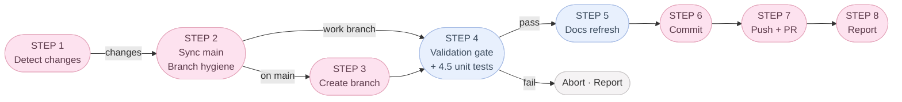

# dwee — Local-First Wellness Tracker

A local-first menstrual cycle and condition tracker — built as a sandbox for
clean architecture, type-safe i18n, and incremental cloud sync.

[Live demo](https://dwee-neon.vercel.app/) · [Architecture notes](./docs/architecture/data-layer.md) · [Flow diagrams](./docs/diagrams) · [Engineering harness](#engineering-harness-claude)

---

## Engineering Highlights

- **Local-first architecture.** IndexedDB is the primary store; Supabase is an opt-in remote adapter behind the same Repository interface.
- **Repository + Adapter pattern.** Stores depend on an interface, not a backend. Swapping IndexedDB for Supabase is a one-line change in `data/index.ts`.
- **Pure domain layer.** `domain/cycle/*` and `lib/insight/*` are side-effect-free and callable from any layer; `domain/cycle/*` carries the Vitest coverage, `lib/insight/*` doesn't have tests yet.
- **Type-safe i18n.** `Dictionary = typeof en` makes a missing translation a TypeScript error, not a runtime fallback.
- **Visual regression matrix.** Playwright snapshots across 5 cycle phases × 2 locales, with a documented WebKit/IndexedDB driver bug isolated to one targeted skip.
- **Server-side AI guardrails.** A Supabase Edge Function fronts OpenAI Vision for body-type analysis — no image persistence, per-user rate limit, prompts swappable without shipping a new bundle.

---

## Why I Built This

I wanted a sandbox to practice the engineering patterns I care about —
local-first storage, swap-in remote adapters, pure domain logic, type-safe
i18n, and visual regression testing — on a domain where data privacy genuinely
matters. The app must work fully offline; records should never leave the
device without an explicit decision.

---

## System Architecture

```
                 ┌────────────┐
   UI (Next.js)  │   app/     │
                 └─────┬──────┘
                       ▼
                 ┌────────────┐    Zustand stores (hydrate / loading / error)
                 │  store/    │    No direct adapter import
                 └─────┬──────┘
                       ▼
        ┌──────────────────────────┐    Repository interfaces
        │ data/repositories/       │    Period · Condition · Settings · Media · Bookmark · Event · EventCategory · DiarySticker · DiaryStickerPlacement · BodyTypeReport · Intro
        └────────┬───────────┬─────┘
                 │           │
       ┌─────────▼──┐   ┌────▼──────────┐
       │ IndexedDB  │   │ Supabase      │
       │ adapter    │   │ adapter       │
       │ (default)  │   │ (opt-in)      │
       └────────────┘   └───────────────┘

   domain/cycle/, lib/insight/   ← pure functions, callable from any layer
```

Dependency direction is strictly one-way. Stores import `@/data` only — never an
adapter directly — so the IndexedDB → Supabase migration is a wiring change, not
a rewrite.

---

## Key Design Decisions & Tradeoffs

| Decision                            | Alternative                   | Why                                                                                                                                                                      |
| ----------------------------------- | ----------------------------- | ------------------------------------------------------------------------------------------------------------------------------------------------------------------------ |
| **Local-first (IndexedDB primary)** | Cloud-first                   | Records must work offline and survive auth changes. Cloud is a sync target, not a dependency.                                                                            |
| **Repository + Adapter pattern**    | Direct Supabase SDK in stores | Interface boundaries let me swap backends and run tests without network.                                                                                                 |
| **Pure-function domain layer**      | Cycle math inside components  | Isolating the riskiest logic makes Vitest coverage cheap and prevents UI re-renders from corrupting math.                                                                |
| **Login-gate on first entry**       | Anonymous auto-start          | Forces the sign-in screen on every cold start (a device's very first launch shows a one-time onboarding intro first); anonymous ("Continue without signing in") is an explicit guest tap that mints an anonymous session, not a silent default. One route-prefix whitelist exception exists for public share links. |
| **`Dictionary = typeof en` i18n**   | Runtime fallback              | Catches missing translations at `tsc --noEmit`.                                                                                                                          |
| **Server-side LLM (Edge Function)** | Client-side LLM               | Keeps API key, rate limit, and prompt off the client; swap models without a new bundle.                                                                                  |
| **Visual snapshots for UI**         | Component snapshot tests      | Cycle phase × locale combinations are where visual bugs hide. The matrix gates merges.                                                                                   |

---

## Local-First Sync Strategy

**Today:** writes go to IndexedDB synchronously; UI re-reads from local. Cold start lands on `/login` — except a device's very first launch, which shows a brief onboarding intro (splash + 3 slides, shown once and tracked by a device-scoped flag, independent of the signed-in account) before `/login`. One carved-out exception to the gate itself: a small whitelist of public share-link routes (currently the body-type share cards) is reachable without a session, so a link handed to someone else doesn't bounce them before they see it. "Continue without signing in" mints an anonymous Supabase session (stays on IndexedDB). Apple and Google OAuth sign-in trigger a one-shot local → Supabase migration, then the Supabase adapter takes over. Sign-out wipes the local cache and returns to `/login` — no automatic anonymous re-issue. All six data stores rehydrate whenever the repo mode flips (sign-in, sign-out, session restore).

**Planned:**

- **Read:** local-first; remote hydrates records the local store has never seen.
- **Write:** write-through local, enqueue sync. Failures don't block the UI.
- **Conflict:** last-write-wins by `updated_at`. LWW is intentional over CRDTs — a single user across 2–3 mostly append-only devices doesn't justify the complexity yet.

I shipped the local-first slice first so the app is fully usable before any sync code exists. Sync becomes an enhancement, not a prerequisite.

---

## Engineering Harness (`.claude/`)

The repository includes a lightweight AI-assisted engineering workflow:

- Role-scoped sub-agents
- Automated quality gates
- Versioned engineering rules
- Documentation synchronization

`/commit` is the merge gate: branch hygiene → lint/typecheck/Vitest gate → unit-test authoring → doc refresh → commit → PR → report. Playwright e2e (`pnpm test:e2e`) runs separately, not inside `pnpm test`; automatic Figma snapshot sync is currently disabled (manual sync only). It refuses to push if any step fails — a solo project gets the same discipline as a CI pipeline.


```mermaid
flowchart LR
    S1(["STEP 1\nDetect changes"])
    S2(["STEP 2\nSync main\nBranch hygiene"])
    S3(["STEP 3\nCreate branch"])
    S4(["STEP 4\nValidation gate\n+ 4.5 unit tests"])
    S5(["STEP 5\nDocs refresh"])
    S6(["STEP 6\nCommit"])
    S7(["STEP 7\nPush + PR"])
    S8(["STEP 8\nReport"])

    S1 -->|"changes"| S2
    S2 -->|"on main"| S3
    S2 -->|"work branch"| S4
    S3 --> S4
    S4 -->|"pass"| S5
    S4 -->|"fail"| X(["Abort · Report"])
    S5 --> S6
    S6 --> S7
    S7 --> S8

    classDef step fill:#FDE2EF,stroke:#E5A8BD,color:#5C3A4A;
    classDef gate fill:#E8F0FD,stroke:#A8BDE5,color:#3A4A5C;
    classDef stop fill:#F5F3F4,stroke:#C9C6C7,color:#353434;
    class S1,S2,S3,S6,S7,S8 step;
    class S4,S5 gate;
    class X stop;
```

The goal is to treat AI tooling as engineering infrastructure rather than code generation.

See [`.claude/`](./.claude/) for implementation details.

---

## Testing & Quality

| Layer              | Tool                  | Coverage                                                                                     |
| ------------------ | --------------------- | -------------------------------------------------------------------------------------------- |
| Pure domain logic  | Vitest                | `domain/cycle/*`, `domain/event/*`, `domain/holiday/*`, `domain/home/*`, `lib/date/*`, `lib/image/*`, `content/foods/*` (32 spec files). Each spec paired with a `*.cases.md` table. `lib/insight/*` has no tests yet. |
| Visual regression  | Playwright            | 5 phases × 2 locales on Home, `/log`, Customize; Magazine is 3 fixed scenarios (not phase-swept); Photo Edit is `.skip`'d (see below).                     |
| Runtime guardrails | Playwright            | Console / pageerror guard fails on any unhandled error.                                      |
| Types              | `tsc --noEmit` strict | Zero `any` in prod code; missing i18n keys fail the build.                                   |

**Debugging story:** Playwright's WebKit driver throws a null `DOMException` storing `Blob` in IndexedDB — a Playwright-only bug; real Safari and WKWebView work fine. I bisected Chromium vs. WebKit on a reduced spec, confirmed against the upstream issue, and shipped one targeted `.skip` instead of disabling the whole spec. The rest of the matrix continues to gate merges.

---

## Technical Challenges & Learnings

- **Designing for a future backend without overengineering.** I resisted mirroring Supabase's schema in the adapter interface — that would have leaked vendor semantics into the domain. The interface is the _minimum surface_ the UI needs; both adapters translate internally, and a `RepoMode` switch picks one at runtime.
- **Pure-function discipline pays off late.** Feels excessive with one consumer; by the third feature, every change is a function-level unit test with no React state to mock. The cycle-status fix (zero countable gaps used to fall through to "regular") was a one-file change once the 15–60-day rule lived in a single `cycleGap.ts`.
- **Type-safe i18n forced better copy.** Once a missing key was a compile error, every new feature surfaced vague or missing strings — and a dead-key sweep later removed 84 strings nobody rendered.
- **"Behavior-preserving" needs more than green tests.** A 157-file refactor passed lint, `tsc` and 586 unit tests, yet an adversarial diff review still found four regressions (a class string missing a space, a cancel check moved past an async step, hook state that used to reset on unmount, a narrowed `catch`). Extracting code changes lifecycles; the fix was to regenerate Playwright baselines from the pre-refactor tree and compare pixels, not just types.
- **Docs drift silently.** A doc-vs-code audit found ~60 stale claims (deleted components still "current", wrong test counts, an i18n key that no longer existed). Docs now get re-verified in the same PR as the code, and Mermaid labels are grep-checked so GitHub never shows a parse error.
- **Device flags vs. account flags.** `introSeen` belongs to the device (survives sign-out, never synced); `onboardingCompleted` belongs to the account (follows the user to a new phone). Getting that split wrong would have replayed the intro slides after every logout, so the guard also back-fills the device flag for devices that pre-date onboarding. The same lesson applied to the sticker seed flag, which is scoped per backend (`local` / `remote:<userId>`) so a signed-in account still receives the defaults a device already seeded anonymously.
- **Concurrent hydrates race.** The built-in event categories were seeded twice when locale detection and a store rehydrate fired the seed effect back-to-back. Sharing one in-flight promise fixed the race; an idempotent dedupe on hydrate cleaned up accounts that had already been hit.
- **Static export shapes the URL design.** With `output: 'export'` a query string can't vary `og:image`, so each body-type share card is its own static route (`share/[type]`, `generateStaticParams` × 3) and the only public exception in the login gate.

---

## What I Built

Solo project. End-to-end ownership of:

- **Data layer** — Repository interfaces, IndexedDB + Supabase adapters behind a runtime `RepoMode` switch, versioned IndexedDB schema (v10), Supabase migrations 0001–0015.
- **Auth & sync** — anonymous sessions, Apple/Google OAuth, first-login local→remote migration, sign-out reset, two-screen account deletion backed by a `delete-account` Edge Function.
- **Cycle domain & insights** — pure `domain/cycle/*` (prediction, phase, status classification, chart scale) and rule-based `lib/insight/*`; single source of truth for the countable-cycle range.
- **Home** — phase-aware hero, week strip, insight cards, keyword/activity/food suggestions; non-destructive photo customization with draft mode and per-slot transforms.
- **Diary** — event categories + event logs with period-mark linkage, optional condition check-in, KR/US public holidays, sticker customization (album/camera → cutout via `sticker-cutout` Edge Function → drag/resize/rotate placement).
- **Cycle report** — status badge, six-month chart, recent-cycles list with out-of-range rows flagged rather than hidden.
- **Magazine & body-type diagnose** — article reader with bookmarks; consent → native/web photo intake → OpenAI Vision via Edge Function → persisted report with a static per-type share route.
- **Onboarding & MyPage** — splash → intro slides → login gate → first-period sheet; settings (language, notifications, holidays), legal pages, account edit.
- **Type-safe i18n** — `Dictionary = typeof en`, en/ko dictionaries, `useT()` everywhere.
- **Testing** — Vitest (32 spec files, each paired with a human-readable `*.cases.md`), Playwright visual matrix, hand-drawn Excalidraw flow diagrams in `docs/diagrams/`.
- **`.claude/` engineering harness** — `/commit` gate, six sub-agents, six rule files.

---

## Future Scalability Considerations

- **Conflict policy:** LWW is fine for one user × few devices. Multi-author records (partner view) would need per-field merge or CRDTs.
- **Schema migrations:** IndexedDB is on schema v10, versioned but untested under real data drift. A real rollout needs a forward-only migration log with failure telemetry.
- **Observability:** no production error pipeline yet. Sentry or a Supabase log table is the first step before opening signups.
- **Multi-region:** Supabase region is fixed. For international launch I'd evaluate edge caching for magazine content (the hot read path) before sharding user data.

---

## Status & Stack

**Status — v1.0 (MVP1 complete).**

- Shipped: cycle record/predict/insights, condition log, diary (events, holidays, stickers), cycle report, magazine + body-type diagnose, home customization, onboarding, MyPage (language, notifications UI, legal, account edit/delete).
- Auth: login gate on cold start, age/terms consent gate before any sign-in path (STEP 1.5), anonymous + Apple/Google OAuth (system browser + `dwee://auth/callback` return on Capacitor, STEP 2), anonymous→account migration, 6-store rehydrate on mode switch.
- Storage: IndexedDB schema v10 (local), Supabase migrations through 0015 (remote), three Edge Functions (`body-type-analyze`, `sticker-cutout`, `delete-account`).
- Notifications: local reminders (period due / delay / fertile window) scheduled on device via `@capacitor/local-notifications` from the pure `domain/notification` planner; web build shows settings only.
- Not wired yet: background sync, multi-device conflict resolution.
- Next: iOS release prep (native OAuth, public legal pages, local notifications) — see [`docs/product/release-plan-v1.md`](./docs/product/release-plan-v1.md).

**Stack:** Next.js 15 (App Router) · React 19 · TypeScript strict · Zustand · IndexedDB (`idb-keyval`) · Supabase (Postgres + Auth + Edge Functions) · Tailwind · react-hook-form · Vitest · Playwright · Capacitor 6 (iOS).

**Run locally:**

```bash
pnpm install
cp .env.example .env.local      # Supabase URL + anon key + SITE_URL for OG metadata
pnpm dev                        # http://localhost:3000
pnpm test                       # lint → typecheck → unit (e2e is separate: pnpm test:e2e)
```

**iOS (Capacitor):** `ios/` is git-ignored and regenerated on demand.

```bash
npx cap add ios                 # generate the Xcode project (once)
pnpm ios:setup                  # scripts/setup-ios.mjs — Info.plist, en/ko strings, icon, launch screen
pnpm cap:ios                    # next build → cap sync → open Xcode
```

`setup-ios.mjs` is idempotent: it adds camera/photo usage descriptions (en in Info.plist, ko via `InfoPlist.strings`), registers the `dwee://` URL scheme for the OAuth return, sets the deployment target to iOS 15, copies `public/app-icon-1024.png` into the icon set and turns the launch screen into a plain `#F5F3F4` view. Still manual in Xcode: Signing team and the **Sign in with Apple** capability.

Architecture deep-dive: [`docs/architecture/data-layer.md`](./docs/architecture/data-layer.md). Hand-drawn flow diagrams (Excalidraw + PNG): [`docs/diagrams/`](./docs/diagrams) — login, body-type diagnose, diary sticker capture, local notifications ([`docs/flows/notifications.md`](./docs/flows/notifications.md)). Edge Function setup: [`supabase/README.md`](./supabase/README.md#edge-functions).

---

## License

MIT.
