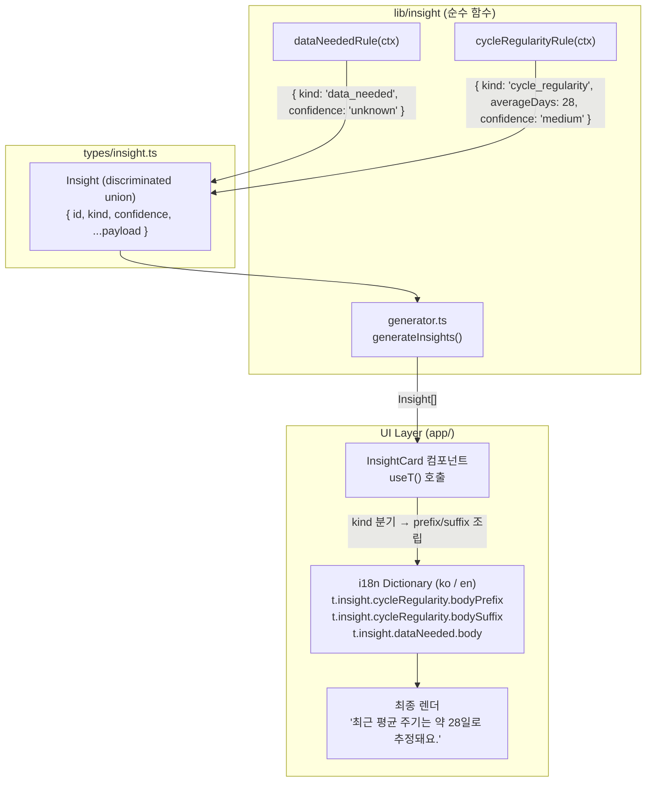
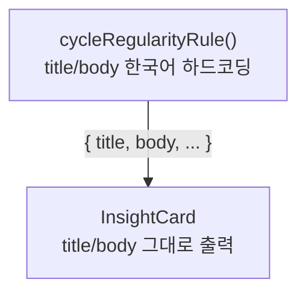

# Insight 데이터 흐름 (STEP 9.0 이후)

> B2 결정: rule 함수가 표시 문자열 책임을 화면 레이어로 이양함.
> 관련 규칙: [health-copy.md](../../.claude/rules/health-copy.md), [cycle-logic.md](../../.claude/rules/cycle-logic.md).

## After (STEP 9.0)

핵심:
- rule 함수는 `kind` + 숫자/날짜 payload + `confidence` 만 반환. 표시 문자열 생성 금지.
- 화면 컴포넌트가 `useT()`로 prefix/suffix 키를 조립하고 동적 값(`averageDays` 등)을 JSX로 보간 (B1: 정적 키 + JSX, `tFn` 헬퍼 금지).
- 의존성 방향: `domain/lib/insight → types ← UI`. domain이 i18n에 의존하지 않음.

## Before (STEP 9.0 이전)

문제점:
1. 한국어 문자열이 domain에 박혀 영어 로케일에서도 한국어 노출.
2. rule이 표시 책임까지 가져 단일 책임 원칙 위반.
3. `tFn` 헬퍼 도입 시 rule이 i18n 레이어에 의존 → 의존성 방향 위반.
