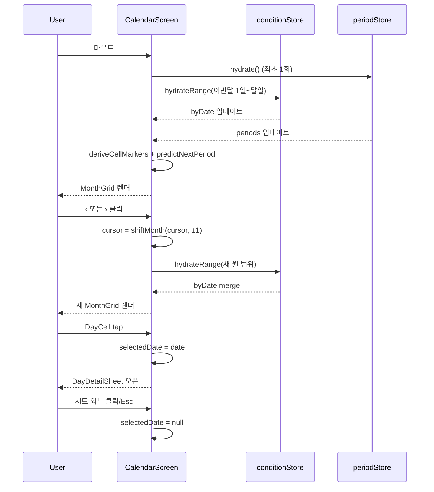
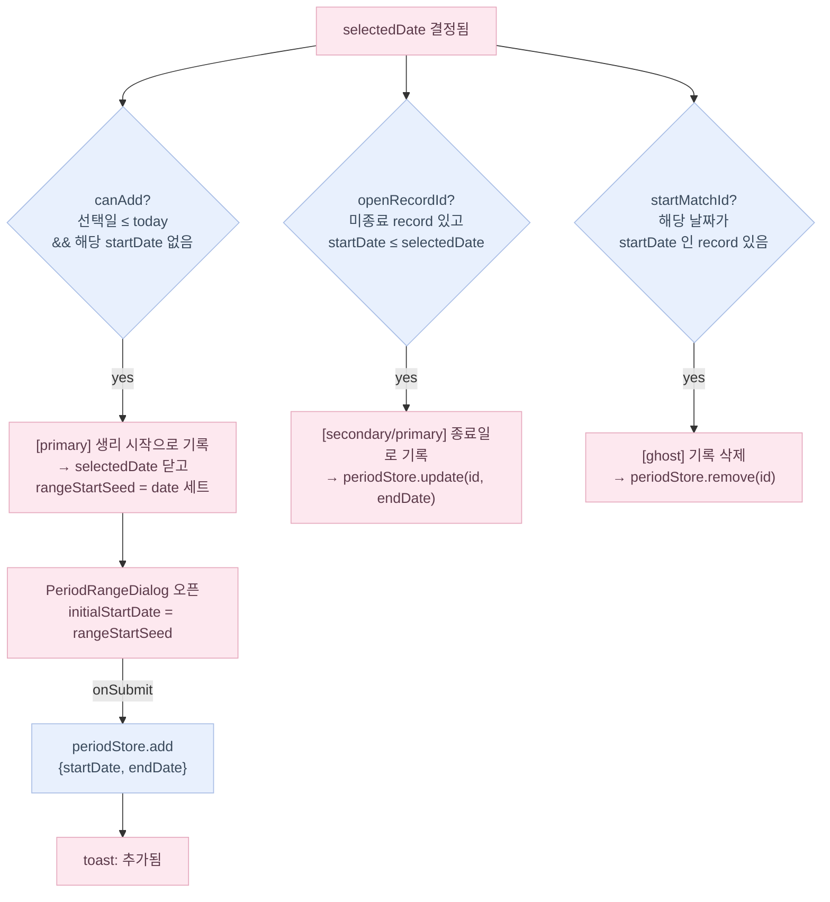

# Calendar 화면 흐름

## 셀 상태 결정 트리

```mermaid
flowchart TD
  A[셀 date 입력] --> B{periods 내 포함?}
  B -- yes --> M[background=menstrual]
  B -- no --> N[background=null]
  M --> P{predictedDate === date?}
  N --> P
  P -- yes --> R[predicted=true]
  P -- no --> S[predicted=false]
  R --> T{conditionByDate[date]?}
  S --> T
  T -- yes --> U[hasCondition=true · 점 표시]
  T -- no --> V[hasCondition=false]
  U --> W{date === today?}
  V --> W
  W -- yes --> X[isToday=true · ring 표시]
  W -- no --> Y[isToday=false]
```

## 월 네비게이션 데이터 흐름



## DayDetailSheet 액션 버튼

`selectedDate`와 `periods` 상태에 따라 버튼이 조건부로 노출됩니다.



- 세 버튼은 중첩될 수 있습니다 (예: 미종료 record 가 있고 동시에 다른 startDate 도 있는 날).
- `canAdd` 조건: `selectedDate <= today` 이고 해당 날짜를 startDate 로 갖는 record 가 없음.
- `openRecordId`: endDate 가 없는 record 중 `startDate <= selectedDate` 를 만족하는 가장 최근 record.
- `PeriodRangeDialog` 는 FAB 과 캘린더 양쪽에서 공유하는 컴포넌트 (`src/components/app/PeriodRangeDialog.tsx`).

## 결정 사항

- **A9** = 주 시작 요일: 일요일 (`WEEK_STARTS_ON = 0`).
- 셀 상태 우선순위: `menstrual`(배경) > `predicted`(ring) > `hasCondition`(하단 점) > `today`(얇은 ring).
  - 같은 셀에 여러 상태 중첩 가능 (예: 오늘이면서 생리 기록 + 컨디션).
- 6주×7일 = 42칸 고정. 5주만 필요한 달은 padding으로 유지 (UX 일관성).
- 월 이동마다 `hydrateRange`로 해당 월 conditions만 로드 (전체 로드 없음).
- 예측 날짜는 `predictNextPeriod()` 단일 값 — 다음 한 사이클만 표시.
