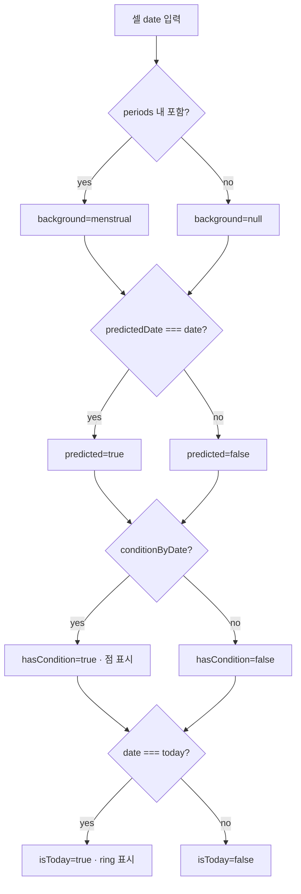
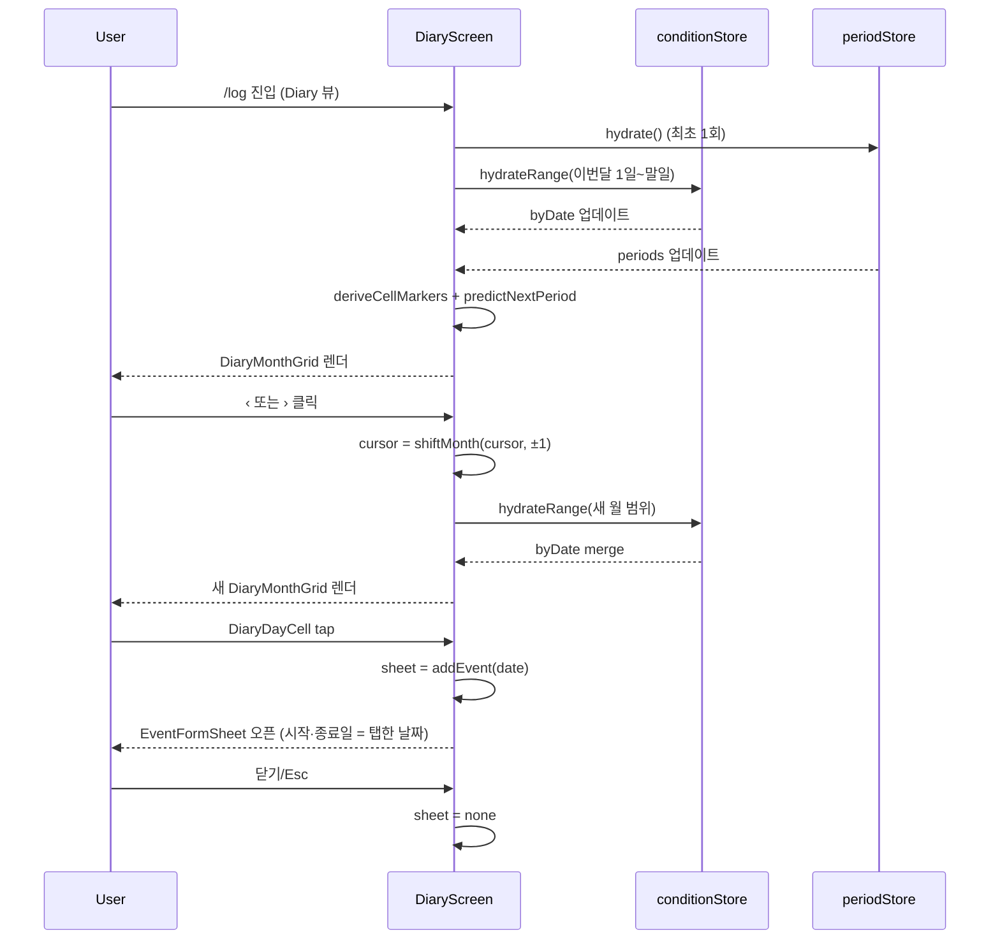
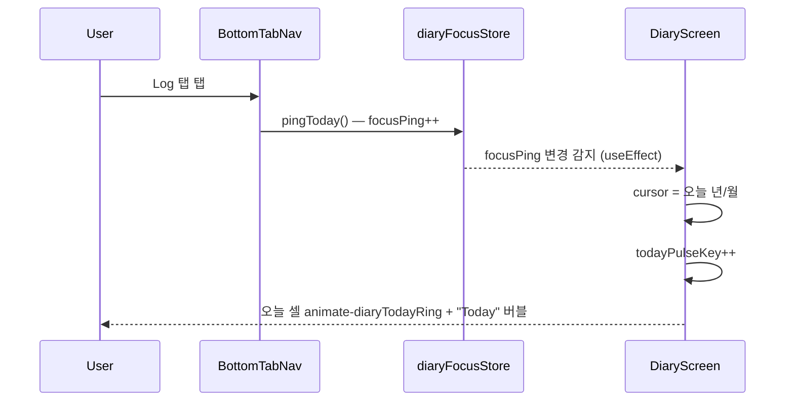

# Calendar 흐름 (DiaryScreen 내장)

> 독립 `/calendar` 라우트와 `CalendarScreen` 컴포넌트는 제거됨.
> 캘린더는 `DiaryScreen` (`/log` 탭 Diary 뷰) 안에 `DiaryMonthGrid`로 통합되어 있습니다.
> 관련 파일: `src/components/diary/DiaryScreen.tsx`, `src/components/calendar/`.

## 셀 상태 결정 트리

```mermaid
flowchart TD
  A["셀 date 입력"] --> B{"periods 내 포함?"}
  B -- yes --> M["background=menstrual"]
  B -- no --> N["background=null"]
  M --> P{"predictedDate === date?"}
  N --> P
  P -- yes --> R["predicted=true"]
  P -- no --> S["predicted=false"]
  R --> T{"conditionByDate?"}
  S --> T
  T -- yes --> U["hasCondition=true · 점 표시"]
  T -- no --> V["hasCondition=false"]
  U --> W{"date === today?"}
  V --> W
  W -- yes --> X["isToday=true · ring 표시"]
  W -- no --> Y["isToday=false"]
```

## 월 네비게이션 데이터 흐름

```mermaid
sequenceDiagram
  participant U as User
  participant D as DiaryScreen
  participant CS as conditionStore
  participant PS as periodStore

  U->>D: /log 진입 (Diary 뷰)
  D->>PS: hydrate() (최초 1회)
  D->>CS: hydrateRange(이번달 1일~말일)
  CS-->>D: byDate 업데이트
  PS-->>D: periods 업데이트
  D->>D: deriveCellMarkers + predictNextPeriod
  D-->>U: DiaryMonthGrid 렌더

  U->>D: ‹ 또는 › 클릭
  D->>D: cursor = shiftMonth(cursor, ±1)
  D->>CS: hydrateRange(새 월 범위)
  CS-->>D: byDate merge
  D-->>U: 새 DiaryMonthGrid 렌더

  U->>D: DiaryDayCell tap
  D->>D: sheet = addEvent(date)
  D-->>U: EventFormSheet 오픈 (시작·종료일 = 탭한 날짜)
  U->>D: 닫기/Esc
  D->>D: sheet = none
```

## 하단 탭 "오늘로 이동" 흐름

Log 탭을 탭하면 현재 보이는 월과 무관하게 오늘 날짜의 월로 되돌아가고, 오늘 셀에 애니메이션 링과 "Today" 버블이 잠깐 표시됩니다. 같은 탭을 연속으로 탭해도 매번 재실행됩니다.

구현: `diaryFocusStore` (`src/store/diaryFocusStore.ts`) 의 ping 카운터를 사용합니다. 카운터 값이 바뀔 때마다 `useEffect`가 트리거되어 cursor 와 `todayPulseKey` 를 갱신합니다. Boolean 대신 카운터를 쓰는 이유는 연속 탭 시 수동 리셋 없이 같은 값으로 재실행이 불가능하기 때문입니다.

```mermaid
sequenceDiagram
  participant U as User
  participant Nav as BottomTabNav
  participant FS as diaryFocusStore
  participant D as DiaryScreen

  U->>Nav: Log 탭 탭
  Nav->>FS: pingToday() — focusPing++
  FS-->>D: focusPing 변경 감지 (useEffect)
  D->>D: cursor = 오늘 년/월
  D->>D: todayPulseKey++
  D-->>U: 오늘 셀 animate-diaryTodayRing + "Today" 버블
```

- 애니메이션 keyframes: `animate-diaryTodayRing`, `animate-diaryTodayBubble` (`tailwind.config.ts` 에 정의)
- i18n 키: `calendar.todayLabel` (en: "Today" / ko: "오늘")

## 날짜 탭 → 생리 기록

과거엔 날짜 탭 시 `DayDetailSheet` 가 열려 상황별 버튼(추가/종료/삭제) 중 하나를 고르고 `PeriodRangeDialog` 로 넘어갔습니다. 두 컴포넌트 모두 삭제되었고, 지금은 날짜 탭이 곧바로 `EventFormSheet` 를 add 모드로 엽니다 (위 [월 네비게이션 데이터 흐름](#월-네비게이션-데이터-흐름) 참고). 생리 시작/종료/삭제는 별도 버튼이 아니라 시트 안의 **생리 토글** 하나로 처리됩니다 — 판정 로직·상세 흐름은 [`docs/flows/log.md` § 생리 토글 + 컨디션 연동](./log.md#생리-토글--컨디션-연동-step-102c-통합-시트-갱신) 참고.

## 결정 사항

- **A9** = 주 시작 요일: 일요일 (`WEEK_STARTS_ON = 0`).
- 셀 상태 우선순위: `menstrual`(배경) > `predicted`(ring) > `hasCondition`(하단 점) > `today`(얇은 ring).
  - 같은 셀에 여러 상태 중첩 가능 (예: 오늘이면서 생리 기록 + 컨디션).
- 6주×7일 = 42칸 고정. 5주만 필요한 달은 padding으로 유지 (UX 일관성).
- 월 이동마다 `hydrateRange`로 해당 월 conditions만 로드 (전체 로드 없음).
- 예측 날짜는 `predictNextPeriod()` 단일 값 — 다음 한 사이클만 표시.
