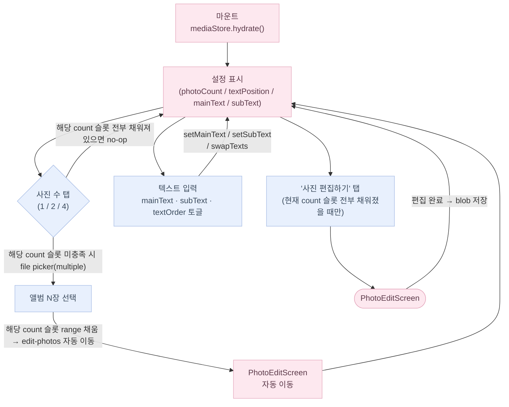
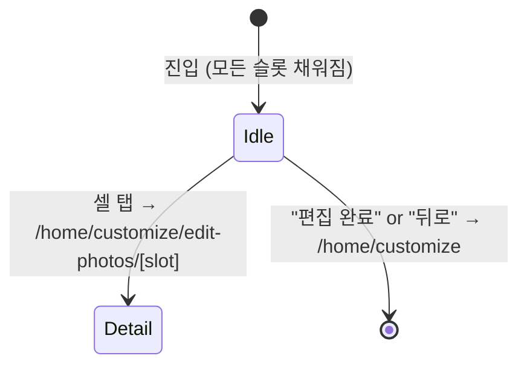
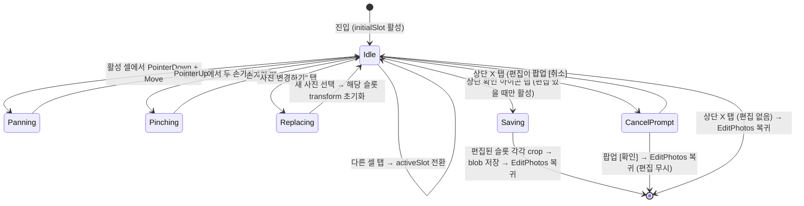
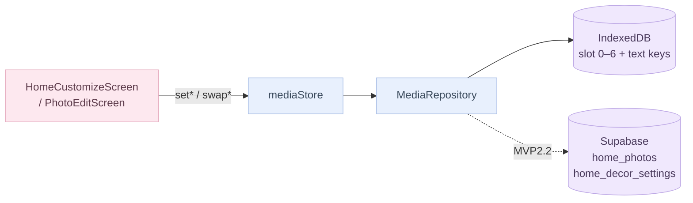

# 홈 커스터마이즈 플로우

> 위치: `src/app/(fullscreen)/home/customize/`, `src/components/home-customize/`

AppShell·탭바 없는 `(fullscreen)` 라우트 그룹에 속합니다.
진입: HomeHero 우상단 EditStar 아이콘 → `/home/customize`.

---

## 화면 구조

```mermaid
flowchart TD
    Home([HomeScreen])
    Customize[HomeCustomizeScreen\n/home/customize]
    EditPhotos[PhotoEditScreen\n/home/customize/edit-photos]
    Detail[PhotoEditDetailScreen\n/home/customize/edit-photos/[slot]]

    Home -->|"EditStar 탭"| Customize
    Customize -->|"'사진 편집하기' 탭"| EditPhotos
    EditPhotos -->|"셀 탭 → slot 상세"| Detail
    Detail -->|"확인 (편집 저장)"| EditPhotos
    Detail -->|"X (편집 없음 or 확인 팝업)"| EditPhotos
    EditPhotos -->|"편집 완료"| Customize
    Customize -->|"뒤로 / 완료"| Home

    classDef ui fill:#FDE8EF,stroke:#E5A8BD,color:#5C3A4A;
    class Home,Customize,EditPhotos,Detail ui;
```

---

## HomeCustomizeScreen 상태



---

## PhotoEditScreen (그리드) 상태



## PhotoEditDetailScreen (사진별 편집) 상태



---

## 데이터 흐름



`setPhotoCount` 가드: count 변경 시 해당 count 슬롯이 모두 채워져 있으면 picker를 열지 않습니다. 각 count는 독립 슬롯 범위(1→[0], 2→[1,2], 4→[3..6])를 사용하므로 count를 바꿔도 다른 count의 사진은 보존됩니다.

---

## domain/home/decor 상수

| 상수 | 값 |
|------|----|
| `PhotoCount` | `1 \| 2 \| 4` |
| `PhotoSlot` | `0 \| 1 \| 2 \| 3 \| 4 \| 5 \| 6` |
| `slotsForCount(count)` | 1→[0], 2→[1,2], 4→[3,4,5,6] |
| `countForSlot(slot)` | 0→1, 1/2→2, 3..6→4 |
| `TextPosition` | `topLeft \| topRight \| bottomLeft \| bottomRight` |
| `TextOrder` | `mainFirst \| subFirst` |
| `MAIN_TEXT_MAX` | 40자 |
| `SUB_TEXT_MAX` | 20자 |

---

## IndexedDB 마이그레이션 이력

| 버전 | 내용 |
|------|------|
| v1 | 초기 schema |
| v2 | `mediaHomeOverlays` 삭제 (스티커 기능 제거) |
| v3 | `mediaHomeHero` blob → slot 0 이주, `mediaPhotoCount = 1` 설정 |
| v4 | `mediaTextPosition` / `mediaMainText` / `mediaSubText` / `mediaTextOrder` 키 추가 (데이터 이주 없음) |
| v5 | 슬롯 0..3 공유 범위 → count별 독립 범위 이주. 기존 blobs를 저장 당시 `photoCount` 기준 슬롯 range로 재배치. |

---

## 관련 파일·문서

- `src/domain/home/decor.ts` — 타입·상수 원천
- `src/store/mediaStore.ts` — hydrate / setPhoto / setMainText / swapTexts
- `src/data/repositories/MediaRepository.ts` — Repository 인터페이스
- `docs/architecture/data-layer.md` — 어댑터 패턴 상세
- `docs/flows/home.md` — HomeHero 에서 customize 진입 맥락
