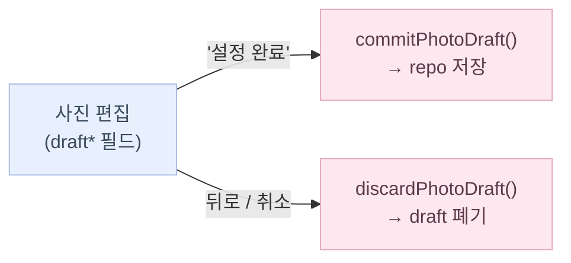
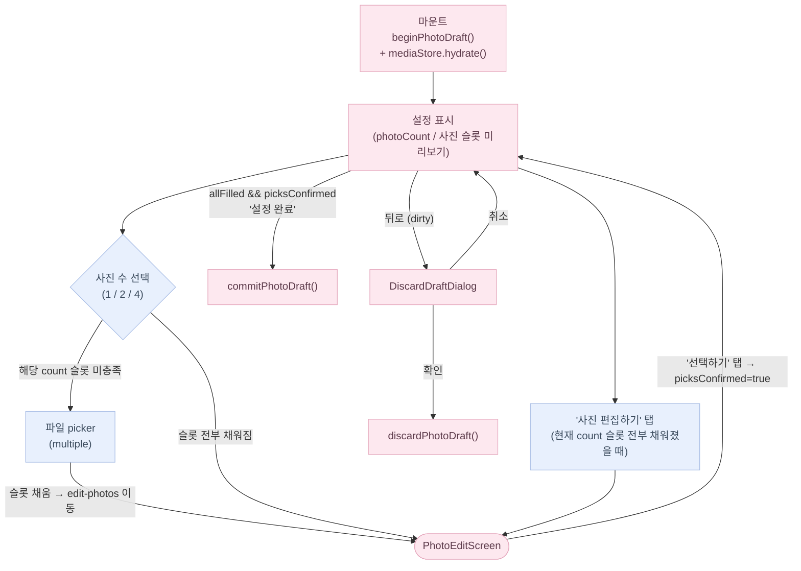
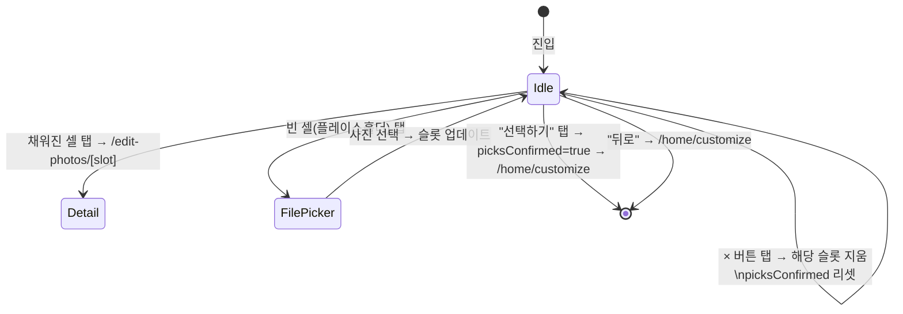
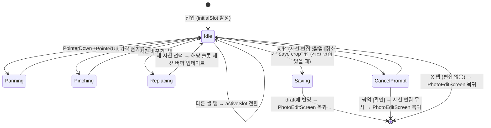
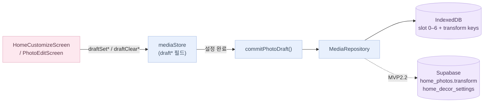

# 홈 커스터마이즈 플로우

> 위치: `src/app/(fullscreen)/home/customize/`, `src/components/home-customize/`

AppShell·탭바 없는 `(fullscreen)` 라우트 그룹에 속합니다.
진입: HomeHero 우상단 EditStar 아이콘 → `/home/customize`.

---

## 화면 구조

```mermaid
flowchart TD
    Home([HomeScreen])
    Customize[HomeCustomizeScreen\n/home/customize]
    EditPhotos[PhotoEditScreen\n/home/customize/edit-photos]
    Detail[PhotoEditDetailScreen\n/home/customize/edit-photos/[slot]]

    Home -->|"EditStar 탭"| Customize
    Customize -->|"'사진 편집하기' 탭"| EditPhotos
    EditPhotos -->|"셀 탭 → slot 상세"| Detail
    Detail -->|"✓ Save crop"| EditPhotos
    Detail -->|"X (취소 or 팝업)"| EditPhotos
    EditPhotos -->|"'선택하기' 탭 → picksConfirmed"| Customize
    Customize -->|"'설정 완료' (gated)"| Home
    Customize -->|"뒤로 (dirty → DiscardDraftDialog)"| Home

    classDef ui fill:#FDE8EF,stroke:#E5A8BD,color:#5C3A4A;
    class Home,Customize,EditPhotos,Detail ui;
```

---

## 드래프트 모드

HomeCustomizeScreen 마운트 시 `beginPhotoDraft()` 를 호출해 드래프트 세션을 시작합니다. 이후 모든 사진 변경은 `mediaStore` 의 `draft*` 필드에만 기록되며, 실제 Repository 저장은 "설정 완료" 탭 시 `commitPhotoDraft()` 가 일괄 처리합니다. 뒤로가기 또는 취소는 `discardPhotoDraft()` 를 호출해 드래프트를 폐기합니다.

```mermaid
flowchart LR
    Edit["사진 편집\n(draft* 필드)"]
    Confirm["commitPhotoDraft()\n→ repo 저장"]
    Discard["discardPhotoDraft()\n→ draft 폐기"]

    Edit -->|"'설정 완료'"| Confirm
    Edit -->|"뒤로 / 취소"| Discard

    classDef logic fill:#E8F0FD,stroke:#A8BDE5,color:#3A4A5C;
    classDef ui fill:#FDE8EF,stroke:#E5A8BD,color:#5C3A4A;
    class Edit logic;
    class Confirm,Discard ui;
```

- **`useMediaCustomizeView()`** — 커스터마이즈 플로우 화면용 훅. 드래프트가 활성이면 `draft*` 값을, 아니면 committed 값을 반환합니다.
- **`useIsPhotoDraftDirty()`** — 드래프트와 committed 상태가 다르면 `true`. 뒤로가기 시 `DiscardDraftDialog` 표시 여부를 결정합니다.

---

## HomeCustomizeScreen 상태

텍스트 커스터마이즈 UI 는 현재 주석 처리(비활성)입니다. 화면은 사진 설정만 담당합니다.

```mermaid
flowchart TD
    Mount["마운트\nbeginPhotoDraft()\n+ mediaStore.hydrate()"] --> Show["설정 표시\n(photoCount / 사진 슬롯 미리보기)"]
    Show --> EditCount{"사진 수 선택\n(1 / 2 / 4)"}
    Show --> TapEdit["'사진 편집하기' 탭\n(현재 count 슬롯 전부 채워졌을 때)"]

    EditCount -->|"해당 count 슬롯 미충족"| Pick["파일 picker\n(multiple)"]
    Pick -->|"슬롯 채움 → edit-photos 이동"| EditPhotos([PhotoEditScreen])
    EditCount -->|"슬롯 전부 채워짐"| EditPhotos
    TapEdit --> EditPhotos
    EditPhotos -->|"'선택하기' 탭 → picksConfirmed=true"| Show

    Show -->|"allFilled && picksConfirmed\n'설정 완료'"| Commit["commitPhotoDraft()"]
    Show -->|"뒤로 (dirty)"| Dialog["DiscardDraftDialog"]
    Dialog -->|"확인"| Discard["discardPhotoDraft()"]
    Dialog -->|"취소"| Show

    classDef ui fill:#FDE8EF,stroke:#E5A8BD,color:#5C3A4A;
    classDef logic fill:#E8F0FD,stroke:#A8BDE5,color:#3A4A5C;
    class Mount,Show,EditPhotos,Commit,Discard,Dialog ui;
    class EditCount,TapEdit,Pick logic;
```

### picksConfirmed 게이트

"설정 완료" 는 `allFilled && picksConfirmed` 조건이 모두 참일 때만 활성화됩니다. `picksConfirmed` 는 PhotoEditScreen 의 "선택하기" 버튼을 눌러야 `true` 로 설정되며, 이후 사진 수 변경·blob 교체·슬롯 지우기 중 하나라도 발생하면 자동 리셋됩니다.

---

## PhotoEditScreen (그리드) 상태

각 슬롯은 채워진 상태와 빈 상태 모두 허용합니다. 채워진 셀에는 × 버튼이 표시되어 해당 슬롯을 지울 수 있습니다. 빈 셀은 "+ Add photo" 플레이스홀더를 표시합니다.

```mermaid
stateDiagram-v2
    [*] --> Idle : 진입
    Idle --> Detail : 채워진 셀 탭 → /edit-photos/[slot]
    Idle --> FilePicker : 빈 셀(플레이스홀더) 탭
    FilePicker --> Idle : 사진 선택 → 슬롯 업데이트
    Idle --> Idle : × 버튼 탭 → 해당 슬롯 지움\npicksConfirmed 리셋
    Idle --> [*] : "선택하기" 탭 → picksConfirmed=true → /home/customize
    Idle --> [*] : "뒤로" → /home/customize
```

---

## PhotoEditDetailScreen (사진별 편집) 상태

각 슬롯의 파일 선택과 pan/zoom 편집은 로컬 세션 버퍼에 먼저 쌓이며, ✓ 탭 시에만 드래프트로 반영됩니다.

```mermaid
stateDiagram-v2
    [*] --> Idle : 진입 (initialSlot 활성)
    Idle --> Panning : PointerDown + Move
    Idle --> Pinching : 두 손가락 터치
    Panning --> Idle : PointerUp
    Pinching --> Idle : 손가락 뗌
    Idle --> Idle : 다른 셀 탭 → activeSlot 전환
    Idle --> Replacing : "사진 바꾸기" 탭
    Replacing --> Idle : 새 사진 선택 → 해당 슬롯 세션 버퍼 업데이트
    Idle --> Saving : ✓ "Save crop" 탭 (세션 편집 있을 때)
    Saving --> [*] : draft에 반영 → PhotoEditScreen 복귀
    Idle --> CancelPrompt : X 탭 (세션 편집 있을 때)
    CancelPrompt --> Idle : 팝업 [취소]
    CancelPrompt --> [*] : 팝업 [확인] → 세션 편집 무시 → PhotoEditScreen 복귀
    Idle --> [*] : X 탭 (편집 없음) → PhotoEditScreen 복귀
```

변경 사항은 ✓ / X 버튼으로 명확하게 "이 슬롯 세션 저장" / "이 슬롯 세션 폐기" 를 나타냅니다. 힌트 문구가 "사진 바꾸기" 버튼 아래에 표시되어 최종 저장은 "설정 완료" 에서 이뤄짐을 안내합니다.

---

## 비파괴 사진 편집 (PhotoTransform)

원본 blob 은 절대 덮어쓰지 않습니다. pan/zoom 편집 결과는 `PhotoTransform = { scale, offsetXNorm, offsetYNorm }` 메타데이터로 슬롯마다 별도 저장되며, 렌더 시 CSS 로 적용됩니다. 이 방식 덕분에 어떤 셀 크기(편집 화면, 미리보기, 홈 히어로)에서도 동일하게 렌더됩니다.

`TransformedPhoto` 컴포넌트는 url + transform 을 받아 CSS 만으로 렌더하는 공유 뷰 컴포넌트입니다. `PhotoLayout`, `PhotoPreviewGrid`, `PhotoEditScreen` 에서 공통으로 사용합니다.

---

## 데이터 흐름

```mermaid
flowchart LR
    Screen[HomeCustomizeScreen\n/ PhotoEditScreen]
    DraftStore["mediaStore\n(draft* 필드)"]
    Commit["commitPhotoDraft()"]
    Repo[MediaRepository]
    IDB[(IndexedDB\nslot 0–6 + transform keys)]
    SB[(Supabase\nhome_photos.transform\nhome_decor_settings)]

    Screen -->|"draftSet* / draftClear*"| DraftStore
    DraftStore -->|"설정 완료"| Commit
    Commit --> Repo
    Repo --> IDB
    Repo -.->|"MVP2.2"| SB

    classDef ui fill:#FDE8EF,stroke:#E5A8BD,color:#5C3A4A;
    classDef logic fill:#E8F0FD,stroke:#A8BDE5,color:#3A4A5C;
    classDef db fill:#F0E8FD,stroke:#BDA8E5,color:#4A3A5C;
    class Screen ui;
    class DraftStore,Commit,Repo logic;
    class IDB,SB db;
```

`slotsForCount` 가드: count 변경 시 해당 count 슬롯이 모두 채워져 있으면 picker 없이 바로 edit-photos 로 이동합니다. 각 count 는 독립 슬롯 범위(1→[0], 2→[1,2], 4→[3..6])를 사용하므로 count 를 바꿔도 다른 count 의 사진은 보존됩니다.

---

## domain/home/decor 상수

| 상수 | 값 |
|------|----|
| `PhotoCount` | `1 \| 2 \| 4` |
| `PhotoSlot` | `0 \| 1 \| 2 \| 3 \| 4 \| 5 \| 6` |
| `slotsForCount(count)` | 1→[0], 2→[1,2], 4→[3,4,5,6] |
| `countForSlot(slot)` | 0→1, 1/2→2, 3..6→4 |
| `PhotoTransform` | `{ scale, offsetXNorm, offsetYNorm }` |
| `isPhotoTransformEdited(tx)` | epsilon 비교로 "편집 없음" 판별 |
| `computePhotoRender(tx, natural, cell)` | 정규화 transform → px 값 변환 |
| `clampPhotoTransform(tx, natural, cell)` | 경계 초과 pan/zoom 클램프 |
| `TextPosition` | `topLeft \| topRight \| bottomLeft \| bottomRight` |
| `TextOrder` | `mainFirst \| subFirst` |
| `MAIN_TEXT_MAX` | 40자 |
| `SUB_TEXT_MAX` | 20자 |

---

## IndexedDB 마이그레이션 이력

| 버전 | 내용 |
|------|------|
| v1 | 초기 schema |
| v2 | `mediaHomeOverlays` 삭제 (스티커 기능 제거) |
| v3 | `mediaHomeHero` blob → slot 0 이주, `mediaPhotoCount = 1` 설정 |
| v4 | `mediaTextPosition` / `mediaMainText` / `mediaSubText` / `mediaTextOrder` 키 추가 |
| v5 | 슬롯 0..3 공유 범위 → count별 독립 범위 이주 |
| v6–v9 | Diary/Event/Sticker 도메인 (다른 doc 참조) |
| v10 | `dwee:media:photo_transform:{slot}` 키 추가 (0..6). 비파괴 transform 메타데이터 저장. 대응 Supabase 마이그레이션: `0010_home_photo_transform.sql` |

---

## 관련 파일·문서

- `src/domain/home/decor.ts` — 타입·상수·순수 함수 원천 (`decor.test.ts` / `decor.cases.md` 포함)
- `src/store/mediaStore.ts` — draft 라이프사이클 + hydrate / commit / discard
- `src/store/useMediaCustomizeView.ts` — `useMediaCustomizeView` / `useIsPhotoDraftDirty` / `isPhotoDraftDirty`
- `src/store/mediaStore.test.ts` / `mediaStore.cases.md` — draft 라이프사이클·picksConfirmed·URL 소유권 테스트 케이스
- `src/components/home-customize/TransformedPhoto.tsx` — url + transform CSS 렌더 컴포넌트
- `src/components/home-customize/DiscardDraftDialog.tsx` — 뒤로가기 시 드래프트 폐기 확인 다이얼로그
- `src/data/repositories/MediaRepository.ts` — Repository 인터페이스
- `supabase/migrations/0010_home_photo_transform.sql` — `home_photos.transform jsonb` 컬럼 추가
- `docs/architecture/data-layer.md` — 어댑터 패턴 상세
- `docs/flows/home.md` — HomeHero 에서 customize 진입 맥락
