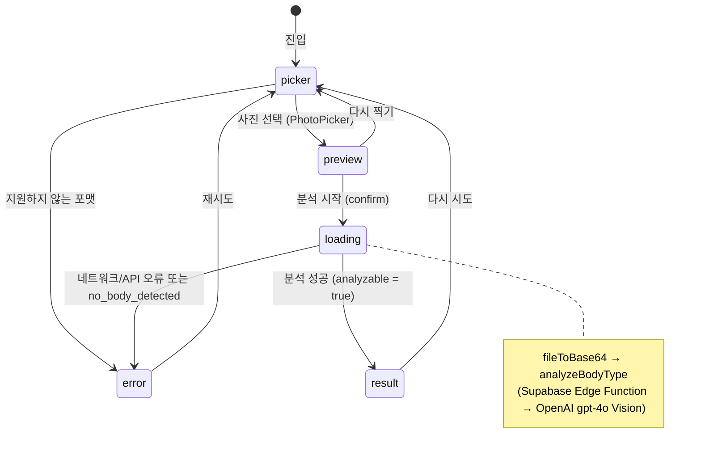
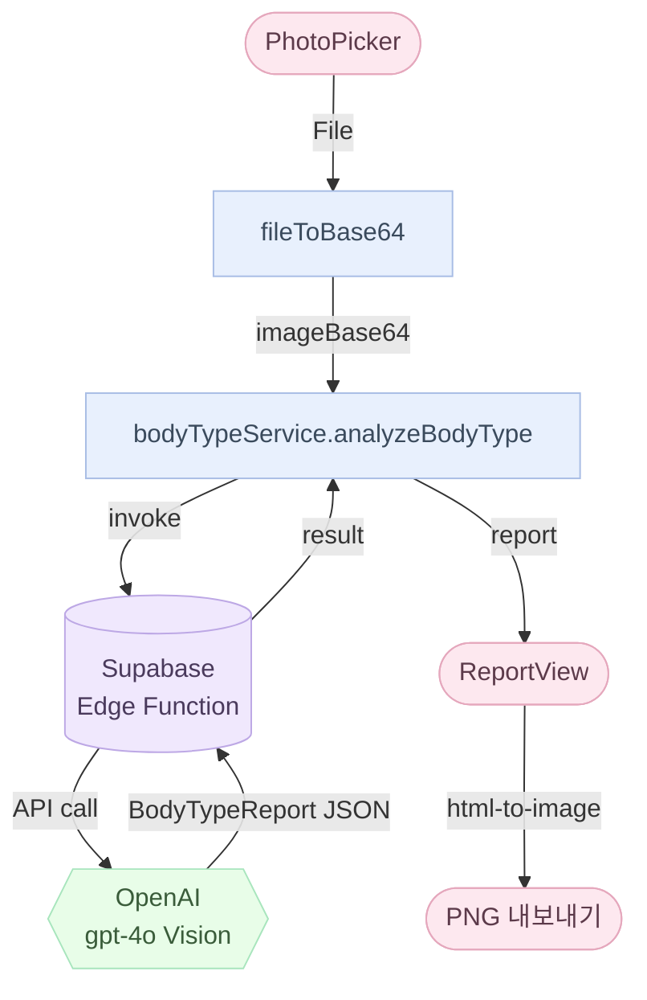

# /magazine/personal-body-type/diagnose 화면 플로우

> 위치: `src/app/(fullscreen)/magazine/personal-body-type/diagnose/page.tsx`, `src/components/diagnose/`

`(fullscreen)` 라우트 그룹에 속합니다 — AppShell·BottomTabNav 없음. 사용자가 직접 진단을 시작할 때만 진입하는 몰입형 플로우입니다.

---

## 상태 머신

`DiagnoseScreen` 은 `step` 상태 하나로 전체 플로우를 관리합니다.

```
type Step =
  | { kind: 'picker' }
  | { kind: 'preview'; file; previewUrl; mediaType }
  | { kind: 'loading' }
  | { kind: 'result'; report; remaining }
  | { kind: 'error'; code: BodyTypeAnalyzeError }
```



---

## 단계별 설명

| 단계 | 표시 내용 | 전환 조건 |
|------|-----------|-----------|
| **picker** | 인트로(제목·안내·톤·개인정보 고지) + PhotoPicker | 유효 포맷 사진 선택 → preview |
| **preview** | 선택 사진 미리보기 (3:4 비율) + 재촬영·확인 버튼 | 확인 → loading / 재촬영 → picker |
| **loading** | 스피너 + "분석 중" 문구 + "화면을 벗어나지 마세요" 힌트 | 응답 수신 → result 또는 error |
| **result** | ReportView (체형 결과 카드) + 이미지 저장·다시 시도 버튼 | 저장 → PNG 내보내기 / 다시 시도 → picker |
| **error** | 에러 코드별 메시지 + 재시도 버튼 | 재시도 → picker |

- `loading` 단계에서는 뒤로가기 링크가 숨겨집니다 (Edge Function 호출 중 이탈 방지).
- `result` 단계의 PNG 내보내기는 `html-to-image` 기반 `exportReportAsPng()` 사용.
- 사진은 **어디에도 저장되지 않습니다** — base64 변환 후 Edge Function 에 전달되고 함수 종료 시 폐기.

---

## 에러 코드 매핑

`BodyTypeAnalyzeError` 값과 사용자 노출 메시지 키 (`t.magazine.diagnose.error.*`):

| 코드 | 메시지 키 |
|------|-----------|
| `unauthenticated` | `error.unauthenticated` |
| `rate_limit_exceeded` | `error.rateLimitExceeded` |
| `image_too_large` | `error.imageTooLarge` |
| `invalid_media_type` | `error.invalidMediaType` |
| `missing_image` | `error.missingImage` |
| `image_refused` | `error.imageRefused` |
| `no_body_detected` | `error.noBodyDetected` |
| `openai_failed` / `report_parse_failed` | `error.openaiFailed` |
| `openai_unreachable` | `error.openaiUnreachable` |
| `invalid_shot_type` / `invalid_locale` / `unknown` | `error.unknown` |

---

## 데이터 흐름



---

## 관련 파일·문서

- `src/components/diagnose/DiagnoseScreen.tsx` — 상태 머신 + 단계별 서브 컴포넌트
- `src/components/diagnose/PhotoPicker.tsx` — 파일 입력 + 포맷 검증
- `src/components/diagnose/ReportView.tsx` — 체형 결과 카드 렌더
- `src/components/diagnose/exportReport.ts` — `html-to-image` 기반 PNG 저장
- `src/data/services/bodyTypeService.ts` — Edge Function 호출 + 익명 세션 보장
- `src/lib/image/fileToBase64.ts` — File → base64 + 미디어 타입 검증
- `src/types/bodyType.ts` — `BodyTypeReport`, `PrimaryBodyType`, `BodyTypeAnalyzeError`
- `supabase/functions/body-type-analyze/` — Edge Function 본체
- `supabase/migrations/0003_body_type_calls.sql` — 일 5회 rate limit 테이블 + RLS
- `supabase/README.md` — Edge Function 배포·시크릿 설정 절차
