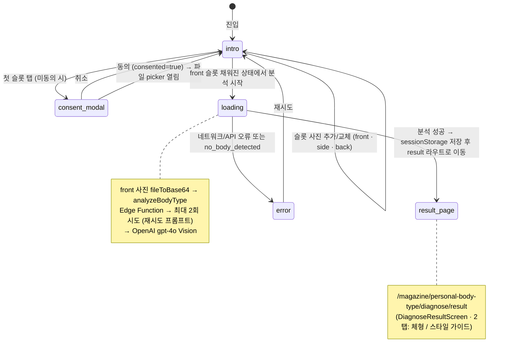
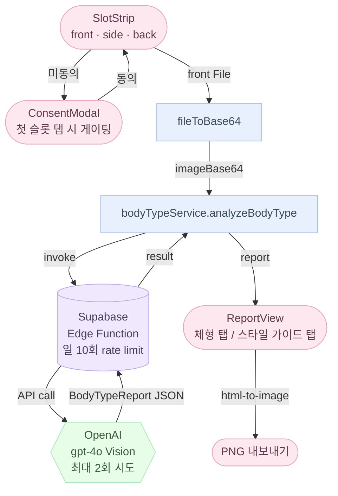

# /magazine/personal-body-type/diagnose 화면 플로우

> 위치: `src/app/(fullscreen)/magazine/personal-body-type/diagnose/page.tsx`, `src/components/diagnose/`

`(fullscreen)` 라우트 그룹에 속합니다 — AppShell·BottomTabNav 없음. 사용자가 직접 진단을 시작할 때만 진입하는 몰입형 플로우입니다.

결과 화면은 별도 라우트 `/magazine/personal-body-type/diagnose/result` (= `DiagnoseResultScreen`)로 분리되어 있으며, `sessionStorage` 키 `REPORT_SESSION_KEY` 로 리포트를 전달받습니다.

---

## 상태 머신

`DiagnoseScreen` 은 `step` 상태 하나로 전체 플로우를 관리합니다.

```
type Slot = 'front' | 'side' | 'back'

type Step =
  | { kind: 'intro'; photos: Partial<Record<Slot, Photo>>; consent: boolean; consented: boolean }
  | { kind: 'loading'; blurUrl: string }
  | { kind: 'error'; code: BodyTypeAnalyzeError }
```



---

## 단계별 설명

| 단계 | 표시 내용 | 전환 조건 |
|------|-----------|-----------|
| **intro** | 제목·부제 + SlotStrip 3개 (front · side · back) + 촬영 가이드 섹션 + 업로드 방법 섹션 + 잔여 횟수 | (미동의) 슬롯 탭 → ConsentModal 표시 / (동의 후) 슬롯 탭 → 파일 picker / front 채운 뒤 분석 버튼 → loading |
| **consent_modal** | 개인정보 고지 모달 (backdrop 클릭·취소 → 닫힘 / 동의 → 닫힘 후 파일 picker 열림) | 동의 → `consented: true`, 즉시 파일 picker 트리거 |
| **loading** | front 사진 blur 15px + dim 15% 배경 + 원형 진행 표시 + 진행률 % | Edge Function 응답 → result 라우트 또는 error |
| **error** | `AlertCircleIcon` + 에러 제목·메시지 + pink pill 재시도 버튼 | 재시도 → intro 초기화 |

- 분석에는 `front` 슬롯 사진만 사용됩니다. `side`, `back` 슬롯은 UX 안내 목적.
- `loading` 단계에서는 뒤로가기 링크가 숨겨집니다 (Edge Function 호출 중 이탈 방지).
- 결과 PNG 내보내기는 `DiagnoseResultScreen`에서 `html-to-image` 기반 `exportReportAsPng()` 호출.
- 사진은 **어디에도 저장되지 않습니다** — base64 변환 후 Edge Function 에 전달되고 함수 종료 시 폐기.

---

## 결과 화면 (DiagnoseResultScreen + ReportView)

결과는 2탭으로 구성됩니다.

| 탭 | 내용 |
|----|------|
| **체형 탭** (BodyTab) | 키워드 뱃지 · 주요 특징 · 골격(frame) 단락들(bone visibility / shoulders / collarbones / skin texture / muscle tone / waist/hip position / center of gravity) · 비율(proportions) |
| **스타일 가이드 탭** (StyleTab) | 가로 스크롤 clothing card 4장 (tops · bottoms · dresses · outerwear), fit criteria (good/bad), 스타일 details 그리드 (neckline · sleeves · waistDetail · length), materials (recommended/avoid) |

상단 Hero 영역은 핑크 배경 + 체형 PNG 이미지(`straight.png` / `wave.png` / `natural.png`) + 체형명·typeSuffix·keyTrait 첫 줄.

---

## 에러 코드 매핑

`BodyTypeAnalyzeError` 값과 사용자 노출 메시지 키 (`t.magazine.diagnose.error.*`):

| 코드 | 메시지 키 |
|------|-----------|
| `unauthenticated` | `error.unauthenticated` |
| `rate_limit_exceeded` | `error.rateLimitExceeded` |
| `image_too_large` | `error.imageTooLarge` |
| `invalid_media_type` | `error.invalidMediaType` |
| `missing_image` | `error.missingImage` |
| `image_refused` | `error.imageRefused` |
| `no_body_detected` | `error.noBodyDetected` |
| `openai_failed` / `report_parse_failed` | `error.openaiFailed` |
| `openai_unreachable` | `error.openaiUnreachable` |
| `invalid_shot_type` / `invalid_locale` / `unknown` | `error.unknown` |

Edge Function 은 `analyzable: false` 또는 일시적 OpenAI 실패(`openai_failed`, `openai_unreachable`) 시 재시도 프롬프트로 1회 자동 재시도합니다 (`MAX_ATTEMPTS = 2`). 재시도 불가(validation·설정 오류) 코드는 즉시 반환합니다. rate limit 는 성공 분석에만 차감됩니다.

---

## 데이터 흐름



---

## 관련 파일·문서

- `src/components/diagnose/DiagnoseScreen.tsx` — 상태 머신 (intro / consent_modal / loading / error) + SlotStrip + ConsentModal + GuideSection
- `src/components/diagnose/DiagnoseResultScreen.tsx` — 결과 라우트 화면 (sessionStorage 수신 + PNG 내보내기)
- `src/components/diagnose/ReportView.tsx` — 2탭 결과 렌더 (Hero · BodyTab · StyleTab)
- `src/components/diagnose/exportReport.ts` — `html-to-image` 기반 PNG 저장
- `src/data/services/bodyTypeService.ts` — Edge Function 호출 + 익명 세션 보장
- `src/lib/image/fileToBase64.ts` — File → base64 + 미디어 타입 검증
- `src/types/bodyType.ts` — `BodyTypeReport`, `PrimaryBodyType`, `BodyTypeAnalyzeError`
- `supabase/functions/body-type-analyze/` — Edge Function 본체 (일 10회 limit, MAX_ATTEMPTS=2, temperature 0.3)
- `supabase/migrations/0003_body_type_calls.sql` — 일일 호출 카운터 테이블 + RLS
- `docs/components/modal.md` — ConsentModal 이 따르는 공통 모달 설계 규칙
- `supabase/README.md` — Edge Function 배포·시크릿 설정 절차
- `public/magazine/personal-body-type/{straight,wave,natural}.png` — 체형별 히어로 이미지
