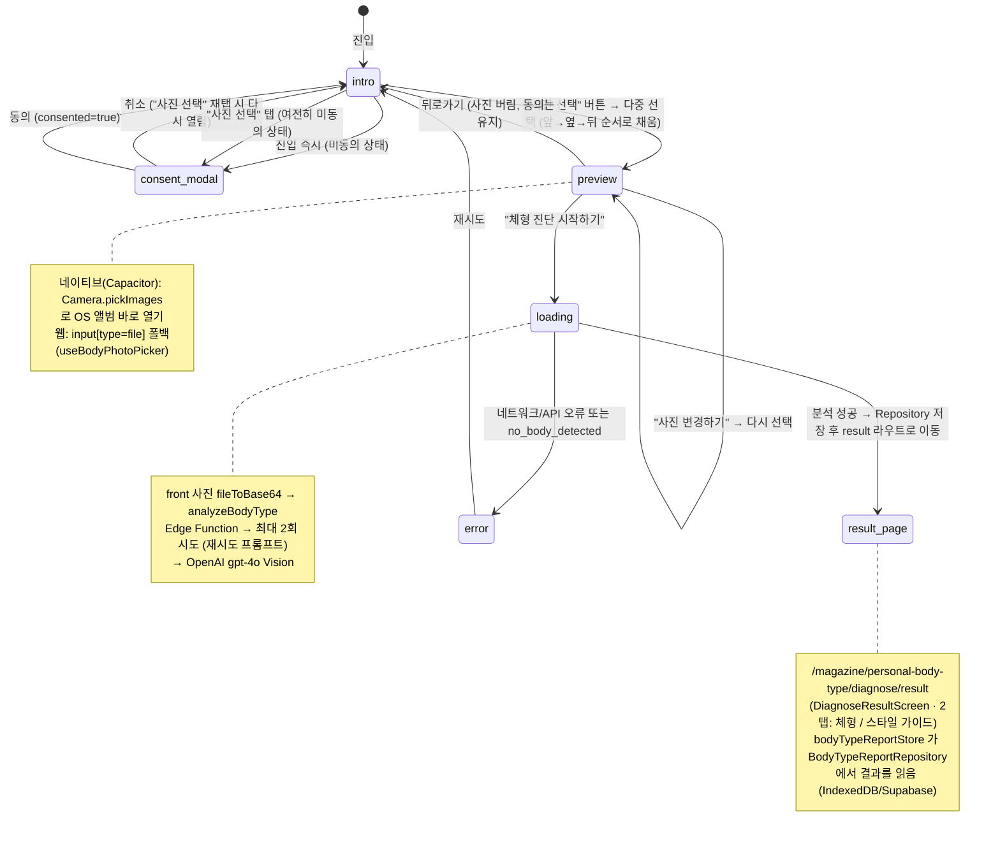
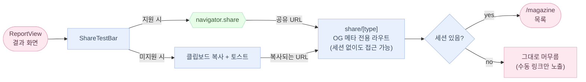
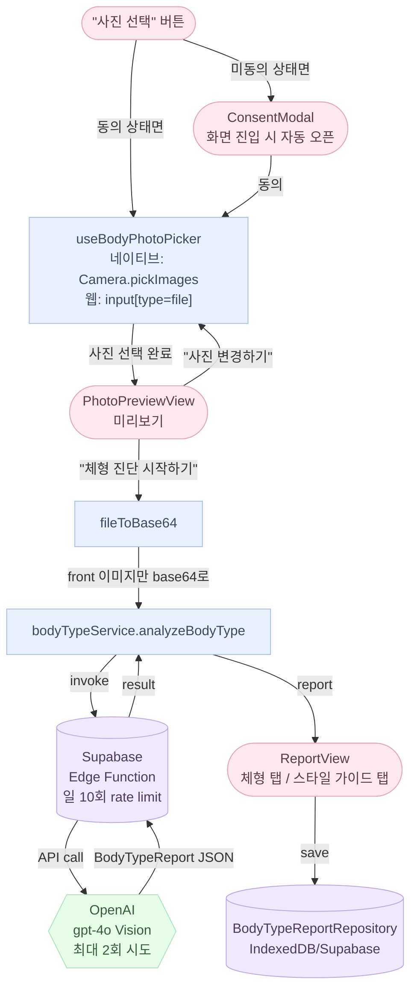

# /magazine/personal-body-type/diagnose 화면 플로우

> 위치: `src/app/(fullscreen)/magazine/personal-body-type/diagnose/page.tsx`, `src/components/diagnose/`

`(fullscreen)` 라우트 그룹에 속합니다 — AppShell·BottomTabNav 없음. 사용자가 직접 진단을 시작할 때만 진입하는 몰입형 플로우입니다.

결과 화면은 별도 라우트 `/magazine/personal-body-type/diagnose/result` (= `DiagnoseResultScreen`)로 분리되어 있으며, `bodyTypeReportStore` (→ `BodyTypeReportRepository`, IndexedDB/Supabase) 에서 결과를 읽어옵니다. 원래는 `sessionStorage` 에만 뒀지만 앱을 껐다 켜면 사라지는 문제가 있어 Repository 로 이관했습니다 — 상세는 [결과 보관](#결과-보관) 참고.

---

## 상태 머신

`DiagnoseScreen` 은 `step` 상태 하나로 전체 플로우를 관리합니다.

```
type Slot = 'front' | 'side' | 'back'

type Step =
  | { kind: 'intro'; photos: Partial<Record<Slot, Photo>>; consent: boolean; consented: boolean }
  | { kind: 'preview'; photos: Partial<Record<Slot, Photo>> }
  | { kind: 'loading'; blurUrl: string }
  | { kind: 'error'; code: BodyTypeAnalyzeError }
```

사진을 고르면 바로 분석하지 않고 `preview` 단계로 먼저 넘어갑니다 — 예전엔 고른 사진이 안내 화면의 작은 슬롯 자리에 들어가 확인이 어려웠기 때문입니다. `preview` 는 `intro` 와 별개 화면(`PhotoPreviewView`)이며, [사진 변경하기]는 사진만 다시 고르고(`preview` 유지), 뒤로가기는 `intro` 로 돌아갑니다(이미 받은 동의는 유지).

Two refs guard against stale closures and React StrictMode's double-mount:

- **`abortRef`** — holds the `AbortController` for the current in-flight `analyzeBodyType` call. Cancelled on unmount and when the user retries.
- **`mountedRef`** — reset to `true` in the effect body on every mount (required to survive StrictMode's double-invoke; without this reset, `mountedRef` stays `false` after the dev-mode unmount and the 95% loading bar hangs because the response is silently dropped).


```mermaid
stateDiagram-v2
    [*] --> intro : 진입
    intro --> consent_modal : 진입 즉시 (미동의 상태)

    consent_modal --> intro : 취소 ("사진 선택" 재탭 시 다시 열림)
    consent_modal --> intro : 동의 (consented=true)

    intro --> preview : "사진 선택" 버튼 → 다중 선택 (앞→옆→뒤 순서로 채움)
    intro --> consent_modal : "사진 선택" 탭 (여전히 미동의 상태)

    preview --> intro : 뒤로가기 (사진 버림, 동의는 유지)
    preview --> preview : "사진 변경하기" → 다시 선택
    preview --> loading : "체형 진단 시작하기"

    loading --> result_page : 분석 성공 → Repository 저장 후 result 라우트로 이동
    loading --> error : 네트워크/API 오류 또는 no_body_detected

    error --> intro : 재시도

    note right of preview
        네이티브(Capacitor): Camera.pickImages
        로 OS 앨범 바로 열기
        웹: input[type=file] 폴백
        (useBodyPhotoPicker)
    end note

    note right of loading
        front 사진 fileToBase64 → analyzeBodyType
        Edge Function → 최대 2회 시도 (재시도 프롬프트)
        → OpenAI gpt-4o Vision
    end note

    note right of result_page
        /magazine/personal-body-type/diagnose/result
        (DiagnoseResultScreen · 2탭: 체형 / 스타일 가이드)
        bodyTypeReportStore 가 BodyTypeReportRepository
        에서 결과를 읽음 (IndexedDB/Supabase)
    end note
```

---

## 단계별 설명

| 단계 | 표시 내용 | 전환 조건 |
|------|-----------|-----------|
| **intro** | 제목·부제 + SlotStrip 3개 (front · side · back, 탭 불가 촬영 가이드) + 촬영 가이드 섹션 + 업로드 방법 섹션 + 잔여 횟수 | 화면 진입 즉시 (미동의 시) → ConsentModal 자동 표시 / 하단 "사진 선택" 버튼 탭 → (동의 상태면) 사진 picker, (미동의 상태면) ConsentModal 재표시 / 사진을 고르면 → preview |
| **consent_modal** | 개인정보 고지 모달 (backdrop 클릭·취소 → 닫힘 / 동의 → 닫힘) | 화면 진입 시 자동 오픈 — 동의해도 이때는 picker 를 열지 않음. "사진 선택" 버튼 탭으로 재오픈된 경우에만 동의 즉시 picker 트리거 |
| **preview** | 고른 사진을 가로 스와이프로 크게 확인 (`PhotoPreviewView`) + [사진 변경하기] + 하단 고정 [체형 진단 시작하기] | [사진 변경하기] → picker 재오픈 (preview 유지) / 뒤로가기 → intro (사진 버림) / [체형 진단 시작하기] → loading |
| **loading** | front 사진 blur 15px + dim 40% 배경 + 원형 진행 표시 + 진행률 % + 결과를 어디서 확인하는지 안내하는 `magazine.diagnose.loading.resultLocation` 문구 | Edge Function 응답 → result 라우트 또는 error |
| **error** | `AlertCircleIcon` + 에러 제목·메시지 + pink pill 재시도 버튼 | 재시도 → intro 초기화 (이미 동의한 상태이므로 ConsentModal 재표시 없음) |

- SlotStrip 은 탭할 수 없는 촬영 가이드 띠입니다. 사진이 없는 슬롯엔 정적 가이드 이미지(`guide-front/side/back.png`)를, 선택된 슬롯엔 실제 미리보기를 보여줍니다.
- 사진 선택은 하단 "사진 선택" 버튼(intro) 또는 "사진 변경하기"(preview) 한 곳에서만 일어나며, 공용 로직은 `useBodyPhotoPicker` 훅입니다. 네이티브(Capacitor)에서는 `Camera.pickImages` 로 OS 앨범을 바로 열고(홈 꾸미기 사진 피커와 동일 패턴), 웹에는 앨범을 직접 여는 API 가 없어 `<input type="file" multiple>` 로 떨어집니다 — 그때 뜨는 다이얼로그는 브라우저가 정합니다. 한 번에 여러 장을 골라 앞→옆→뒤 순서로 채우며, 매 선택마다 이전 선택을 통째로 대체합니다(슬롯별 개별 교체 불가).
- 분석에는 `front` 슬롯 사진만 사용됩니다. `side`, `back` 슬롯은 UX 안내 목적.
- `loading` 단계에서는 뒤로가기 링크가 숨겨집니다 (Edge Function 호출 중 이탈 방지). `beforeunload` 이벤트 리스너도 등록되어 탭 닫기 / 페이지 새로고침 시 브라우저 확인 다이얼로그를 표시합니다.
- 컴포넌트 언마운트(뒤로가기 포함) 또는 재시도 탭 시 현재 in-flight 요청이 `AbortController.abort()`로 취소됩니다. 취소된 요청은 `{ ok: false, error: 'aborted' }` 로 반환되며 화면 상태에 반영하지 않습니다.
- PNG 리포트 내보내기 기능은 Figma 재설계 후 제거됨 (`exportReport.ts` 삭제, 다운로드 버튼 제거).
- 사진은 **어디에도 저장되지 않습니다** — base64 변환 후 Edge Function 에 전달되고 함수 종료 시 폐기.

---

## 결과 화면 (DiagnoseResultScreen + ReportView)

### 결과 보관

분석에 성공하면 `useBodyTypeReportStore.getState().save(report)` 가 먼저 메모리에 반영하고(즉시 result 라우트로 이동), 이어서 `BodyTypeReportRepository` (IndexedDB/Supabase) 에 저장합니다. 원래는 `sessionStorage` 에만 뒀지만 앱을 껐다 켜면 사라지는 문제가 있어 Repository 로 이관했습니다 (Supabase migration `0013_body_type_reports.sql`, 사용자당 1행 jsonb). 로그인 사용자는 다른 기기에서도 같은 결과를 보고, 마이페이지 `MyTestsCard` 도 이 저장소를 읽어 "결과" 행을 띄웁니다. 결과를 지우는 유일한 방법은 결과 화면의 [다른 사진으로 다시하기]뿐입니다.

- 익명 상태에서 진단한 뒤 로그인하면 `anonToRemote` 마이그레이션이 로컬 결과를 한 번 원격으로 올립니다(원격에 이미 있으면 덮어쓰지 않음).
- `bodyTypeReportStore` 는 `rehydrateAll` 대상에 포함되어 로그인/로그아웃 등 repo mode 전환 시 다시 읽습니다.
- 이 기능이 원래 브라우저 저장소(local/sessionStorage)에만 결과를 두던 시절의 값은 최초 hydrate 시 한 번 읽어 Repository 로 올리고 지웁니다 (`src/data/bodyTypeReportStorage.ts`, 키는 `DEPRECATED_KEYS.bodyTypeReportBrowser`).

결과는 2탭으로 구성됩니다.

| 탭 | 내용 |
|----|------|
| **체형 탭** (BodyTab) | "핵심 특징" 섹션 (이모지 불릿 keyTraits 5개 + 해시태그 chips) + 5개 단락 (골격 / 살성 / 라인 / 비율 / 시각적 무게중심) |
| **스타일 가이드 탭** (StyleTab) | 체형별 정적 요약 블록 (quote + 포인트 3줄 + 해시태그 3개, `styleSummary.*` i18n 키) + 의류 카드 4장 (tops · bottoms · dresses · outerwear) + 스타일 카드 2장 (materials · fit) + 디테일 2×2 그리드 (neckline · sleeves · waistDetail · length) |

상단 Hero 영역은 어두운 배경(`brand-gray900`) + 우측에 크롭/줌된 컷아웃 초상 이미지(`straight-cutout.png` / `wave-cutout.png` / `natural-cutout.png`) + 체형명·typeSubtitle·keyTrait 첫 줄. (다운로드 버튼은 Figma 재설계에서 제거됨.)

상단은 `DiagnoseResultTopBar` 가 `fixed` 로 고정되어 왼쪽 뒤로가기 + 오른쪽 "다른 사진으로 다시하기"를 스크롤과 무관하게 항상 노출합니다(재시도 동작이 화면 하단에서 이 바로 이동). 히어로 위에선 반투명 원 + 밝은 아이콘, `ReportView` 의 sticky 탭바가 카드 위로 올라와 바와 겹치는 시점(`stuck`)부터는 `bg-brand-gray50` + 어두운 아이콘으로 전환합니다. `ReportView` 의 탭바는 이 바 높이(`TOP_BAR_HEIGHT = 64`)만큼 아래에서 고정되며, stuck 판정에 쓰는 `IntersectionObserver` 의 `rootMargin` 도 같은 값으로 맞춰 두 컴포넌트의 전환 시점을 정렬합니다. `ReportView` 는 `onStuckChange` 콜백으로 부모(`DiagnoseResultScreen`)에 stuck 상태를 알립니다.

화면 하단은 `ShareTestBar` 가 고정 바로 깔립니다 (`bg-brand-gray900` + `text-brand-pink100`). `navigator.share` 가 있으면 네이티브 공유 시트를, 없으면 링크를 클립보드에 복사하고 토스트를 띄웁니다(`QnaScreen` 의 기존 복사 폴백과 동일 패턴). 공유 시트를 사용자가 취소한 경우는 복사하지 않고 조용히 종료합니다.

---

## 공유 (Share)

`ShareTestBar` 가 공유하는 링크는 아티클이 아니라 `/magazine/personal-body-type/share/[type]` (`straight` / `wave` / `natural`) 라우트입니다. 이유: **`next.config` 의 `output: 'export'`(정적 내보내기)에서는 쿼리스트링으로 OG 메타를 바꿀 수 없어서**, 체형별 공유 카드가 필요하면 타입마다 실제 경로가 있어야 합니다. 같은 제약이 앞으로 "결과별 공유 카드"가 필요한 다른 기능(예: 다른 진단 종류)에서도 재발할 수 있습니다.

- `generateStaticParams` 로 3개 타입을 프리렌더, `generateMetadata` 로 타입별 `og:image`(`og-{type}.png`, 1200×630 · `public/magazine/personal-body-type/`)·title·description 을 부여합니다.
- OG 카드 이미지가 한국어로 제작되어 있어 이 라우트의 메타는 `locale: 'ko_KR'` 로 고정합니다 (루트 `layout.tsx` 의 앱 공용 OG 는 en — 이 라우트만 예외).
- **인증 게이트 예외**: 이 라우트는 `AuthGuard` 의 `PUBLIC_PREFIXES` 화이트리스트에 등록돼 세션 없이도 접근 가능합니다 — MVP2 "첫 진입 강제 `/login` 게이트" 정책의 첫 예외입니다. 링크를 건네받은 사람이 세션 없이 열어도 `/login` 으로 튕기지 않고 이 화면 자체를 봅니다.
- 사람이 직접 링크를 열면 `ShareLandingRedirect` 가 세션이 있을 때만 `/magazine` (매거진 목록) 으로 `router.replace` 합니다. 세션이 없으면 그대로 머무르며 매거진 목록으로 가는 링크만 보여줍니다 — `/magazine` 자체는 `(app)` 그룹이라 `AuthGuard` 뒤에 있어서, 세션 없이 넘기면 결국 `/login` 으로 다시 튕기기 때문입니다. 크롤러는 어느 경우든 메타 태그만 읽고 갑니다.


```mermaid
flowchart LR
    Result(["ReportView\n결과 화면"])
    Bar["ShareTestBar"]
    Native{{"navigator.share"}}
    Copy["클립보드 복사 + 토스트"]
    Share["share/[type]\nOG 메타 전용 라우트\n(세션 없이도 접근 가능)"]
    HasSession{"세션 있음?"}
    Magazine(["/magazine\n목록"])
    Stay["그대로 머무름\n(수동 링크만 노출)"]

    Result --> Bar
    Bar -->|"지원 시"| Native
    Bar -->|"미지원 시"| Copy
    Native -->|"공유 URL"| Share
    Copy -->|"복사되는 URL"| Share
    Share --> HasSession
    HasSession -- yes --> Magazine
    HasSession -- no --> Stay

    classDef ui fill:#FDE8EF,stroke:#E5A8BD,color:#5C3A4A;
    classDef logic fill:#E8F0FD,stroke:#A8BDE5,color:#3A4A5C;
    classDef ext fill:#E8FDE8,stroke:#A8E5BD,color:#3A5C3A;
    class Result,Magazine,Stay ui;
    class Bar,Copy,Share logic;
    class Native ext;
    class HasSession logic;
```

---

## 에러 코드 매핑

`BodyTypeAnalyzeError` 값과 사용자 노출 메시지 키 (`t.magazine.diagnose.error.*`):

| 코드 | 메시지 키 |
|------|-----------|
| `unauthenticated` | `error.unauthenticated` |
| `rate_limit_exceeded` | `error.rateLimitExceeded` |
| `image_too_large` | `error.imageTooLarge` |
| `invalid_media_type` | `error.invalidMediaType` |
| `missing_image` | `error.missingImage` |
| `image_refused` | `error.imageRefused` |
| `no_body_detected` | `error.noBodyDetected` |
| `openai_failed` / `report_parse_failed` | `error.openaiFailed` |
| `openai_unreachable` | `error.openaiUnreachable` |
| `invalid_shot_type` / `invalid_locale` / `unknown` | `error.unknown` |
| `aborted` | 사용자 노출 없음 — 컴포넌트 언마운트 또는 재시도로 인한 취소, 에러 UI 미표시 |

Edge Function 은 `analyzable: false` 또는 일시적 OpenAI 실패(`openai_failed`, `openai_unreachable`) 시 재시도 프롬프트로 1회 자동 재시도합니다 (`MAX_ATTEMPTS = 2`). 재시도 불가(validation·설정 오류) 코드는 즉시 반환합니다. rate limit 는 성공 분석에만 차감됩니다.

---

## 데이터 흐름


```mermaid
flowchart TD
    Consent(["ConsentModal\n화면 진입 시 자동 오픈"])
    Button(["#quot;사진 선택#quot; 버튼"])
    Picker["useBodyPhotoPicker\n네이티브: Camera.pickImages\n웹: input[type=file]"]
    Preview(["PhotoPreviewView\n미리보기"])
    Base64["fileToBase64"]
    Service["bodyTypeService.analyzeBodyType"]
    EdgeFn[("Supabase\nEdge Function\n일 10회 rate limit")]
    OpenAI{{"OpenAI\ngpt-4o Vision\n최대 2회 시도"}}
    Report(["ReportView\n체형 탭 / 스타일 가이드 탭"])
    Repo[("BodyTypeReportRepository\nIndexedDB/Supabase")]

    Button -->|"미동의 상태면"| Consent
    Button -->|"동의 상태면"| Picker
    Consent -->|"동의"| Picker
    Picker -->|"사진 선택 완료"| Preview
    Preview -->|"#quot;사진 변경하기#quot;"| Picker
    Preview -->|"#quot;체형 진단 시작하기#quot;"| Base64
    Base64 -->|"front 이미지만 base64로"| Service
    Service -->|"invoke"| EdgeFn
    EdgeFn -->|"API call"| OpenAI
    OpenAI -->|"BodyTypeReport JSON"| EdgeFn
    EdgeFn -->|"result"| Service
    Service -->|"report"| Report
    Report -->|"save"| Repo

    classDef ui fill:#FDE8EF,stroke:#E5A8BD,color:#5C3A4A;
    classDef logic fill:#E8F0FD,stroke:#A8BDE5,color:#3A4A5C;
    classDef store fill:#F0E8FD,stroke:#BDA8E5,color:#4A3A5C;
    classDef ext fill:#E8FDE8,stroke:#A8E5BD,color:#3A5C3A;
    class Consent,Button,Preview,Report ui;
    class Picker,Base64,Service logic;
    class EdgeFn,Repo store;
    class OpenAI ext;
```

---

## 관련 파일·문서

- `src/components/diagnose/DiagnoseScreen.tsx` — 상태 머신 (intro / preview / consent_modal / loading / error) + SlotStrip(가이드 전용, 탭 불가) + ConsentModal + GuideSection. 하단 CTA 는 `Button.tsx` 의 `BOTTOM_CTA_CLASS` 공유.
- `src/components/diagnose/PhotoPreviewView.tsx` — 사진 선택 직후 전체화면 미리보기 (가로 스와이프, [사진 변경하기] / [체형 진단 시작하기])
- `src/components/diagnose/useBodyPhotoPicker.tsx` — 사진 선택 훅. 네이티브(Capacitor)는 `Camera.pickImages` 로 OS 앨범 직접 오픈, 웹은 `<input type="file">` 폴백
- `src/components/diagnose/DiagnoseResultScreen.tsx` — 결과 라우트 화면 (`bodyTypeReportStore` hydrate, Figma 재설계 후 다운로드 버튼 제거, 상/하단 고정바 조립)
- `src/components/diagnose/DiagnoseResultTopBar.tsx` — 상단 고정바 (뒤로가기 + 다시하기, stuck 시 배경 전환)
- `src/store/bodyTypeReportStore.ts` — 결과 보관 store (hydrate/rehydrate/save/clear), 레거시 브라우저 저장값 1회 승격
- `src/data/repositories/BodyTypeReportRepository.ts` — `get()/save()/clear()`, 사용자당 결과 1건
- `src/data/adapters/indexeddb/IndexedDBBodyTypeReportAdapter.ts`, `src/data/adapters/supabase/SupabaseBodyTypeReportAdapter.ts` — 로컬/원격 구현
- `src/data/bodyTypeReportStorage.ts` — 레거시 local/sessionStorage 결과를 Repository 로 1회 승격 후 삭제 (`DEPRECATED_KEYS.bodyTypeReportBrowser`)
- `supabase/migrations/0013_body_type_reports.sql` — `body_type_reports` 테이블 (user_id PK 1행, report jsonb, RLS 익명 차단)
- `src/components/diagnose/ReportView.tsx` — 2탭 결과 렌더 (Hero · BodyTab · StyleTab), sticky 탭바 stuck 상태를 `onStuckChange` 로 부모에 전달
- `src/components/diagnose/ShareTestBar.tsx` — 하단 고정 공유 바 (네이티브 공유 시트 / 클립보드 복사 폴백)
- `src/components/diagnose/ShareLandingRedirect.tsx` — 공유 라우트 진입 화면. 세션 있으면 `/magazine` 목록으로 리다이렉트, 없으면 그대로 머무름
- `src/components/auth/AuthGuard.tsx` — `PUBLIC_PREFIXES`(`/magazine/personal-body-type/share`)는 세션 없이도 통과
- `src/app/(fullscreen)/magazine/personal-body-type/share/[type]/page.tsx` — 체형별 OG 메타 전용 정적 라우트 (`generateStaticParams` + `generateMetadata`)
- `public/magazine/personal-body-type/og-{straight,wave,natural}.png` — 공유 카드 OG 이미지 (1200×630)
- `src/data/services/bodyTypeService.ts` — Edge Function 호출 + 익명 세션 보장 + `AbortSignal` pass-through
- `src/lib/image/fileToBase64.ts` — File → base64 + 미디어 타입 검증
- `src/types/bodyType.ts` — `BodyTypeReport`, `PrimaryBodyType`, `BodyTypeAnalyzeError`
- `supabase/functions/body-type-analyze/` — Edge Function 본체 (일 10회 limit, MAX_ATTEMPTS=2, temperature 0.3). 프롬프트 파일(`prompt.ts`)에 체형별 참조 블록(keyTraits 5개 / frame / skin / line / proportions / centerOfGravity / styleGuide 등) 추가. 변경 시 `supabase functions deploy body-type-analyze` 재배포 필요.
- `supabase/migrations/0003_body_type_calls.sql` — 일일 호출 카운터 테이블 + RLS
- `docs/components/modal.md` — ConsentModal 이 따르는 공통 모달 설계 규칙
- `supabase/README.md` — Edge Function 배포·시크릿 설정 절차
- `public/magazine/personal-body-type/{straight,wave,natural}.png` — 체형별 전신 배경 이미지
- `public/magazine/personal-body-type/{straight,wave,natural}-cutout.png` — Hero 우측 컷아웃 초상 이미지
- `public/magazine/personal-body-type/guide-{front,side,back}.png` — SlotStrip 촬영 가이드 이미지 (사진 미선택 슬롯에 표시)
