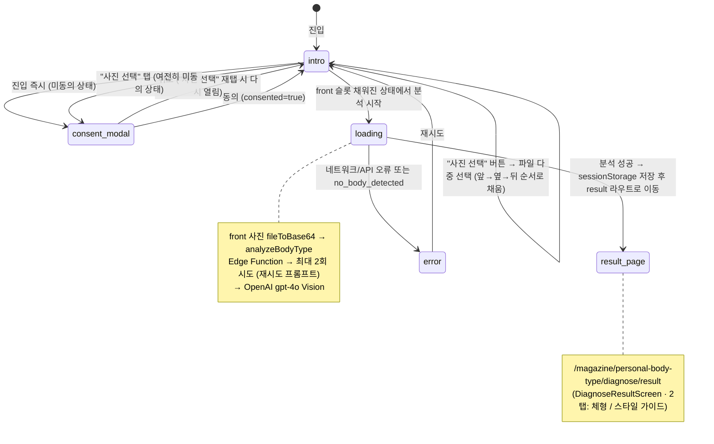
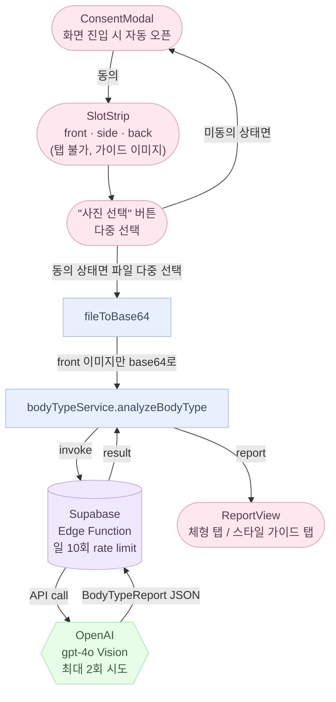

# /magazine/personal-body-type/diagnose 화면 플로우

> 위치: `src/app/(fullscreen)/magazine/personal-body-type/diagnose/page.tsx`, `src/components/diagnose/`

`(fullscreen)` 라우트 그룹에 속합니다 — AppShell·BottomTabNav 없음. 사용자가 직접 진단을 시작할 때만 진입하는 몰입형 플로우입니다.

결과 화면은 별도 라우트 `/magazine/personal-body-type/diagnose/result` (= `DiagnoseResultScreen`)로 분리되어 있으며, `sessionStorage` 키 `REPORT_SESSION_KEY` 로 리포트를 전달받습니다.

---

## 상태 머신

`DiagnoseScreen` 은 `step` 상태 하나로 전체 플로우를 관리합니다.

```
type Slot = 'front' | 'side' | 'back'

type Step =
  | { kind: 'intro'; photos: Partial<Record<Slot, Photo>>; consent: boolean; consented: boolean }
  | { kind: 'loading'; blurUrl: string }
  | { kind: 'error'; code: BodyTypeAnalyzeError }
```

Two refs guard against stale closures and React StrictMode's double-mount:

- **`abortRef`** — holds the `AbortController` for the current in-flight `analyzeBodyType` call. Cancelled on unmount and when the user retries.
- **`mountedRef`** — reset to `true` in the effect body on every mount (required to survive StrictMode's double-invoke; without this reset, `mountedRef` stays `false` after the dev-mode unmount and the 95% loading bar hangs because the response is silently dropped).


```mermaid
stateDiagram-v2
    [*] --> intro : 진입
    intro --> consent_modal : 진입 즉시 (미동의 상태)

    consent_modal --> intro : 취소 ("사진 선택" 재탭 시 다시 열림)
    consent_modal --> intro : 동의 (consented=true)

    intro --> intro : "사진 선택" 버튼 → 파일 다중 선택 (앞→옆→뒤 순서로 채움)
    intro --> consent_modal : "사진 선택" 탭 (여전히 미동의 상태)
    intro --> loading : front 슬롯 채워진 상태에서 분석 시작

    loading --> result_page : 분석 성공 → sessionStorage 저장 후 result 라우트로 이동
    loading --> error : 네트워크/API 오류 또는 no_body_detected

    error --> intro : 재시도

    note right of loading
        front 사진 fileToBase64 → analyzeBodyType
        Edge Function → 최대 2회 시도 (재시도 프롬프트)
        → OpenAI gpt-4o Vision
    end note

    note right of result_page
        /magazine/personal-body-type/diagnose/result
        (DiagnoseResultScreen · 2탭: 체형 / 스타일 가이드)
    end note
```

---

## 단계별 설명

| 단계 | 표시 내용 | 전환 조건 |
|------|-----------|-----------|
| **intro** | 제목·부제 + SlotStrip 3개 (front · side · back, 탭 불가 촬영 가이드) + 촬영 가이드 섹션 + 업로드 방법 섹션 + 잔여 횟수 | 화면 진입 즉시 (미동의 시) → ConsentModal 자동 표시 / 하단 "사진 선택" 버튼 탭 → (동의 상태면) 파일 picker, (미동의 상태면) ConsentModal 재표시 / front 채운 뒤 분석 버튼 → loading |
| **consent_modal** | 개인정보 고지 모달 (backdrop 클릭·취소 → 닫힘 / 동의 → 닫힘) | 화면 진입 시 자동 오픈 — 동의해도 이때는 파일 picker 를 열지 않음. "사진 선택" 버튼 탭으로 재오픈된 경우에만 동의 즉시 파일 picker 트리거 |
| **loading** | front 사진 blur 15px + dim 40% 배경 + 원형 진행 표시 + 진행률 % + 결과를 어디서 확인하는지 안내하는 `magazine.diagnose.loading.resultLocation` 문구 | Edge Function 응답 → result 라우트 또는 error |
| **error** | `AlertCircleIcon` + 에러 제목·메시지 + pink pill 재시도 버튼 | 재시도 → intro 초기화 (이미 동의한 상태이므로 ConsentModal 재표시 없음) |

- SlotStrip 은 탭할 수 없는 촬영 가이드 띠입니다. 사진이 없는 슬롯엔 정적 가이드 이미지(`guide-front/side/back.png`)를, 선택된 슬롯엔 실제 미리보기를 보여줍니다.
- 사진 선택은 하단 "사진 선택" 버튼 한 곳에서만 일어납니다. `<input multiple>` 로 여러 장을 한 번에 골라 앞→옆→뒤 순서로 채우며, 매 선택마다 이전 선택을 통째로 대체합니다(슬롯별 개별 교체 불가).
- 분석에는 `front` 슬롯 사진만 사용됩니다. `side`, `back` 슬롯은 UX 안내 목적.
- `loading` 단계에서는 뒤로가기 링크가 숨겨집니다 (Edge Function 호출 중 이탈 방지). `beforeunload` 이벤트 리스너도 등록되어 탭 닫기 / 페이지 새로고침 시 브라우저 확인 다이얼로그를 표시합니다.
- 컴포넌트 언마운트(뒤로가기 포함) 또는 재시도 탭 시 현재 in-flight 요청이 `AbortController.abort()`로 취소됩니다. 취소된 요청은 `{ ok: false, error: 'aborted' }` 로 반환되며 화면 상태에 반영하지 않습니다.
- PNG 리포트 내보내기 기능은 Figma 재설계 후 제거됨 (`exportReport.ts` 삭제, 다운로드 버튼 제거).
- 사진은 **어디에도 저장되지 않습니다** — base64 변환 후 Edge Function 에 전달되고 함수 종료 시 폐기.

---

## 결과 화면 (DiagnoseResultScreen + ReportView)

결과는 2탭으로 구성됩니다.

| 탭 | 내용 |
|----|------|
| **체형 탭** (BodyTab) | "핵심 특징" 섹션 (이모지 불릿 keyTraits 5개 + 해시태그 chips) + 5개 단락 (골격 / 살성 / 라인 / 비율 / 시각적 무게중심) |
| **스타일 가이드 탭** (StyleTab) | 체형별 정적 요약 블록 (quote + 포인트 3줄 + 해시태그 3개, `styleSummary.*` i18n 키) + 의류 카드 4장 (tops · bottoms · dresses · outerwear) + 스타일 카드 2장 (materials · fit) + 디테일 2×2 그리드 (neckline · sleeves · waistDetail · length) |

상단 Hero 영역은 어두운 배경(`brand-gray900`) + 우측에 크롭/줌된 컷아웃 초상 이미지(`straight-cutout.png` / `wave-cutout.png` / `natural-cutout.png`) + 체형명·typeSubtitle·keyTrait 첫 줄. 다시하기 pill 은 `ReportView` 내부에 배치됩니다. (다운로드 버튼은 Figma 재설계에서 제거됨.)

---

## 에러 코드 매핑

`BodyTypeAnalyzeError` 값과 사용자 노출 메시지 키 (`t.magazine.diagnose.error.*`):

| 코드 | 메시지 키 |
|------|-----------|
| `unauthenticated` | `error.unauthenticated` |
| `rate_limit_exceeded` | `error.rateLimitExceeded` |
| `image_too_large` | `error.imageTooLarge` |
| `invalid_media_type` | `error.invalidMediaType` |
| `missing_image` | `error.missingImage` |
| `image_refused` | `error.imageRefused` |
| `no_body_detected` | `error.noBodyDetected` |
| `openai_failed` / `report_parse_failed` | `error.openaiFailed` |
| `openai_unreachable` | `error.openaiUnreachable` |
| `invalid_shot_type` / `invalid_locale` / `unknown` | `error.unknown` |
| `aborted` | 사용자 노출 없음 — 컴포넌트 언마운트 또는 재시도로 인한 취소, 에러 UI 미표시 |

Edge Function 은 `analyzable: false` 또는 일시적 OpenAI 실패(`openai_failed`, `openai_unreachable`) 시 재시도 프롬프트로 1회 자동 재시도합니다 (`MAX_ATTEMPTS = 2`). 재시도 불가(validation·설정 오류) 코드는 즉시 반환합니다. rate limit 는 성공 분석에만 차감됩니다.

---

## 데이터 흐름


```mermaid
flowchart TD
    Consent(["ConsentModal\n화면 진입 시 자동 오픈"])
    Picker(["SlotStrip\nfront · side · back\n(탭 불가, 가이드 이미지)"])
    Button(["#quot;사진 선택#quot; 버튼\n다중 선택"])
    Base64["fileToBase64"]
    Service["bodyTypeService.analyzeBodyType"]
    EdgeFn[("Supabase\nEdge Function\n일 10회 rate limit")]
    OpenAI{{"OpenAI\ngpt-4o Vision\n최대 2회 시도"}}
    Report(["ReportView\n체형 탭 / 스타일 가이드 탭"])

    Consent -->|"동의"| Picker
    Picker --> Button
    Button -->|"미동의 상태면"| Consent
    Button -->|"동의 상태면 파일 다중 선택"| Base64
    Base64 -->|"front 이미지만 base64로"| Service
    Service -->|"invoke"| EdgeFn
    EdgeFn -->|"API call"| OpenAI
    OpenAI -->|"BodyTypeReport JSON"| EdgeFn
    EdgeFn -->|"result"| Service
    Service -->|"report"| Report

    classDef ui fill:#FDE8EF,stroke:#E5A8BD,color:#5C3A4A;
    classDef logic fill:#E8F0FD,stroke:#A8BDE5,color:#3A4A5C;
    classDef store fill:#F0E8FD,stroke:#BDA8E5,color:#4A3A5C;
    classDef ext fill:#E8FDE8,stroke:#A8E5BD,color:#3A5C3A;
    class Consent,Picker,Button,Report ui;
    class Base64,Service logic;
    class EdgeFn store;
    class OpenAI ext;
```

---

## 관련 파일·문서

- `src/components/diagnose/DiagnoseScreen.tsx` — 상태 머신 (intro / consent_modal / loading / error) + SlotStrip(가이드 전용, 탭 불가) + ConsentModal + GuideSection. 하단 CTA 는 `Button.tsx` 의 `BOTTOM_CTA_CLASS` 공유.
- `src/components/diagnose/DiagnoseResultScreen.tsx` — 결과 라우트 화면 (sessionStorage 수신, Figma 재설계 후 다운로드 버튼 제거)
- `src/components/diagnose/ReportView.tsx` — 2탭 결과 렌더 (Hero · BodyTab · StyleTab)
- `src/data/services/bodyTypeService.ts` — Edge Function 호출 + 익명 세션 보장 + `AbortSignal` pass-through
- `src/lib/image/fileToBase64.ts` — File → base64 + 미디어 타입 검증
- `src/types/bodyType.ts` — `BodyTypeReport`, `PrimaryBodyType`, `BodyTypeAnalyzeError`
- `supabase/functions/body-type-analyze/` — Edge Function 본체 (일 10회 limit, MAX_ATTEMPTS=2, temperature 0.3). 프롬프트 파일(`prompt.ts`)에 체형별 참조 블록(keyTraits 5개 / frame / skin / line / proportions / centerOfGravity / styleGuide 등) 추가. 변경 시 `supabase functions deploy body-type-analyze` 재배포 필요.
- `supabase/migrations/0003_body_type_calls.sql` — 일일 호출 카운터 테이블 + RLS
- `docs/components/modal.md` — ConsentModal 이 따르는 공통 모달 설계 규칙
- `supabase/README.md` — Edge Function 배포·시크릿 설정 절차
- `public/magazine/personal-body-type/{straight,wave,natural}.png` — 체형별 전신 배경 이미지
- `public/magazine/personal-body-type/{straight,wave,natural}-cutout.png` — Hero 우측 컷아웃 초상 이미지
- `public/magazine/personal-body-type/guide-{front,side,back}.png` — SlotStrip 촬영 가이드 이미지 (사진 미선택 슬롯에 표시)
