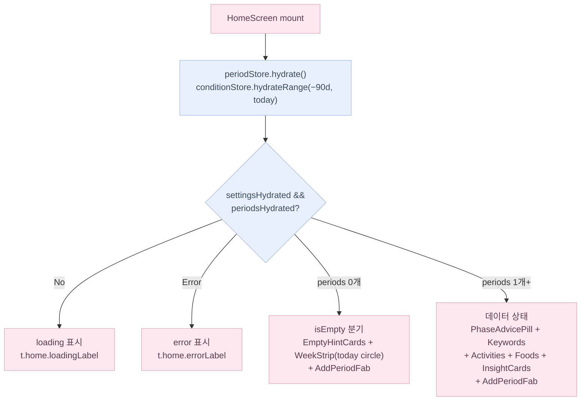
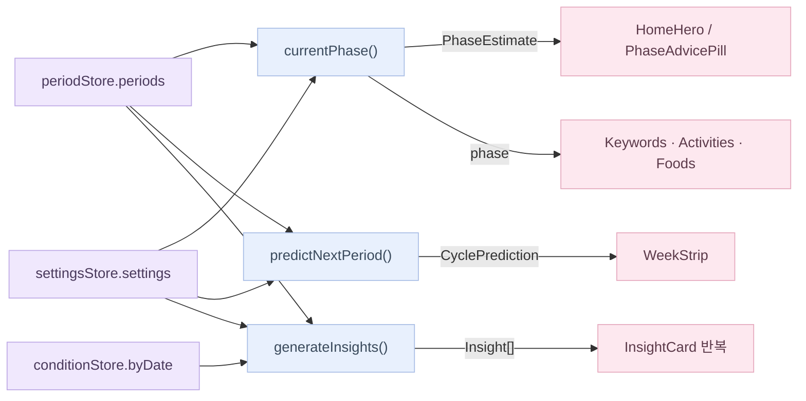
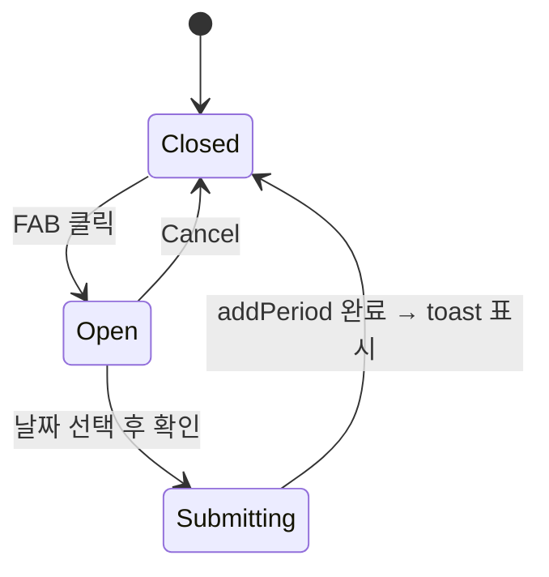

# 홈 화면 플로우

> 위치: `src/components/app/{HomeScreen,HomeHero,WeekStrip,EmptyHintCard,PhaseAdvicePill,KeywordCards,ActivitySuggestions,FoodSuggestions,AddPeriodFab}.tsx`, `src/app/(app)/page.tsx`

## 화면 상태 분기

### isEmpty 분기 상세

- **HomeHero**: `isEmpty=true` → dwee 로고 + 별 아이콘 + `editHint` 가이드 문구 표시
- **WeekStrip**: 예측 데이터 없이 오늘 날짜 원만 표시 (pink50 배경, pink800 텍스트)
- **PhaseAdvicePill**: 숨김 → `EmptyHintCard`(+ 캘린더 FAB 안내) 로 대체
- **Keywords / Activities / Foods**: 각 섹션에 `EmptyHintCard` placeholder 삽입
- **AddPeriodFab**: isEmpty 여부와 무관하게 항상 노출 (우하단 고정)

> 이전 `setupMode` (인라인 `SetupPeriodPicker` 캘린더 picker) 는 삭제됨.
> 생리 첫 기록은 항상 `AddPeriodFab` → FAB 탭 → 날짜 선택 흐름으로 통일.

## 데이터 흐름 (데이터 상태)

## WeekStrip 색상 분기

| 날짜 유형 | 배경 | 텍스트 |
|-----------|------|--------|
| 실제 생리 기록 | `brand-pink100` | `brand-pink900` |
| 예측 생리일 | `brand-pink50` | `brand-pink800` |
| 오늘 (isEmpty) | `brand-pink50` | `brand-pink800` |
| 오늘 (데이터 있음) | 위 분류 우선, 없으면 강조 원 | — |

## AddPeriodFab 내부 상태

## 검증 케이스

- `periods.length === 0` → isEmpty 분기. 모든 콘텐츠 섹션에 EmptyHintCard. WeekStrip은 오늘만 표시.
- `periods.length === 1` → 데이터 상태. `cycle_regularity` 인사이트는 안 뜸 (rule이 `cycleLengths.length < 2` 로 null).
- `periods.length >= 2` → 두 인사이트 모두 평가됨, 적합한 것만 카드로 표시.
- `prediction.predictedDate === null` → "Not enough data yet" / "아직 예측하기 어려워요" 표시.
- 다음 생리까지 0일 → "around today" / "오늘 즈음" 표시.
- 다음 생리 예정일이 지남 (`diff < 0`) → "N days late" / "N일 지남" 표시.
- 의료적 단정 표현 없음 — 모든 phase 카피에 "추정/보여요/패턴" / "estimated/pattern/reference" 어휘 동반 (health-copy.md §1).
