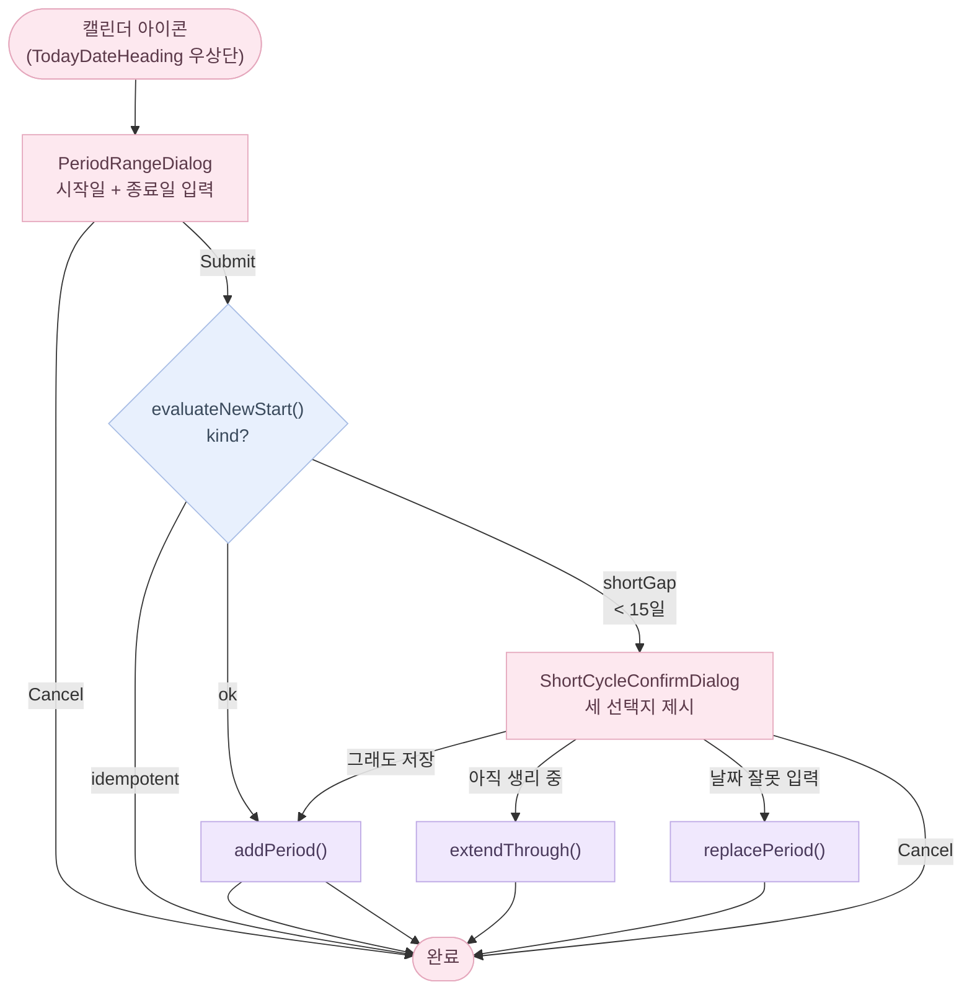
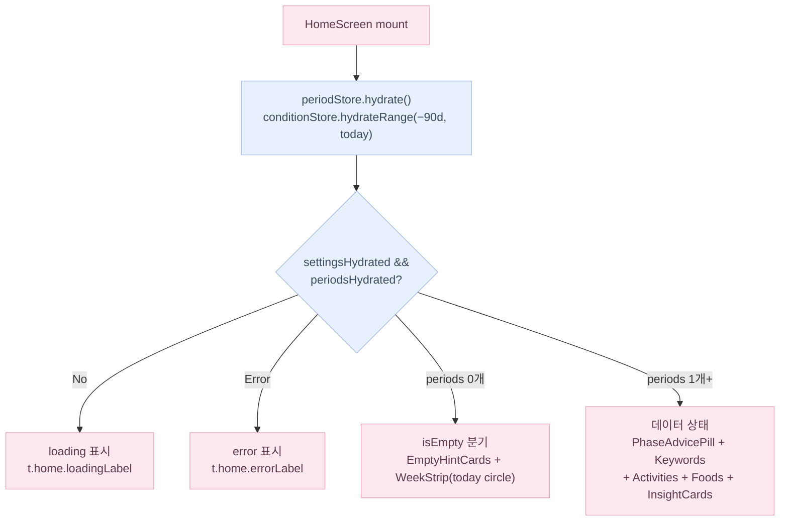
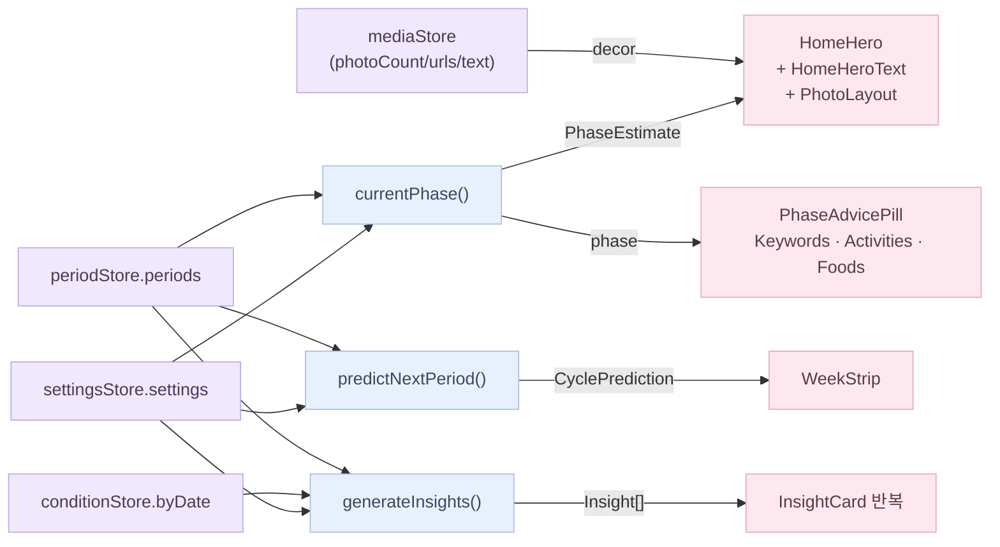

# 홈 화면 플로우

> 위치: `src/components/app/{HomeScreen,HomeHero,WeekStrip,EmptyHintCard,PhaseAdvicePill,KeywordCards,ActivitySuggestions,FoodSuggestions,TodayDateHeading,CalendarAddIcon,PeriodRangeDialog,ShortCycleConfirmDialog}.tsx`, `src/app/(app)/page.tsx`

## 생리 기록 진입점

**우상단 캘린더 아이콘**이 유일한 진입점입니다. `TodayDateHeading` 컴포넌트의 캘린더 아이콘을 탭하면 `PeriodRangeDialog`가 열립니다. 기존 우하단 FAB(`AddPeriodFab`)은 삭제되었습니다.

## 화면 상태 분기

### isEmpty 분기 상세

- **HomeHero**: `isEmpty && !isCustom && !hasUserText` 조건이 모두 참일 때만 `editHint` 가이드 문구 표시.  
  `isCustom` = photoCount 슬롯이 전부 채워진 경우, `hasUserText` = mainText 또는 subText 가 비어있지 않은 경우.  
  배경은 기본 `bg-brand-gray300`. 사진이 있으면 `PhotoLayout`(1/2/4 그리드), 텍스트가 있으면 `HomeHeroText` 오버레이 표시.
- **WeekStrip**: 예측 데이터 없이 오늘 날짜 원만 표시 (pink50 배경, pink800 텍스트)
- **PhaseAdvicePill**: 숨김 → `EmptyHintCard`(`t.home.empty.bodyPrefix` + 캘린더 아이콘 인라인 + `t.home.empty.bodySuffix`) 로 대체
- **Keywords / Activities / Foods**: 각 섹션에 `EmptyHintCard` placeholder 삽입. 섹션 간 간격 `gap-12`.

> 이전 `setupMode` (인라인 `SetupPeriodPicker` 캘린더 picker) 는 삭제됨.  
> 이전 우하단 `AddPeriodFab` 도 삭제됨. 기록 진입은 `TodayDateHeading` 캘린더 아이콘으로 통일.

## 데이터 흐름 (데이터 상태)

## WeekStrip 색상 분기

| 날짜 유형 | 배경 | 텍스트 |
|-----------|------|--------|
| 실제 생리 기록 | `brand-pink100` | `brand-pink900` |
| 예측 생리일 | `brand-pink50` | `brand-pink800` |
| 오늘 (isEmpty) | `brand-pink50` | `brand-pink800` |
| 오늘 (데이터 있음) | 위 분류 우선, 없으면 강조 원 | — |

## ActivitySuggestions / FoodSuggestions 구조

- **ActivitySuggestions**: chip 필터 탭(카테고리별) + 카드 그리드. `src/data/homeImagery.ts`의 `ACTIVITY_CATEGORY_KEYS` 순서 기반.
- **FoodSuggestions**: 원형 카드 carousel. phase 기반 음식 목록을 `home.foods.{phase}` i18n 키에서 조회.

## 검증 케이스

- `periods.length === 0` → isEmpty 분기. 모든 콘텐츠 섹션에 EmptyHintCard. WeekStrip은 오늘만 표시.
- `periods.length === 1` → 데이터 상태. `cycle_regularity` 인사이트는 안 뜸 (rule이 `cycleLengths.length < 2` 로 null).
- `periods.length >= 2` → 두 인사이트 모두 평가됨, 적합한 것만 카드로 표시.
- `prediction.predictedDate === null` → "Not enough data yet" / "아직 예측하기 어려워요" 표시.
- 다음 생리까지 0일 → "around today" / "오늘 즈음" 표시.
- 다음 생리 예정일이 지남 (`diff < 0`) → "N days late" / "N일 지남" 표시.
- 짧은 주기 (`evaluateNewStart` → `shortGap`) → `ShortCycleConfirmDialog` 노출. 세 선택지: extend / replace / saveAnyway. (상세: `docs/qa/edge-cases.md` 시나리오 6)
- 의료적 단정 표현 없음 — 모든 phase 카피에 "추정/보여요/패턴" / "estimated/pattern/reference" 어휘 동반 (health-copy.md §1).
