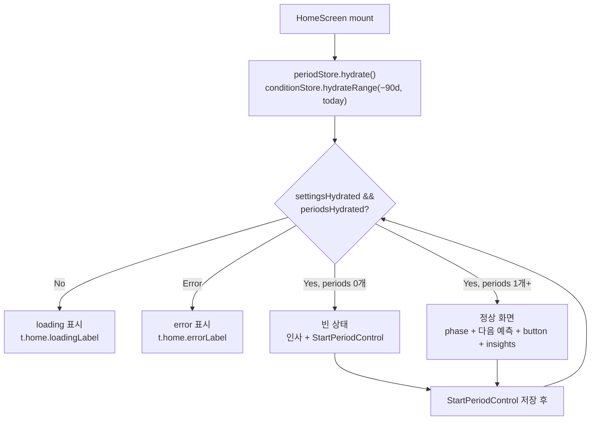
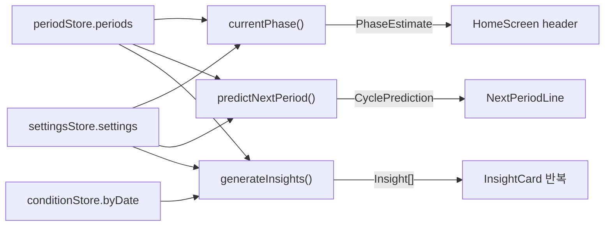
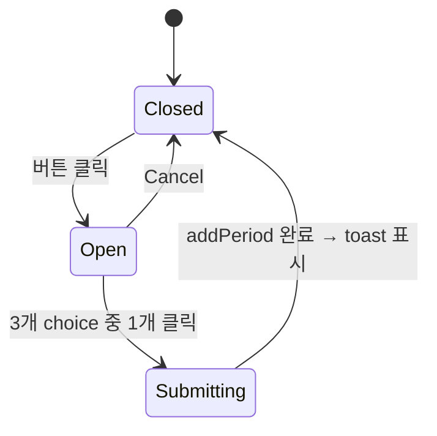

# 홈 화면 플로우 (STEP 9.2)

> 위치: `src/components/app/{HomeScreen,StartPeriodControl,InsightCard}.tsx`, `src/app/(app)/page.tsx`
> 결정 적용: A4 = 생리 시작은 −2일/−1일/오늘 3개 버튼 (master plan "±2일" 추천에서 미래 날짜 제외 — "생리 시작" 의미상 미래값 부적절).

## 화면 상태 분기

## 데이터 흐름 (정상 상태)

## StartPeriodControl 내부 상태

## 검증 케이스

- `periods.length === 0` → Empty UI (인사 + 시작 버튼만)
- `periods.length === 1` → Normal UI, `cycle_regularity` 인사이트는 안 뜸 (rule이 `cycleLengths.length < 2`로 null)
- `periods.length >= 2` → 두 인사이트 모두 평가됨, 적합한 것만 카드로 표시
- `prediction.predictedDate === null` → "아직 예측하기 어려워요" 표시
- 다음 생리까지 0일 → "오늘 즈음" 표시
- 다음 생리 예정일이 지남 (`diff < 0`) → "N일 지남" 표시
- 의료적 단정 표현 없음 — 모든 phase 카피에 "추정/보여요/패턴" 어휘 동반 (health-copy.md §1)
