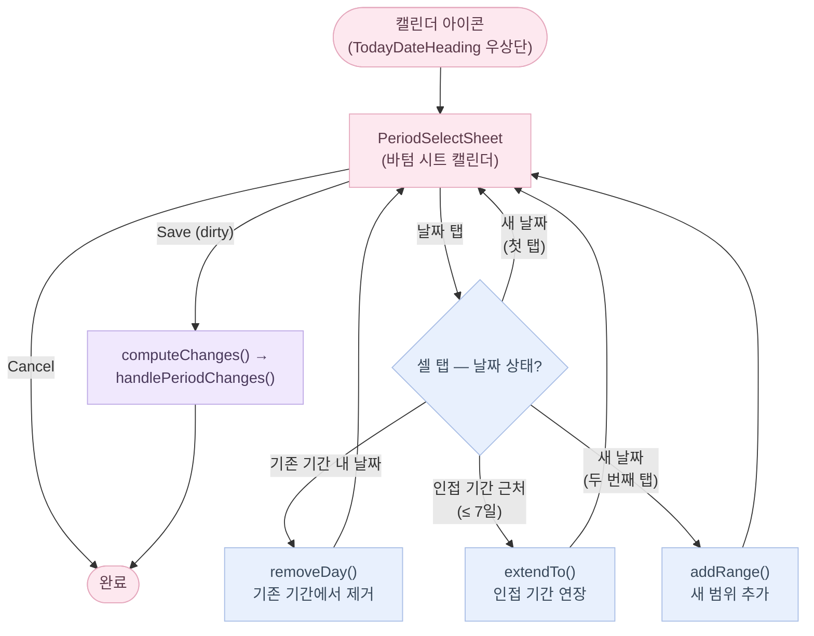
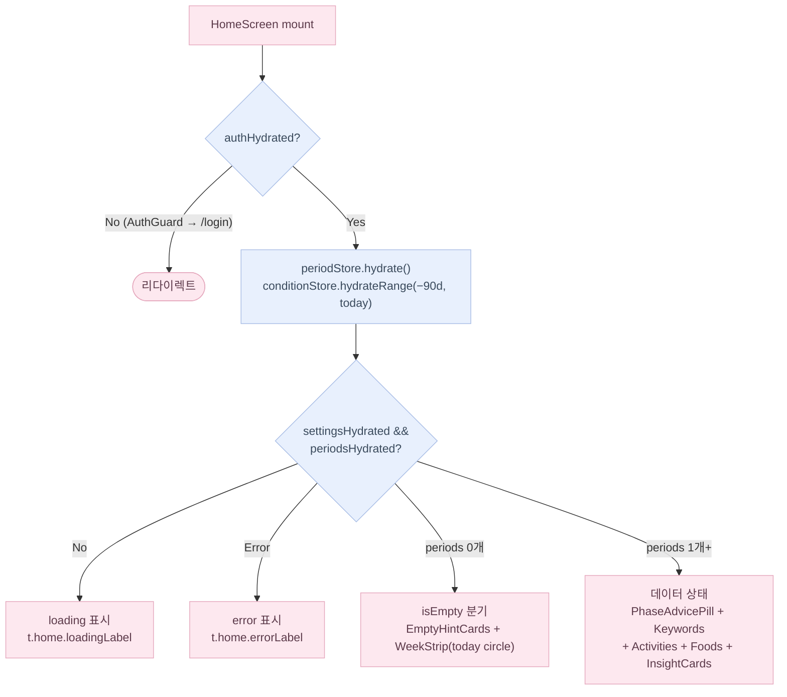
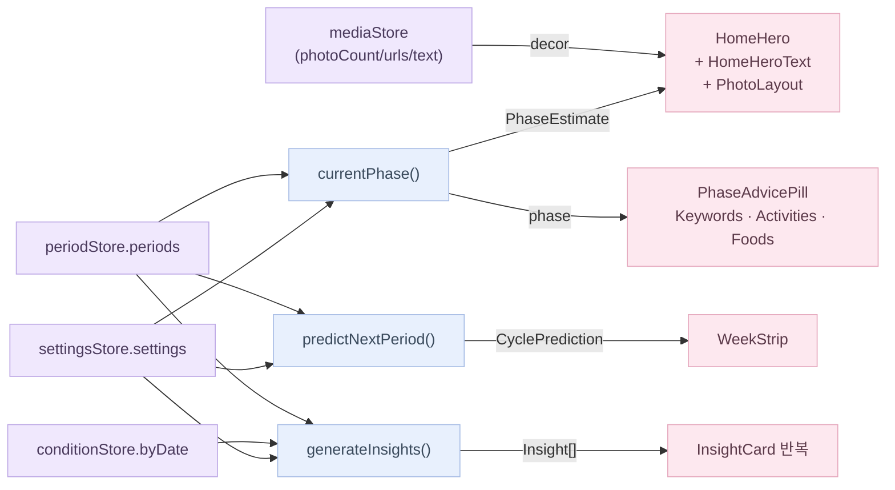

# 홈 화면 플로우

> 위치: `src/components/app/{HomeScreen,HomeHero,WeekStrip,EmptyHintCard,PhaseAdvicePill,ScratchKeywordCard,ActivitySuggestions,FoodSuggestions,FoodArticleScreen,TodayDateHeading,PeriodSelectSheet}.tsx`, `src/components/ui/icons/PeriodAddIcon.tsx`, `src/app/(app)/page.tsx`, `src/app/(fullscreen)/foods/[id]/page.tsx`, `src/content/foods/{index,articles-en,articles-ko}.ts`

## 생리 기록 진입점

**우상단 캘린더 아이콘**이 유일한 진입점입니다. `TodayDateHeading` 컴포넌트의 캘린더 아이콘을 탭하면 `PeriodSelectSheet` (바텀 시트 캘린더)가 열립니다. 기존 우하단 FAB(`AddPeriodFab`)과 `PeriodRangeDialog` + `ShortCycleConfirmDialog` 조합은 완전히 삭제되었습니다 — 두 컴포넌트 파일 모두 저장소에 남아 있지 않습니다.

`PeriodSelectSheet`는 최근 N개월 캘린더 그리드를 보여주며, 날짜 셀을 탭하면 `domain/cycle/periodEdit.ts`의 순수 함수로 드래프트를 조작합니다. 저장 시 `PeriodChange[]` diff를 `HomeScreen.handlePeriodChanges`로 전달해 add / update / remove를 일괄 적용합니다.

> 로그인 직후 기록 0건 + `!settings.onboardingCompleted` 상태의 첫 홈 진입에는 같은 컴포넌트가 `variant="intro"`로 다른 배경 위에 뜬다 (헤더 없이 "시작하기" 하나). 결과 분기와 저장 위치는 [`docs/flows/onboarding.md`](./onboarding.md) 참고.

```mermaid
flowchart TD
    Icon(["캘린더 아이콘\n(TodayDateHeading 우상단)"])
    Sheet["PeriodSelectSheet\n(바텀 시트 캘린더)"]
    Tap{"셀 탭 — 날짜 상태?"}
    Remove["removeDay()\n기존 기간에서 제거"]
    Extend["extendTo()\n인접 기간 연장"]
    Range["addRange()\n새 범위 추가"]
    Save["computeChanges() →\nhandlePeriodChanges()"]
    Done(["완료"])

    Icon --> Sheet
    Sheet -->|"Cancel"| Done
    Sheet -->|"날짜 탭"| Tap
    Tap -->|"기존 기간 내 날짜"| Remove --> Sheet
    Tap -->|"인접 기간 근처\n(≤ 7일)"| Extend --> Sheet
    Tap -->|"새 날짜\n(첫 탭)"| Sheet
    Tap -->|"새 날짜\n(두 번째 탭)"| Range --> Sheet
    Sheet -->|"Save (dirty)"| Save --> Done

    classDef ui fill:#FDE8EF,stroke:#E5A8BD,color:#5C3A4A;
    classDef logic fill:#E8F0FD,stroke:#A8BDE5,color:#3A4A5C;
    classDef store fill:#F0E8FD,stroke:#BDA8E5,color:#4A3A5C;
    class Icon,Sheet,Done ui;
    class Tap,Remove,Extend,Range logic;
    class Save store;
```

## 화면 상태 분기

```mermaid
flowchart TD
    Mount["HomeScreen mount"] --> Auth{"authHydrated?"}
    Auth -->|"No (AuthGuard → /login)"| Done2(["리다이렉트"])
    Auth -->|"Yes"| Hydrate["periodStore.hydrate()\nconditionStore.hydrateRange(−90d, today)"]
    Hydrate --> Check{"settingsHydrated &&\nperiodsHydrated?"}
    Check -->|"No"| Loading["loading 표시\nt.home.loadingLabel"]
    Check -->|"Error"| Error["error 표시\nt.home.errorLabel"]
    Check -->|"periods 0개"| Empty["isEmpty 분기\nEmptyHintCards + WeekStrip(today circle)"]
    Check -->|"periods 1개+"| Normal["데이터 상태\nPhaseAdvicePill + Keywords\n+ Activities + Foods + InsightCards"]

    classDef ui fill:#FDE8EF,stroke:#E5A8BD,color:#5C3A4A;
    classDef logic fill:#E8F0FD,stroke:#A8BDE5,color:#3A4A5C;
    class Mount,Loading,Error,Empty,Normal,Done2 ui;
    class Auth,Hydrate,Check logic;
```

### isEmpty 분기 상세

- **HomeHero**: `!isCustom && !hasUserText` 조건이 모두 참일 때만 `editHint` 가이드 문구 표시 (isEmpty 는 이 조건에 관여하지 않음 — 데이터 상태에서도 사진·텍스트 미설정이면 같은 힌트가 뜬다).  
  `isCustom` = photoCount 슬롯이 전부 채워진 경우, `hasUserText` = mainText 또는 subText 가 비어있지 않은 경우.  
  기본(커스터마이즈 전) 히어로는 `/home/default-hero.jpg`. 사진이 설정되면 `PhotoLayout`(1/2/4 그리드), 텍스트가 있으면 `HomeHeroText` 오버레이 표시.
- **WeekStrip**: 예측 데이터 없이 오늘 날짜 원만 표시 (pink50 배경, pink800 텍스트)
- **PhaseAdvicePill**: 숨김 → `EmptyHintCard`(`t.home.empty.bodyPrefix` + 캘린더 아이콘 인라인 + `t.home.empty.bodySuffix`) 로 대체
- **Keywords / Activities / Foods**: 각 섹션에 `EmptyHintCard` placeholder 삽입. 섹션 간 간격 `gap-12`.

> 이전 `setupMode` (인라인 `SetupPeriodPicker` 캘린더 picker) 는 삭제됨.  
> 이전 우하단 `AddPeriodFab` 도 삭제됨.  
> 이전 `PeriodRangeDialog` + `ShortCycleConfirmDialog` 조합도 파일째 삭제됨.  
> 기록 진입은 `TodayDateHeading` 캘린더 아이콘 → `PeriodSelectSheet` 로 통일.

## 데이터 흐름 (데이터 상태)

```mermaid
flowchart LR
    PS["periodStore.periods"] --> CP["currentPhase()"]
    SS["settingsStore.settings"] --> CP
    PS --> PNP["predictNextPeriod()"]
    SS --> PNP
    PS --> GI["generateInsights()"]
    CS["conditionStore.byDate"] --> GI
    SS --> GI
    MS["mediaStore\n(photoCount/urls/text)"] -->|"decor"| Hero

    CP -->|"PhaseEstimate"| Hero["HomeHero\n+ HomeHeroText\n+ PhotoLayout"]
    CP -->|"phase"| Cards["PhaseAdvicePill\nKeywords · Activities · Foods"]
    PNP -->|"CyclePrediction"| Strip["WeekStrip"]
    GI -->|"Insight[]"| IC["InsightCard 반복"]

    classDef store fill:#F0E8FD,stroke:#BDA8E5,color:#4A3A5C;
    classDef logic fill:#E8F0FD,stroke:#A8BDE5,color:#3A4A5C;
    classDef ui fill:#FDE8EF,stroke:#E5A8BD,color:#5C3A4A;
    class PS,SS,CS,MS store;
    class CP,PNP,GI logic;
    class Hero,Cards,Strip,IC ui;
```

## WeekStrip 색상 분기

WeekStrip은 날짜마다 `CycleState`(`'actualPeriod' | 'predictedPeriod' | 'predictedFertile' | null`)를 계산하고 우선순위 순(실제 생리 > 예측 생리 > 예측 가임기 > 기본)으로 스타일을 적용합니다.

| 날짜 유형 (`CycleState`) | 외곽선 | 배경 | 텍스트 |
|--------------------------|--------|------|--------|
| `actualPeriod` — 실제 생리 기록 | 없음 | `brand-pink100` (fill) | `brand-pink900` |
| `predictedPeriod` — 예측 생리일 | `brand-pink100` (outline) | 없음 | `brand-pink800` |
| `predictedFertile` — 예측 가임기 | `brand-lavender100` (outline) | 없음 | `brand-lavender400` |
| `null` / 오늘 (isEmpty) | 없음 | `brand-pink50` (today circle) | `brand-pink800` |
| `null` / 오늘 (데이터 있음, 해당 없음) | 강조 원 | 위 분류 우선 | — |

가임기 예측은 `domain/cycle/fertile.ts`의 `predictFertileWindow(predictedDate, predictionConfidence)` 순수 함수가 담당하며, `predictionConfidence`가 낮으면 null을 반환해 WeekStrip에 표시하지 않습니다.

## ActivitySuggestions / FoodSuggestions 구조

- **ActivitySuggestions**: chip 필터 탭(카테고리별: emotion / exercise / work / selfcare) + 톤 순환 카드(gray → pink → dark → gray). 각 카드는 제목·인라인 이모지·설명·duration pill(`durationMinutes` + `t.home.durationSuffix`)을 표시. `src/data/homeImagery.ts`의 `ACTIVITY_CATEGORY_KEYS` 순서 기반.
- **FoodSuggestions**: phase별로 두 가지 렌더링 중 하나를 고른다 (`FOOD_BOWL_IMAGE[phase]` 존재 여부로 분기).
  - **PhotoBowl** (menstrual/follicular/ovulation/luteal) — Figma 시안에서 내보낸 주기별 합성 사진 1장(`public/home/foods/<phase>.png`) 위에 dark pill 라벨을 얹는다. 라벨 위치는 `FOOD_LABEL_POSITION`에 음식 id별 `{ left, top }` %좌표로 저장되어 있어 사진 속 실제 식재료 자리에 붙고, 이미지가 리사이즈돼도 상대 위치를 유지한다.
  - **EmojiBowl** (unknown) — 사진 시안이 아직 없는 주기용 폴백. 기존 CSS로 그린 그릇 위에 이모지 4개 + dark pill 라벨을 겹쳐 배치하던 원래 렌더링을 그대로 유지한다.
  - 음식 목록 자체도 이번에 카테고리형 4개("따뜻한 영양국" 등)에서 구체적 식품명 5개(소고기·굴 등)로 교체되며 id가 전부 재배치됐다. phase 기반 음식 목록은 여전히 `home.foods.{phase}.items` i18n 키에서 조회.
  - **음식 칩 → 상세 화면**: PhotoBowl 칩(사진이 아니라 이름+이모지 pill)은 `/foods/[id]` (fullscreen, 탭바 없음)로 이동하는 `Link`다. `FoodArticleScreen`이 해당 음식이 왜 좋은지 설명하는 읽기 전용 화면을 보여준다 — 매거진 아티클과 별개 구현이라 북마크·공유가 없다. 콘텐츠는 `src/content/foods/articles-{en,ko}.ts`에 20개(4개 주기 × 5개 음식, headline/title/intro/sections/tips/closing)가 언어별로 들어 있고, 화면은 `foodArticle(id, locale)`(`content/foods/index.ts`)로 설정 locale 의 사전을 고른다. en 이 source-of-truth, ko 는 Figma 시안 원문. 히어로 사진(`public/home/foods/articles/{id}.webp`)은 텍스트 없는 원본이고 `headline` 은 사진 위에 텍스트로 얹는다 — 예전엔 한국어 헤드라인이 사진에 구워져 있어 en 사용자에게도 한국어로 보였다. **콘텐츠 키는 `home.foods` 사전의 음식 id 와 1:1 대응** — 사전에서 id 를 바꾸면 이 파일의 키도 함께 바꿔야 칩과 콘텐츠가 이어진다. `/foods/[id]`는 `generateStaticParams`로 20개 전부 프리렌더.
  - **상세에서 홈으로 돌아올 때 스크롤 복원**: `HomeScreen`은 마운트 시 `useScrollRestore('home')`을 호출하고, `FoodArticleScreen`의 뒤로가기 버튼은 `useHistoryBackClick()`(`src/hooks/useHistoryBackClick.ts`)을 쓴다 — 단순 `<Link href="/">`는 항상 push 내비게이션이라 홈이 맨 위로 리셋되지만, 바로 앞 기록이 앱 안이면(Navigation API `currentEntry.index > 0`, 미지원 브라우저는 `history.length` 폴백) `router.back()`으로 돌아가 `useScrollRestore`가 저장해 둔 위치를 복원한다. 딥링크로 상세에 바로 들어와 히스토리가 없을 때만 `href`(`/`)로 정상 폴백. 같은 훅을 `MyPageBackLink`도 공유한다 (`docs/flows/settings.md` 참고).
  - EmojiBowl(unknown phase)의 칩은 아직 ``이다 — 히어로 사진도 해당 phase 용 콘텐츠도 없어 링크로 전환되지 않았다.

## 검증 케이스

- `periods.length === 0` → isEmpty 분기. 모든 콘텐츠 섹션에 EmptyHintCard. WeekStrip은 오늘만 표시.
- `periods.length === 1` → 데이터 상태. `cycle_regularity` 인사이트는 안 뜸 (rule이 `cycleLengths.length < 2` 로 null). `cycle_phase`/`pain_pattern`/`mood_trend` 등 나머지 세 rule은 각자 조건 충족 시 평가됨.
- `periods.length >= 2` → `generateInsights()`에 등록된 4개 rule(`cycleRegularity`/`cyclePhase`/`painPattern`/`moodTrend`) 모두 평가됨, 조건에 맞는 것만 카드로 표시.
- `prediction.predictedDate === null` → "Not enough data yet" / "아직 예측하기 어려워요" 표시.
- 다음 생리까지 0일 → "around today" / "오늘 즈음" 표시.
- 다음 생리 예정일이 지남 (`diff < 0`) → "N days late" / "N일 지남" 표시.
- 짧은 주기 확인 다이얼로그(`evaluateNewStart` → `shortGap` → `ShortCycleConfirmDialog`)는 **현재 도달 불가** — `ShortCycleConfirmDialog`는 삭제됐고 `evaluateNewStart`를 호출하는 UI가 없다. 순수 함수와 테스트만 남아 있다 (상세: `docs/domain/cycle.md` §신규 기록 입력 정책).
- 의료적 단정 표현 없음 — 모든 phase 카피에 "추정/보여요/패턴" / "estimated/pattern/reference" 어휘 동반 (health-copy.md §1).
