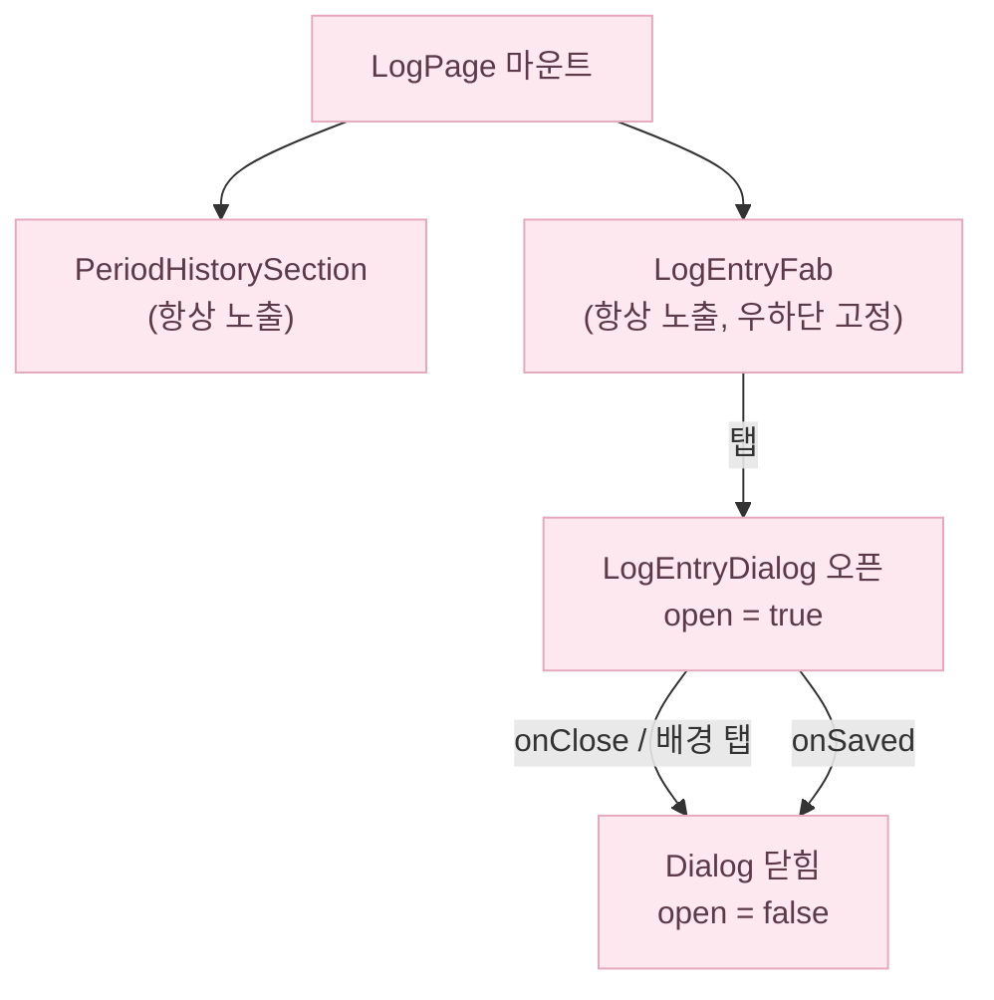
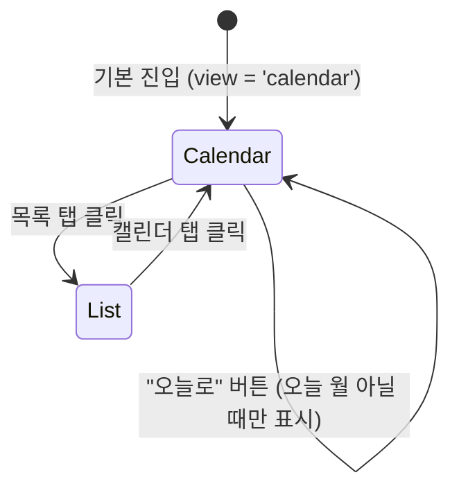
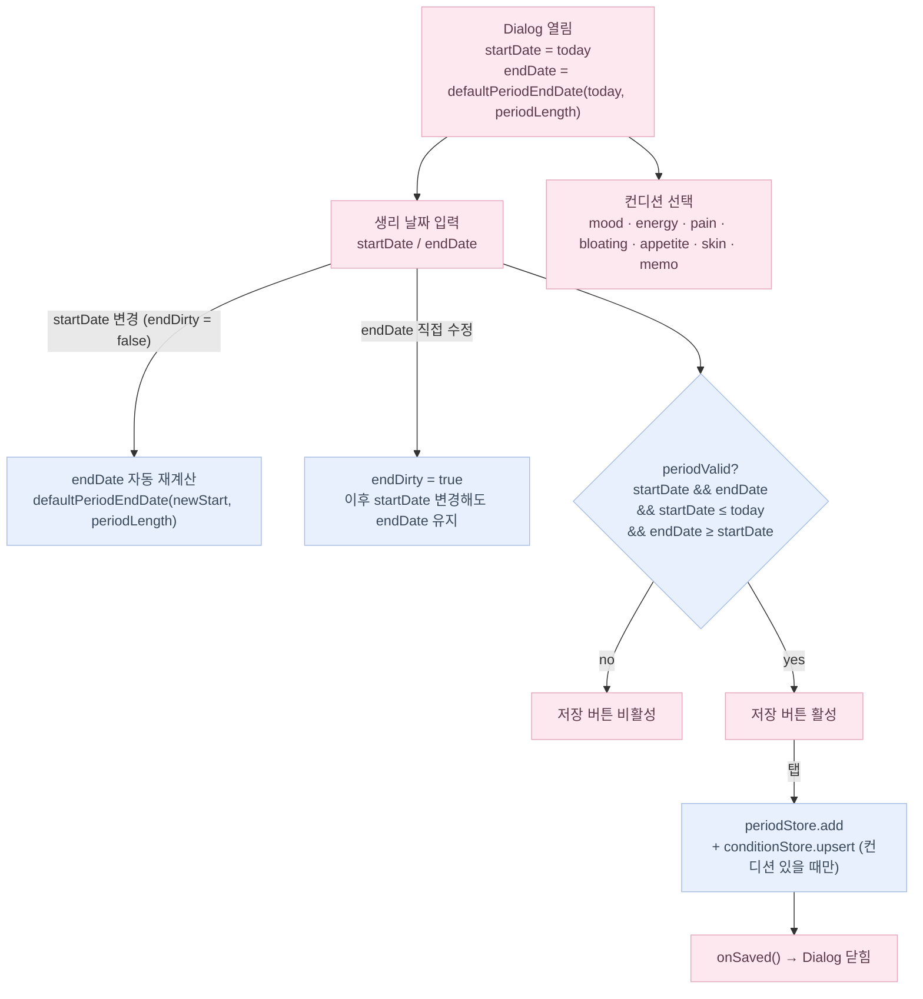

# /log 화면 플로우

> 위치: `src/app/(app)/log/page.tsx`, `src/components/log/`

AppShell + BottomTabNav 아래의 `(app)` 라우트 그룹에 속합니다.

---

## 화면 구조

`/log` 는 두 영역으로 구성됩니다.

1. **PeriodHistorySection** — 생리 기록 이력 조회 (캘린더 / 목록 전환 가능, 읽기 전용).
2. **LogEntryFab + LogEntryDialog** — 생리 기간 + 오늘 컨디션을 한 번에 기록.

---

## 화면 상태 분기

---

## PeriodHistorySection — 뷰 전환

- 캘린더 뷰는 읽기 전용입니다. 셀 탭 → no-op (편집은 `/calendar` 탭에서).
- 목록 뷰는 `PeriodHistoryList`가 periods 배열을 오름차순으로 렌더합니다.
- 월 이동 시 `conditionStore.hydrateRange`를 다시 호출합니다 (캘린더 뷰일 때만).

---

## LogEntryDialog 상태

- `defaultPeriodEndDate` 는 `src/domain/cycle/recordPolicy.ts` 의 순수 함수입니다.
- 컨디션은 선택 사항입니다. 하나도 선택 안 해도 생리 기록만 저장됩니다.
- `conditionStore.upsert` 의 `date` 는 항상 **today** (기록 당일) 고정입니다.

---

## 관련 파일·문서

- `src/app/(app)/log/page.tsx` — 최소 래퍼 (open 상태만 관리)
- `src/components/log/PeriodHistorySection.tsx` — 이력 조회 + 뷰 전환
- `src/components/log/PeriodHistoryList.tsx` — 목록 렌더
- `src/components/log/LogEntryFab.tsx` — FAB 버튼
- `src/components/log/LogEntryDialog.tsx` — 생리 + 컨디션 통합 입력 다이얼로그
- `src/domain/cycle/recordPolicy.ts` — `defaultPeriodEndDate`, `reconcileForNewStart`
- `docs/flows/calendar.md` — 캘린더 편집 플로우 (DayDetailSheet 액션 버튼)
