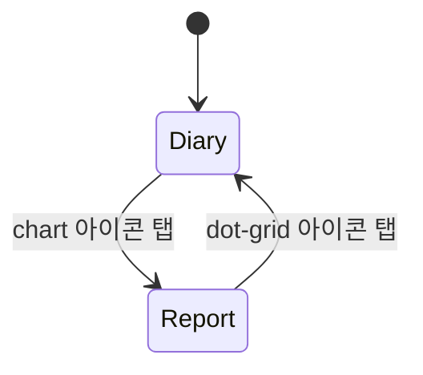

# /log 화면 플로우 — 다이어리 / 주기리포트

> 위치: `src/app/(app)/log/page.tsx`, `src/components/diary/`, `src/components/report/`

AppShell + BottomTabNav 아래의 `(app)` 라우트 그룹에 속합니다.
하단 탭 레이블: **Diary / 다이어리** (이전: Today / 오늘).

---

## 뷰 전환 (STEP 10.1)

`/log` 진입 시 **Diary 탭이 기본**. 헤더 우측 2-아이콘 segmented toggle 로 Report ↔ Diary 전환.

```mermaid
stateDiagram-v2
    [*] --> Diary
    Diary --> Report: chart 아이콘 탭
    Report --> Diary: dot-grid 아이콘 탭
```

- `LogPage` 는 `useState<LogView>('diary')` 상태만 보유하고 조건부로 두 화면 중 하나를 렌더 (얇은 래퍼).
- `LogViewToggle` (`src/components/diary/LogViewToggle.tsx`) — 두 헤더에서 재사용. 흰 정사각형 슬라이더가 좌우 이동.
- STEP 10.2 완료: `+` 버튼 바텀시트(생리/일정), `▼` 연·월 wheel picker, 일정(이벤트) 배지 (AddQuickSheet, EventFormSheet, EventDetailSheet, YearMonthWheelPicker, InlineDatePicker, CategoryChip/Selector, EventCategoryFormSheet).
- STEP 10.3 완료: edit-star 아이콘 → `/log/customize` 풀스크린 (StickerLibrarySheet, PhotoImportModal, PlacedStickerLayer).

---

## Report 화면 구조

Report 탭이 활성화되면 `<CycleReportScreen />` 을 렌더합니다. 구성 요소:

1. **ReportHeader** — 화면 제목 + 우상단 새 기록 버튼 (LogEntryDialog 트리거).
2. **StatusBadge** — `classifyCycleStatus()` 결과를 7단계 코드(`stable` / `regular` / `slightlyIrregular` / `irregular` / `shortPeriod` / `longPeriod` / `insufficient`)로 표시. 탭하면 StatusTooltip이 열림.
3. **CycleChart** — 최근 주기 길이 시계열 차트.
4. **RecentCyclesCard** — 최근 생리 기록 목록 (날짜 + 기간).
5. **CycleReportEmpty** — 기록이 없을 때 안내.

---

## 화면 상태 분기

```mermaid
flowchart TD
    Mount(["CycleReportScreen 마운트"])
    HasPeriods{periods > 0?}
    Empty["CycleReportEmpty\n(기록 없음 안내)"]
    Report["ReportHeader\n+ StatusBadge\n+ CycleChart\n+ RecentCyclesCard"]
    Tooltip["StatusTooltip\n(StatusBadge 탭)"]
    Dialog["LogEntryDialog\n(기록 버튼 탭)"]

    Mount --> HasPeriods
    HasPeriods -- no --> Empty
    HasPeriods -- yes --> Report
    Report -->|"배지 탭"| Tooltip
    Report -->|"+ 버튼"| Dialog
    Dialog -->|"onSaved / onClose"| Report

    classDef ui fill:#FDE8EF,stroke:#E5A8BD,color:#5C3A4A;
    classDef logic fill:#E8F0FD,stroke:#A8BDE5,color:#3A4A5C;
    class Mount,Empty,Report,Tooltip,Dialog ui;
    class HasPeriods logic;
```

---

## StatusBadge — 상태 판정 흐름

상태 코드는 `classifyCycleStatus(periods)` 순수 함수가 반환합니다.
표시 문자열은 화면이 `t.report.status[status]` 로 조립하며 도메인은 문자열을 반환하지 않습니다.

판정 우선순위:

| 우선순위 | 코드 | 판정 기준 |
|---|---|---|
| 1 | `insufficient` | 기록 3회 미만 |
| 2 | `shortPeriod` | 최근 완료 기간 ≤ 2일 |
| 3 | `longPeriod` | 최근 완료 기간 ≥ 8일 |
| 4 | `irregular` | 주기 변동폭 ≥ 15일 |
| 5 | `slightlyIrregular` | 주기 변동폭 8~14일 |
| 6 | `stable` | 기간 3~7일, 주기 21~35일, 변동폭 ≤ 7일 |
| 7 | `regular` | 위 조건 외 나머지 |

카피 톤: 의료 단언 금지. 모든 레이블에 "패턴/추정" 뉘앙스 유지.
(상세 기준: [`.claude/rules/cycle-logic.md §8`](../../.claude/rules/cycle-logic.md))

---

## 관련 파일·문서

- `src/app/(app)/log/page.tsx` — 최소 래퍼, 뷰 상태 보유
- `src/components/diary/DiaryScreen.tsx` — 다이어리 탭 최상위 (MonthGrid 재사용, 생리일 핑크 + 오늘 검정 마커)
- `src/components/diary/DiaryHeader.tsx` — 다이어리 헤더 (title + edit-star + 월 셀렉터 + 토글 + `+`)
- `src/components/diary/LogViewToggle.tsx` — 재사용 가능한 2-아이콘 segmented toggle
- `src/components/diary/DiaryMonthGrid.tsx`, `DiaryDayCell.tsx` — 다이어리용 캘린더 (생리 마커 + 이벤트 배지, STEP 10.2a)
- `src/components/diary/AddQuickSheet.tsx` — `+` 버튼 chooser: 생리 추가 / 일정 추가 (STEP 10.2a)
- `src/components/diary/EventFormSheet.tsx` — 일정 등록/편집 공통 폼 시트 (STEP 10.2b, mode = 'add' | 'edit', inline date picker 포함)
- `src/components/diary/EventDetailSheet.tsx` — 일정 상세 (제목·메모·카테고리·생리 토글·삭제, STEP 10.2b)
- `src/components/diary/InlineDatePicker.tsx` — 시작/종료 날짜 확장 시 나타나는 인라인 미니 캘린더 (STEP 10.2b)
- `src/components/diary/YearMonthWheelPicker.tsx` — 연·월 선택 wheel picker 바텀시트 (STEP 10.2b, DiaryHeader ▼ + InlineDatePicker 에서 재사용)
- `src/components/diary/CategoryChip.tsx`, `CategorySelector.tsx` — 팔레트 기반 카테고리 UI (10.2c 부터 편집·추가 진입점 활성)
- `src/components/diary/EventCategoryFormSheet.tsx` — 일정 유형 추가/편집 시트 (STEP 10.2c, name + 색상 팔레트 선택)
- `src/components/diary/ColorPaletteSelector.tsx` — 7색 팔레트 확장 셀렉터
- `src/store/eventStore.ts` — 이벤트/카테고리 Zustand 스토어. `addEvent`/`updateEvent`/`removeEvent`/`addCategory`/`updateCategory`/`linkPeriodMark`/`unlinkPeriodMark`

### Diary 커스터마이즈 (STEP 10.3a–10.3d — 완료)

`edit-star` 아이콘 → `/log/customize` fullscreen 라우트로 이동.
- 데이터: `DiarySticker` (id, storageRef, ratio 1:1|4:3, source photo|sticker, createdAt).
- 저장소: IndexedDB `dwee:diary:stickers` + blob per id. Supabase `diary_stickers` 테이블 + `media` bucket 경로 `{user_id}/diary_stickers/{id}.{ext}` (RLS anon lockout).
- 10.3a 포함: 스티커 보관함 그리드 + `+` 팝오버 (앨범 선택 / 사진 찍기) + 앨범 임포트 후 미리보기 + 1:1/4:3 crop → 저장.
- 10.3b 포함: 캘린더 위에 스티커 배치 (drag/select/resize/rotate/delete). 라이브러리 썸네일 탭 → 화면 중앙 근처에 draft placement 생성. 커스터마이즈 화면은 draft 상태를 유지하며 완료 시 diff → repo 반영, 뒤로 시 `DiscardDialog` → 폐기.
- 10.3c 포함: `CameraSheet` — Capacitor Camera 플러그인으로 촬영 후 crop 진입. `DraggableBottomSheet` — 스티커 라이브러리를 snap 2단계(collapsed/expanded) 바텀시트로 감쌈.
- 10.3d 포함: `StickerScanScreen` + `CutoutConfirmScreen` — rembg 누끼 처리 결과 확인 → 보관함 저장. `DeleteStickersDialog` — 스티커 다중 선택 삭제 확인. `DiaryStickerViewLayer` — 다이어리 달력 위에 확정된 배치를 read-only 렌더하는 레이어(커스터마이즈 화면 밖에서도 표시).
- **기본 스티커 시드**: `src/domain/diary/defaultStickers.ts` 에 5개 기본 스티커 정의 (airpods-max / avocado-toast / glass-lemon / matcha / workout). `ensureDefaultStickersSeeded()` (`src/data/index.ts`)가 첫 앱 로드 시 `diaryDefaultStickersSeeded` 플래그를 확인하고, 미시드 상태면 `public/stickers/default/*.png` 블롭을 repo에 일괄 삽입.

관련 파일:
- `src/app/(fullscreen)/log/customize/page.tsx`
- `src/components/diary-customize/{DiaryCustomizeScreen,StickerLibrarySheet,PhotoImportModal,PlacedStickerLayer,PlacedSticker,CameraSheet,StickerScanScreen,CutoutConfirmScreen,DeleteStickersDialog}.tsx`
- `src/components/diary/DiaryStickerViewLayer.tsx` — 다이어리 탭 캘린더 위 read-only 오버레이
- `src/components/ui/DraggableBottomSheet.tsx`
- `src/store/{diaryStickerStore,diaryPlacementStore}.ts`
- `src/domain/diary/defaultStickers.ts` — 기본 스티커 메타 정의
- `public/stickers/default/*.png` — 5개 rembg 누끼 처리 이미지
- `src/data/index.ts` — `ensureDefaultStickersSeeded()` 진입점
- `src/data/adapters/indexeddb/keys.ts` — `diaryDefaultStickersSeeded` 플래그 키
- `src/data/{repositories,adapters/indexeddb,adapters/supabase}` 에 `DiaryStickerRepository`, `DiaryStickerPlacementRepository`
- `supabase/migrations/0008_diary_stickers.sql`, `supabase/migrations/0009_diary_sticker_placements.sql`

### 생리 토글 연동 (STEP 10.2c)

EventDetailSheet 의 생리 토글은 `eventStore.linkPeriodMark(id)` / `unlinkPeriodMark(id)` 를 호출:
- ON: `periodStore.add({ startDate, endDate })` → 반환된 PeriodLog.id 를 `event.linkedPeriodId` 로 저장.
- OFF: 저장된 `linkedPeriodId` 로 `periodStore.remove()` → event.linkedPeriodId 제거, `hasPeriodMark=false`.
- Supabase `event_logs.linked_period_id` 컬럼 (`supabase/migrations/0007_event_period_link.sql`, `on delete set null`) 이 캘린더에서 직접 삭제된 경우도 커버.
- `src/components/report/CycleReportScreen.tsx` — 최상위 화면 컴포넌트
- `src/components/report/ReportHeader.tsx` — 헤더 + 새 기록 버튼
- `src/components/report/StatusBadge.tsx` — 상태 코드 → 뱃지 UI
- `src/components/report/StatusTooltip.tsx` — 상태 설명 툴팁
- `src/components/report/CycleChart.tsx` — 주기 차트
- `src/components/report/RecentCyclesCard.tsx` — 최근 기록 목록
- `src/components/report/CycleReportEmpty.tsx` — 빈 상태 안내
- `src/components/report/CycleReportCard.tsx` — 공용 카드 래퍼
- `src/domain/cycle/status.ts` — `classifyCycleStatus()` 순수 함수
- `src/domain/cycle/status.test.ts` — 10개 Vitest 케이스
- `src/domain/cycle/status.cases.md` — 케이스 테이블
- `src/domain/cycle/chartScale.ts` — `computeChartScale()` 순수 함수 (y-축 min/max/step 계산). `chartScale.test.ts` + `chartScale.cases.md` 쌍 포함.
- `docs/domain/cycle.md` — 주기 도메인 전체 로직 (4-phase, recordPolicy, periodEdit, cycleStatus)
