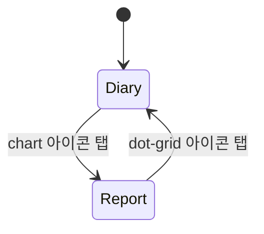
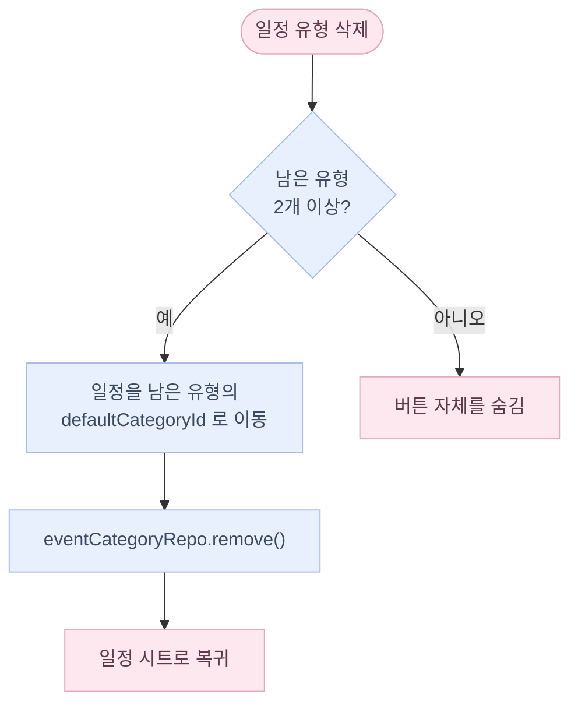
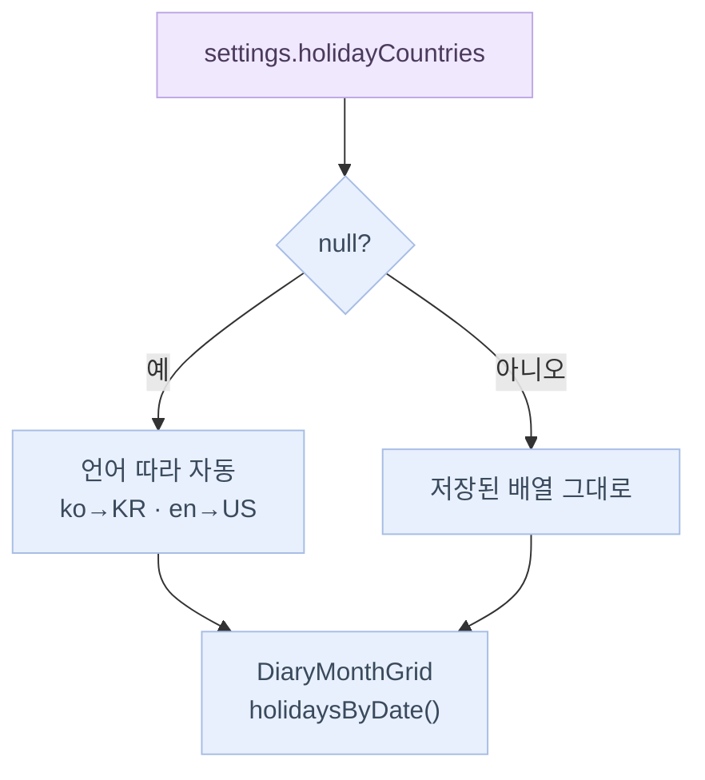
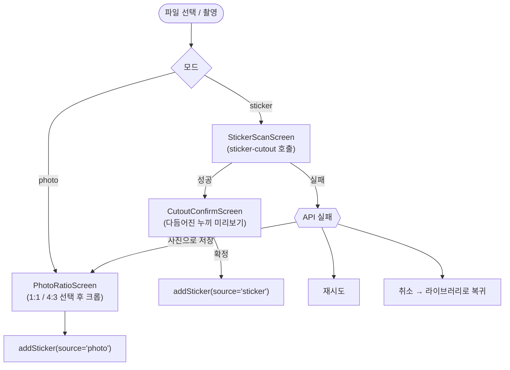

# /log 화면 플로우 — 다이어리 / 주기리포트

> 위치: `src/app/(app)/log/page.tsx`, `src/components/diary/`, `src/components/report/`

AppShell + BottomTabNav 아래의 `(app)` 라우트 그룹에 속합니다.
하단 탭 레이블: **Diary / 다이어리** (이전: Today / 오늘).

---

## 뷰 전환 (STEP 10.1)

`/log` 진입 시 **Diary 탭이 기본**. 헤더 우측 2-아이콘 segmented toggle 로 Report ↔ Diary 전환.

```mermaid
stateDiagram-v2
    [*] --> Diary
    Diary --> Report: chart 아이콘 탭
    Report --> Diary: dot-grid 아이콘 탭
```

- `LogPage` 는 `useState<LogView>('diary')` 상태만 보유하고 조건부로 두 화면 중 하나를 렌더 (얇은 래퍼).
- `LogViewToggle` (`src/components/diary/LogViewToggle.tsx`) — 두 헤더에서 재사용. 흰 정사각형 슬라이더가 좌우 이동.
- STEP 10.2 완료: `+` 버튼(및 빈 날짜 셀 탭) → `EventFormSheet` add 모드 바로 오픈 (생리 추가/일정 추가 2-메뉴 팝오버는 제거됨 — 시트 안에 생리 토글 + 컨디션 섹션을 포함해 하나의 폼으로 통합), `▼` 연·월 wheel picker, 일정(이벤트) 배지 (EventFormSheet, YearMonthWheelPicker, InlineDatePicker, CategoryChip/Selector, EventCategoryFormSheet). 이벤트 배지 탭 시엔 `EventDetailScreen`(읽기 전용, Figma 012_7)이 먼저 열리고, 그 안의 [편집] 버튼을 눌러야 `EventFormSheet` 편집 모드가 상세 화면 위에 겹쳐 뜬다 — 삭제·생리 토글 즉시 반영은 편집 시트에서만 가능.
- STEP 10.3 완료: edit-star 아이콘 → `/log/customize` 풀스크린 (StickerLibrarySheet, PhotoImportModal, PlacedStickerLayer).

---

## Report 화면 구조

Report 탭이 활성화되면 `<CycleReportScreen />` 을 렌더합니다. 구성 요소:

1. **ReportHeader** — 화면 제목 + 우상단 새 기록 버튼 (LogEntryDialog 트리거).
2. **StatusBadge** — `classifyCycleStatus()` 결과를 7단계 코드(`stable` / `regular` / `slightlyIrregular` / `irregular` / `shortPeriod` / `longPeriod` / `insufficient`)로 표시. 탭하면 StatusTooltip이 열림.
3. **CycleChart** — 최근 주기 길이 시계열 차트.
4. **RecentCyclesCard** — 최근 생리 기록 목록 (날짜 + 기간).
5. **CycleReportEmpty** — 기록이 없을 때 안내.

---

## 화면 상태 분기

```mermaid
flowchart TD
    Mount(["CycleReportScreen 마운트"])
    HasPeriods{"periods > 0?"}
    Empty["CycleReportEmpty\n(기록 없음 안내)"]
    Report["ReportHeader\n+ StatusBadge\n+ CycleChart\n+ RecentCyclesCard"]
    Tooltip["StatusTooltip\n(StatusBadge 탭)"]
    Dialog["LogEntryDialog\n(기록 버튼 탭)"]

    Mount --> HasPeriods
    HasPeriods -- no --> Empty
    HasPeriods -- yes --> Report
    Report -->|"배지 탭"| Tooltip
    Report -->|"+ 버튼"| Dialog
    Dialog -->|"onSaved / onClose"| Report

    classDef ui fill:#FDE8EF,stroke:#E5A8BD,color:#5C3A4A;
    classDef logic fill:#E8F0FD,stroke:#A8BDE5,color:#3A4A5C;
    class Mount,Empty,Report,Tooltip,Dialog ui;
    class HasPeriods logic;
```

---

## StatusBadge — 상태 판정 흐름

상태 코드는 `classifyCycleStatus(periods)` 순수 함수가 반환합니다.
표시 문자열은 화면이 `t.report.status[status]` 로 조립하며 도메인은 문자열을 반환하지 않습니다.

판정 우선순위:

| 우선순위 | 코드 | 판정 기준 |
|---|---|---|
| 1 | `insufficient` | 기록 3회 미만 |
| 2 | `shortPeriod` | 최근 완료 기간 ≤ 2일 |
| 3 | `longPeriod` | 최근 완료 기간 ≥ 8일 |
| 4 | `insufficient` | 유효 주기 간격 0개 (모든 간격이 `cycleGap.ts`의 15~60일 범위 밖) — 판정할 주기가 없으므로 `regular`로 흘려보내지 않음 |
| 5 | `irregular` | 주기 변동폭 ≥ 15일 |
| 6 | `slightlyIrregular` | 주기 변동폭 8~14일 |
| 7 | `stable` | 기간 3~7일, 주기 21~35일, 변동폭 ≤ 7일 |
| 8 | `regular` | 위 조건 외 나머지 |

"유효 주기" 판정 기준(15~60일)은 `src/domain/cycle/cycleGap.ts`의 `isCountableCycleGap()`이 단일 출처다 — 평균(`aggregate.ts`), 상태 판정(`status.ts`), 차트 축(`chartScale.ts`), 아래 `CycleChart`/`RecentCyclesCard`가 모두 이 값을 쓴다.

카피 톤: 의료 단언 금지. 모든 레이블에 "패턴/추정" 뉘앙스 유지.
(상세 기준: [`.claude/rules/cycle-logic.md §8`](../../.claude/rules/cycle-logic.md))

### CycleChart / RecentCyclesCard — 유효 주기 0개일 때

`CycleReportCard`는 기록 수와 최근 6개월 안에 셀 수 있는 주기가 있는지에 따라 세 상태 중 하나로 차트를 그린다(`monthlyCyclePoints()`, `src/domain/cycle/chartPoints.ts`):

| 상태 | 조건 | 표시 |
|---|---|---|
| `tooFewRecords` | `periods.length < 3` | `t.report.chartEmpty` (기록 부족 안내) |
| `noCycles` | 기록은 3회 이상인데 최근 6개월에 셀 수 있는 주기가 0개 | `t.report.chartNoCycles` (빈 격자만 보여 주면 기록이 반영 안 된 것처럼 보이는 걸 방지) |
| `plot` | 그릴 점이 하나라도 있음 | `CycleChart` 렌더 |

`RecentCyclesCard`는 목록에는 셀 수 없는 주기 값도 그대로 보여주되(기록 자체를 숨기지 않음), 15~60일 범위 밖인 행에는 "· 통계 제외" 꼬리표를 붙이고 카드 하단에 각주(`t.report.recentExcludedNote`)를 한 번만 표시한다 — 차트·평균·상태 판정에서는 빠지는 값이라는 걸 알리기 위함.

---

## 일정 시트 ↔ 일정 유형 시트

`CategorySelector`의 "편집"/"+ 일정 유형 추가" 행을 누르면 `EventCategoryFormSheet`가 `EventFormSheet` **위에** 겹쳐 뜬다. `EventFormSheet`는 언마운트하지 않고 `suspended` prop만 켠다 — 입력 중인 제목·메모·날짜·컨디션이 시트 내부 state라, 언마운트하면 유형 화면에서 돌아왔을 때 전부 비어 있기 때문. `suspended`인 동안은 `useEscToClose`가 꺼지고(Esc가 위의 유형 시트로만 감) `inert` 속성으로 포커스/입력도 막는다. X 또는 저장으로 유형 시트를 나오면 `DiaryScreen`이 원래 있던 add/edit 일정 시트로 돌려보낸다(`EventPrev`에 어느 시트로 돌아갈지 저장).

### 일정 유형 삭제 (Figma 873:5374, 012_10 ⑤)

`EventCategoryFormSheet`는 edit 모드에서 하단에 "일정 유형 삭제" 버튼을 보여준다(확인 팝업 없이 즉시 삭제) — 단, 부모가 `onDelete`를 넘겨줄 때만, 즉 **유형이 2개 이상 남아 있을 때만**. `eventStore.removeCategory(id)`는 그 유형을 쓰던 일정을 먼저 남은 유형 중 `defaultCategoryId()`로 옮긴 뒤(Supabase FK가 `on delete restrict`라 유형이 참조된 채로는 지워지지 않음) 유형을 지운다. 마지막 한 개는 지울 수 없다 — 0개가 되면 다음 하이드레이션에서 기본 유형 시드가 다시 돌아 방금 지운 것까지 되살아나기 때문.

```mermaid
flowchart TD
    Tap(["일정 유형 삭제"])
    LastOne{"남은 유형\n2개 이상?"}
    Move["일정을 남은 유형의\ndefaultCategoryId 로 이동"]
    Remove["eventCategoryRepo.remove()"]
    Return["일정 시트로 복귀"]
    Blocked["버튼 자체를 숨김"]

    Tap --> LastOne
    LastOne -- 예 --> Move --> Remove --> Return
    LastOne -- 아니오 --> Blocked

    classDef ui fill:#FDE8EF,stroke:#E5A8BD,color:#5C3A4A;
    classDef logic fill:#E8F0FD,stroke:#A8BDE5,color:#3A4A5C;
    class Tap,Return,Blocked ui;
    class LastOne,Move,Remove logic;
```

### 기본 유형 시드 — 순서·중복 방지

`seedBuiltinsIfEmpty()`는 **설정 스토어 하이드레이션이 끝난 뒤**에만 실행된다(`DiaryScreen`이 `eventsHydrated && settingsHydrated`를 모두 기다림) — 그렇지 않으면 언어가 기본값(en)일 때 시드가 돌아 한국어 기기에도 "Family / Friend…" 영어 이름이 저장돼 버린다. 동시에 두 번 불려도(언어가 막 확정되며 effect가 다시 돌거나, 로그인 직후 재하이드레이션) 한 벌만 생기도록 진행 중인 시드 promise를 `seedInFlight`로 공유해 두 번째 호출이 첫 번째를 기다리게 한다. 이미 두 벌로 저장된 계정은 다음 `hydrate()`에서 `repairDuplicateBuiltins()`가 정리한다 — 이름·색까지 같은 기본 유형만 중복으로 보고(사용자가 이름/색을 바꾼 쪽은 건드리지 않음) 가장 오래 전에 만들어진 것을 남기며, 지우기 전에 그 유형을 쓰던 일정을 먼저 옮긴다(계획은 순수 함수 `src/domain/event/builtinDedupe.ts`의 `planBuiltinDedupe`).

## 관련 파일·문서

- `src/app/(app)/log/page.tsx` — 최소 래퍼, 뷰 상태 보유
- `src/components/diary/DiaryScreen.tsx` — 다이어리 탭 최상위 (MonthGrid 재사용, 생리일 핑크 + 오늘 검정 마커)
- `src/components/diary/DiaryHeader.tsx` — 다이어리 헤더 (title + edit-star + 월 셀렉터 + 토글 + `+`)
- `src/components/diary/LogViewToggle.tsx` — 재사용 가능한 2-아이콘 segmented toggle
- `src/components/diary/DiaryMonthGrid.tsx`, `DiaryDayCell.tsx`, `DiaryWeekEventLayer.tsx` — 다이어리용 캘린더 (생리 마커 + 주 단위로 이어지는 이벤트 바, STEP 10.2a). 배치는 `src/domain/event/weekLanes.ts` 의 `layoutWeekSegments()` 가 한 주(7칸) 단위로 계산 — 같은 기간의 이벤트는 여러 날에 걸쳐 하나의 막대로 이어지고, 겹치는 이벤트는 lane 을 나눠 쌓인다(최대 `MAX_BADGES_PER_DAY`개).
- `src/components/diary/EventDetailScreen.tsx` — 일정 배지 탭 시 먼저 뜨는 읽기 전용 상세 화면(Figma 012_7). [편집] 버튼으로만 `EventFormSheet` 편집 모드를 그 위에 연다.
- `src/components/diary/EventFormSheet.tsx` — 일정/기록 등록·편집 공통 폼 시트 (mode = 'add' | 'edit'). `+` 버튼이 바로 여는 시트로, inline date picker · 생리 토글(add/edit 공통) · `EventConditionSection`(선택 컨디션 8항목) · 삭제(edit 전용) 포함. 카테고리 초기값은 `initial?.categoryId` (edit) 없으면 `defaultCategoryId(categories)` (add) — 목록의 첫 항목이 아니라 내장 카테고리 "친구"를 우선 선택. `suspended` prop — 위에 일정 유형 시트가 겹쳐 뜬 동안 마운트는 유지한 채 입력만 막음 (아래 "일정 시트 ↔ 일정 유형 시트" 참고)
- `src/components/diary/EventConditionSection.tsx` — `EventFormSheet` 안의 선택적 컨디션 카드 (기분/에너지/통증/붓기/식욕/피부/수면/운동, `ConditionRow` variant="outline" 재사용)
- `src/components/diary/InlineDatePicker.tsx` — 시작/종료 날짜 확장 시 나타나는 인라인 미니 캘린더 (STEP 10.2b)
- `src/components/diary/YearMonthWheelPicker.tsx` — 연·월 선택 wheel picker 바텀시트 (STEP 10.2b, DiaryHeader ▼ + InlineDatePicker 에서 재사용)
- `src/components/diary/CategoryChip.tsx` — 팔레트 기반 카테고리 칩 (`size='sm'` 캘린더 배지 / `'md'` 폼 행·목록)
- `src/components/diary/CategorySelector.tsx` — "일정 유형" 행. 접힌 상태는 선택 칩 + 화살표만 보이고(날짜 필드와 같은 accordion 그룹, `EventFormSheet` 가 `expanded`/`onToggle` 로 제어), 탭하면 세로 목록으로 펼쳐져 선택 항목에 핑크 체크 + 행별 "편집" 버튼 + 맨 아래 "+ 일정 유형 추가" 행을 보여줌(Figma 012_2/012_6)
- `src/components/diary/EventCategoryFormSheet.tsx` — 일정 유형 추가/편집 시트 (STEP 10.2c, name + 색상 팔레트 선택). edit 모드에서 하단 "일정 유형 삭제" 버튼(유형이 2개 이상 남아 있을 때만 부모가 `onDelete`를 넘김)
- `src/components/diary/ColorPaletteSelector.tsx` — 7색 팔레트 확장 셀렉터
- `src/store/eventStore.ts` — 이벤트/카테고리 Zustand 스토어. `addEvent`/`updateEvent`/`removeEvent`/`addCategory`/`updateCategory`/`removeCategory`/`linkPeriodMark`/`unlinkPeriodMark`. `hydrate()`가 `repairDuplicateBuiltins()`로 중복 기본 유형을 정리하고, `seedBuiltinsIfEmpty()`는 동시 호출을 `seedInFlight`로 직렬화
- `src/domain/event/builtins.ts` — 내장 카테고리 시드(family/friend/work/club) + 순수 함수 `defaultCategoryId()` (신규 일정 기본 카테고리 = "친구", 테스트: `builtins.test.ts`/`builtins.cases.md`)
- `src/domain/event/builtinDedupe.ts` — 순수 함수 `planBuiltinDedupe()` (중복 기본 유형 중 남길 것/지울 것 계획, `eventStore.repairDuplicateBuiltins`가 소비)

### 공휴일 표시

`DiaryMonthGrid`가 보이는 달의 셀 범위만큼 `domain/holiday`의 `holidaysByDate(countries, start, end)`를 호출해 날짜별 공휴일을 계산하고, `DiaryDayCell`에 라벨 한 줄을 넘긴다. 한국(KR)·미국(US) 두 나라를 지원.

```mermaid
flowchart TD
    Setting["settings.holidayCountries"]
    IsNull{"null?"}
    Auto["언어 따라 자동\nko→KR · en→US"]
    Explicit["저장된 배열 그대로"]
    Grid["DiaryMonthGrid\nholidaysByDate()"]

    Setting --> IsNull
    IsNull -- "예" --> Auto --> Grid
    IsNull -- "아니오" --> Explicit --> Grid

    classDef store fill:#F0E8FD,stroke:#BDA8E5,color:#4A3A5C;
    classDef logic fill:#E8F0FD,stroke:#A8BDE5,color:#3A4A5C;
    class Setting store;
    class IsNull,Auto,Explicit,Grid logic;
```

- **어느 나라를 보여줄지**: `resolveHolidayCountries(setting, locale)`. 저장값이 `null`(마이페이지 토글을 한 번도 건드리지 않은 기본값)이면 앱 언어를 따라 자동 결정(ko → KR, en → US). `/settings/holidays`에서 토글하면 그 시점부터 명시적 배열이 저장되고, 이후 언어를 바꿔도 그 선택이 유지된다.
- **라벨 배치**: `DiaryDayCell`의 날짜 숫자 바로 아래 12px 줄에 한 줄 truncate로 표시하고, 이벤트 바(3-lane)는 그 아래(`DiaryWeekEventLayer` `top-[43px]`)에서 시작한다. 이 줄은 공휴일이 없는 셀에도 항상 비워 둔 채 확보해 행 높이가 주마다 달라지지 않게 한다 — 셀 최소 높이 92px → 100px. 이번 달이 아닌 셀(`inCurrentMonth === false`)은 공휴일이 있어도 표시하지 않는다.
- **이름/톤**: `t.holiday.KR.*` / `t.holiday.US.*` (en source, ko 번역). 한국 대체공휴일은 원래 이름 대신 "대체공휴일" 한 단어로, 미국 observed day는 원래 이름 뒤에 " (observed)"를 붙인다. 부처님오신날은 한 줄에 맞추기 위해 "석가탄신일"로 표시. 같은 날 두 나라 공휴일이 겹치면 가운뎃점(·)으로 잇는다.
- **어디서 쓰이는지**: `DiaryScreen`(`/log` 다이어리 탭)과 `DiaryCustomizeScreen`(`/log/customize`, 스티커 배치 화면)이 같은 `DiaryMonthGrid`를 재사용해 동일한 규칙으로 공휴일을 얹는다. 커스터마이즈 화면은 `(fullscreen)` 라우트라 설정 스토어 하이드레이션이 따로 필요했다 — `FullscreenShell`이 `useCoreStoresHydration()`을 호출해 `/log`와 같은 설정을 갖도록 함(이전에는 새로고침·딥링크 진입 시 기본값(영어)으로 렌더되던 버그가 있었음).
- 도메인 로직 상세(음력 표·대체공휴일 규칙·지원 연도): [`docs/domain/holiday.md`](../domain/holiday.md)
- 설정 화면: [`docs/flows/settings.md`](./settings.md)

관련 파일: `src/domain/holiday/`, `src/components/diary/DiaryMonthGrid.tsx`, `src/components/diary/DiaryDayCell.tsx`, `src/hooks/useCoreStoresHydration.ts`, `src/components/app/FullscreenShell.tsx`.

### Diary 커스터마이즈 (STEP 10.3a–10.3d — 완료)

`edit-star` 아이콘 → `/log/customize` fullscreen 라우트로 이동.
- **달 유지**: `diaryFocusStore.visibleMonth` 를 다이어리와 꾸미기 화면이 공유한다. 꾸미기는 다이어리가 보여주던 달로 열리고(이전엔 항상 오늘 달로 열려 다른 달을 보다가 들어가면 튕기는 버그가 있었음), 돌아왔을 때도 그 달이 유지된다. 하단 탭의 log 탭을 다시 탭할 때(`pingToday`)만 둘 다 오늘 달로 리셋된다. 새로고침·딥링크처럼 기록이 없으면 오늘 달이 기본.
- **다이어리에서 스티커 탭 → 꾸미기**: `DiaryStickerViewLayer` 가 다이어리 탭에서도 스티커를 탭 가능하게 만든다(이벤트 바보다 위 레이어라, 겹친 곳은 스티커가 이벤트를 가로챈다). 탭하면 `diaryFocusStore.setFocusPlacementId(id)` 로 1회용 값을 저장하고 `/log/customize` 로 이동 — 꾸미기 화면이 마운트되며 그 스티커를 바로 선택 상태로 열고 라이브러리 시트를 `peek` 로 내려 가리지 않게 한다.
- 데이터: `DiarySticker` (id, storageRef, ratio 1:1|4:3, source photo|sticker, createdAt).
- 저장소: IndexedDB `dwee:diary:stickers` + blob per id. Supabase `diary_stickers` 테이블 + `media` bucket 경로 `{user_id}/diary_stickers/{id}.{ext}` (RLS anon lockout).
- 10.3a 포함: 스티커 보관함 그리드 + `+` 팝오버 (앨범 선택 / 사진 찍기) + 앨범 임포트 후 미리보기 + 1:1/4:3 crop → 저장.
- 10.3b 포함: 캘린더 위에 스티커 배치 (drag/select/resize/rotate/delete). 라이브러리 썸네일 탭 → 화면 중앙 근처에 draft placement 생성. 커스터마이즈 화면은 draft 상태를 유지하며 완료 시 diff → repo 반영, 뒤로 시 `DiscardDialog` → 폐기.
- 10.3c 포함, 이후 비율 선택을 촬영 뒤로 옮기며 갱신: `CameraSheet` — MediaDevices 라이브 프리뷰가 화면 전체(full-bleed)이고 조작부(닫기·앨범·셔터·전환·모드 pill)가 그 위에 뜬다. **비율(1:1/4:3) 토글은 없다** — 남은 토글은 모드(사진/스티커)뿐. 이유: 비율은 사진을 "그대로" 쓸 때만 의미가 있으므로 촬영 전에 묻지 않는다. 셔터는 뷰파인더에 보이는 영역 그대로(비디오 `object-cover`의 보이는 가운데 영역)를 JPEG 로 담아 부모(`DiaryCustomizeScreen`)에 넘긴다(`PhotoImportModal` 을 거치지 않음) — `photo` 모드는 새 `CapturedPhotoRatioStep`(013_5/6 비율 선택)으로, `sticker` 모드는 바로 `StickerScanScreen` 으로 진입한다. `DraggableBottomSheet` — 스티커 라이브러리를 감싸는 3-snap(`peek`/`medium`/`full`) 바텀시트. 시트 전체 표면이 드래그 대상(핸들만이 아님) — `full` 미만에서는 위로 스와이프가 항상 시트를 확장하고, `full` 에서는 안쪽 리스트가 스크롤을 먼저 가져가다 맨 위에서 더 당기면 시트가 접힘. `open`/`onDismiss` props 로 캘린더(시트 바깥) 탭을 부모에 알림(`onDismiss`가 해당 `PointerEvent`를 그대로 전달, 스티커 위 탭 등은 부모가 타겟을 보고 걸러낸다). `DiaryCustomizeScreen`의 `handleSheetOutsideTap`은 즉시 닫지 않고 스냅을 한 단계씩 낮춘다 — 시트가 `medium`/`full`이면 먼저 `peek`으로 내리고, 이미 `peek`이고 선택된 스티커도 없을 때만 화면을 나간다(화면 자체 오버레이가 떠 있는 동안엔 `onDismiss` 를 꺼서 오작동 방지).
- 10.3d 포함, 이후 자동 다듬기를 더하며 갱신: `StickerScanScreen` + `CutoutConfirmScreen` — `sticker-cutout` edge function (remove.bg 프록시) 을 호출해 배경 제거된 PNG 를 받는다. `onCutoutReady`에서 `trimTransparentMargins()`(`src/lib/image/stickerCrop.ts`)로 투명 여백을 불투명 경계에 맞춰 먼저 잘라 낸 뒤 미리보기(013_4) → 보관함 저장 (`source: 'sticker'`) — 카메라가 화면 전체를 찍게 되면서 피사체 둘레 여백이 커져 스티커가 상자보다 작아 보이던 문제의 보완. API 실패 시 같은 화면에서 재시도 · 취소 선택 가능하고, **"사진으로 저장"은 바로 저장하지 않고 `CapturedPhotoRatioStep` 비율 선택 단계로 보낸다**. `DeleteStickersDialog` — 스티커 다중 선택 삭제 확인. `DiaryStickerViewLayer` — 다이어리 달력 위에 확정된 배치를 read-only 렌더하는 레이어(커스터마이즈 화면 밖에서도 표시).
- **기본 스티커 시드**: `src/domain/diary/defaultStickers.ts` 에 5개 기본 스티커 정의 (airpods-max / avocado-toast / glass-lemon / matcha / workout, 배열 순서 = 화면 표시 순서). `ensureDefaultStickersSeeded()` (`src/data/index.ts`)는 시딩 시엔 이 배열을 **역순**으로 넣는다 — 어댑터의 `add` 가 새 항목을 맨 앞에 쌓기(newest first) 때문. 시드 완료 플래그는 `DEFAULT_STICKER_SET_VERSION` 을 포함해 **백엔드별로 스코프**된다(`local` / `remote:{userId}`) — 기기가 이미 익명 라이브러리를 시드했어도 이후 로그인하는 계정은 별도로 시드받고, 기본 아트워크가 바뀌어 버전이 오르면 (라이브러리가 비어 있는 한) 재시드된다. `rehydrateAll.ts` 가 repo mode 전환 시 `diaryStickerStore.rehydrate()` 를 함께 호출해 이 재시드를 트리거한다.
- **스티커 맞춤 규칙(contain vs cover)**: `stickerImageFit(source)` (`src/components/diary/stickerImageFit.ts`)가 배치 상자 안에 이미지를 어떻게 맞출지 정한다 — `source: 'photo'`는 저장 시 이미 그 비율로 정확히 잘라 둔 사진이라 상자를 꽉 채우고(`object-cover`), `source: 'sticker'`(누끼)는 모양이 제각각이라 cover로 채우면 가장자리가 잘린다(기본 헤드셋 스티커가 3:4 상자에서 좌우 4%씩 잘리던 문제) — 상자 안에 통째로 보이도록 맞춘다(`object-contain`). 꾸미기 화면(`PlacedSticker`)과 다이어리(`DiaryStickerViewLayer`)가 이 함수를 공유해 편집 중 모양과 붙인 뒤 모양이 같게 유지한다.

관련 파일:
- `src/app/(fullscreen)/log/customize/page.tsx`
- `src/components/diary-customize/{DiaryCustomizeScreen,StickerLibrarySheet,PhotoImportModal,PhotoRatioScreen,CapturedPhotoRatioStep,PlacedStickerLayer,PlacedSticker,CameraSheet,StickerScanScreen,CutoutConfirmScreen,DeleteStickersDialog}.tsx`
- `src/components/diary/DiaryStickerViewLayer.tsx` — 다이어리 탭 캘린더 위 read-only 오버레이
- `src/components/diary/stickerImageFit.ts` — `object-cover`(사진) / `object-contain`(누끼) 판정 (위 "스티커 맞춤 규칙" 참고)
- `src/components/ui/DraggableBottomSheet.tsx`
- `src/components/ui/icons/CameraFlipIcon.tsx` — 카메라 전·후면 전환 글리프
- `src/lib/image/stickerFrame.ts` — 순수 계산(canvas·DOM 의존 없음): `STICKER_RATIO_ASPECT`, `stickerRatioForAspect`, `centerCropRect`, `opaqueBounds`, `expandBounds`
- `src/lib/image/stickerCrop.ts` — canvas/DOM 헬퍼: `ratioForImage`, `cropToRatio`, `trimTransparentMargins` (앨범·카메라 공용)
- `src/hooks/usePhotoLibraryPicker.tsx` — 앨범 사진 한 장 선택 (네이티브 `Camera.pickImages` / 웹 file input 폴백)
- `src/store/{diaryStickerStore,diaryPlacementStore}.ts`
- `src/store/diaryFocusStore.ts` — `visibleMonth`(다이어리↔꾸미기 공유 월) + `focusPlacementId`(스티커 탭 → 꾸미기 프리셀렉트, 1회용)
- `src/domain/diary/defaultStickers.ts` — 기본 스티커 메타 정의
- `public/stickers/default/*.png` — 5개 rembg 누끼 처리 이미지
- `src/data/index.ts` — `ensureDefaultStickersSeeded()` 진입점
- `src/data/adapters/indexeddb/keys.ts` — `diaryDefaultStickersSeeded` 플래그 키
- `src/data/{repositories,adapters/indexeddb,adapters/supabase}` 에 `DiaryStickerRepository`, `DiaryStickerPlacementRepository`
- `supabase/migrations/0008_diary_stickers.sql`, `supabase/migrations/0009_diary_sticker_placements.sql`

### 스티커 업로드 분기 — 사진 그대로 vs 누끼

앨범(`PhotoImportModal`)과 카메라(`CameraSheet`) 모두 확정 전에 **모드 선택** (사진 그대로 / 누끼)을 제공하고, **비율(1:1 · 4:3)을 언제 정하는지도 이제 둘이 같은 규칙**을 따릅니다 — 비율은 사진을 "그대로" 쓸 때만 의미가 있으므로, 촬영/선택 직후에만 묻고 누끼 경로는 아예 건너뜁니다.

- **사진 그대로**: 카메라는 셔터 직후 `CapturedPhotoRatioStep`(013_5/6, `PhotoRatioScreen` 래퍼)으로, 앨범은 모드를 고른 직후 풀스크린 `PhotoRatioScreen` 으로 넘어가 비율을 고르고 가운데 기준으로 크롭해 저장합니다. 카메라 시트 자체에는 비율 토글이 없습니다 — 남은 토글은 모드(사진/스티커)뿐이고, 셔터는 뷰파인더에 보이는 영역 그대로를 JPEG 로 담아 바로 부모에 넘깁니다 (`PhotoImportModal` 미경유). 카메라 시트 안의 앨범 아이콘은 `usePhotoLibraryPicker` 훅으로 OS 앨범을 직접 엽니다.
- **누끼**: 앨범은 사진을 고르면 먼저 라디오 카드로 모드부터 선택합니다 (**"누끼로 만들기"가 기본 선택**). 두 경로 모두 원본을 그대로 `StickerScanScreen` 에 넘겨 `sticker-cutout` 을 호출하고, 돌아온 PNG 는 `onCutoutReady`에서 `trimTransparentMargins()` 로 투명 여백을 먼저 다듬습니다(013_4 미리보기 전) — 카메라가 화면 전체를 찍으면서 피사체 둘레 여백이 커진 문제의 보완. 배치용 비율은 **원본 사진이 아니라 이 다듬어진 누끼의 모양**에서 추론합니다 (`ratioForImage` — 폭/높이 ≥ 0.875 면 1:1, 아니면 4:3, 기준값은 그대로). 스캔이 실패하면 "사진으로 저장" 도 바로 저장하지 않고 비율 선택 단계로 보냅니다.
- **공용 헬퍼**: `ratioForImage` / `cropToRatio` / `trimTransparentMargins` 는 `src/lib/image/stickerCrop.ts` (canvas·DOM), 순수 계산(`STICKER_RATIO_ASPECT`, `stickerRatioForAspect`, `centerCropRect`, `opaqueBounds`, `expandBounds`)은 `src/lib/image/stickerFrame.ts` 에 있습니다. 예전엔 `PhotoImportModal.tsx` 안에 있던 것을 앨범·카메라 공용으로 분리했습니다.
- **`usePhotoLibraryPicker`** (`src/hooks/usePhotoLibraryPicker.tsx`) — 스티커 라이브러리의 `+` 팝오버 "앨범"과 카메라 시트의 앨범 아이콘이 공유하는 훅. 네이티브(Capacitor)에서는 `Camera.pickImages({ limit: 1 })` 로 OS 앨범 피커를 바로 열고(카메라/파일 선택이 섞인 액션 시트 없음), 웹에서는 숨은 `<input type="file">` 로 폴백한다 — 이전엔 각 화면이 자기 file input 을 직접 관리했다.

부모(`DiaryCustomizeScreen`)가 이후 분기:

```mermaid
flowchart TD
    Pick(["파일 선택 / 촬영"])
    Mode{"모드"}
    Ratio["PhotoRatioScreen\n(1:1 / 4:3 선택 후 크롭)"]
    SaveRaw["addSticker(source='photo')"]
    Scan["StickerScanScreen\n(sticker-cutout 호출)"]
    Confirm["CutoutConfirmScreen\n(다듬어진 누끼 미리보기)"]
    SaveCut["addSticker(source='sticker')"]
    Err{{"API 실패"}}
    Retry["재시도"]
    Cancel["취소 → 라이브러리로 복귀"]

    Pick --> Mode
    Mode -- photo --> Ratio --> SaveRaw
    Mode -- sticker --> Scan
    Scan -- 성공 --> Confirm
    Confirm -- 확정 --> SaveCut
    Scan -- 실패 --> Err
    Err --> Retry
    Err -- 사진으로 저장 --> Ratio
    Err --> Cancel
```

관련:
- Edge function: `supabase/functions/sticker-cutout/index.ts` — remove.bg API 프록시. Auth = Supabase JWT, 일일 20회 제한 (`sticker_cutout_calls` 테이블).
- Client service: `src/data/services/stickerCutoutService.ts` — `removeStickerBackground({blob, mediaType, signal})`.
- Pure helper: `src/lib/cutout/base64ToBlob.ts` (+ 테스트/케이스 표).
- Env: `REMOVE_BG_API_KEY` (edge function secret) 필요. Supabase Dashboard → Functions → Secrets 에서 설정.

### 생리 토글 + 컨디션 연동 (STEP 10.2c, 통합 시트 갱신)

`EventFormSheet` 는 add/edit 두 모드 모두에서 생리 토글과 `EventConditionSection`(선택) 을 렌더하지만, 반영 시점이 다릅니다.

- **생리 토글 — edit 모드**: 탭 즉시 `eventStore.linkPeriodMark(id)` / `unlinkPeriodMark(id)` 호출.
  - ON: `periodStore.add({ startDate, endDate })` → 반환된 PeriodLog.id 를 `event.linkedPeriodId` 로 저장.
  - OFF: 저장된 `linkedPeriodId` 로 `periodStore.remove()` → event.linkedPeriodId 제거, `hasPeriodMark=false`.
  - Supabase `event_logs.linked_period_id` 컬럼 (`supabase/migrations/0007_event_period_link.sql`, `on delete set null`) 이 캘린더에서 직접 삭제된 경우도 커버.
- **생리 토글 — add 모드**: 로컬 state(`periodOn`)만 토글하고, 저장(✓) 시 `EventFormInput.periodMark` 로 전달 → `DiaryScreen.handleAddEvent` 가 `addEvent()` 성공 후 `linkPeriodMark(log.id)` 호출. 시작 날짜가 오늘 이후면 토글이 disabled (미래 생리 기록 방지, `LogEntryDialog` 의 `startDate ≤ today` 제약과 동일한 취지).
- **컨디션 섹션**: 두 모드 모두 선택 사항. add 모드는 빈 값에서 시작, edit 모드는 `conditionByDate[event.startDate]` 로 초기화. 저장 시 하나라도 선택돼 있으면 `EventFormInput.condition` 에 담겨 `DiaryScreen` 이 `conditionStore.upsert({ date: startDate, ...condition })` 호출.
- `conditionStore.upsert` 는 리포지토리가 **레코드 전체를 교체(REPLACE)** 하는 것을 보완하기 위해, 호출 전 그 날짜의 기존 `byDate` 엔트리와 필드별로 merge 합니다(`memo` 등 이번 폼이 건드리지 않은 값 보존). `LogEntryDialog` 를 포함한 모든 `upsert` 호출자가 이 merge 를 공유합니다.
- `src/components/report/CycleReportScreen.tsx` — 최상위 화면 컴포넌트
- `src/components/report/ReportHeader.tsx` — 헤더 + 새 기록 버튼
- `src/components/report/StatusBadge.tsx` — 상태 코드 → 뱃지 UI
- `src/components/report/StatusTooltip.tsx` — 상태 설명 툴팁
- `src/components/report/CycleChart.tsx` — 주기 차트
- `src/components/report/RecentCyclesCard.tsx` — 최근 기록 목록
- `src/components/report/CycleReportEmpty.tsx` — 빈 상태 안내
- `src/components/report/CycleReportCard.tsx` — 카드 래퍼 + `tooFewRecords`/`noCycles`/`plot` 차트 상태 분기
- `src/domain/cycle/status.ts` — `classifyCycleStatus()` 순수 함수
- `src/domain/cycle/status.test.ts` — 10개 Vitest 케이스
- `src/domain/cycle/status.cases.md` — 케이스 테이블
- `src/domain/cycle/chartScale.ts` — `computeChartScale()` 순수 함수 (y-축 min/max/step 계산). `chartScale.test.ts` + `chartScale.cases.md` 쌍 포함.
- `src/domain/cycle/chartPoints.ts` — `monthlyCyclePoints()` 순수 함수 (달별 주기 점 계산, `CycleReportCard`/`CycleChart` 소비)
- `src/domain/cycle/cycleGap.ts` — `isCountableCycleGap()` + `CYCLE_GAP_MIN_DAYS`/`CYCLE_GAP_MAX_DAYS`(15~60일). 유효 주기 판정의 단일 출처. `cycleGap.test.ts` + `cycleGap.cases.md` 쌍 포함.
- `docs/domain/cycle.md` — 주기 도메인 전체 로직 (4-phase, recordPolicy, periodEdit, cycleStatus)
