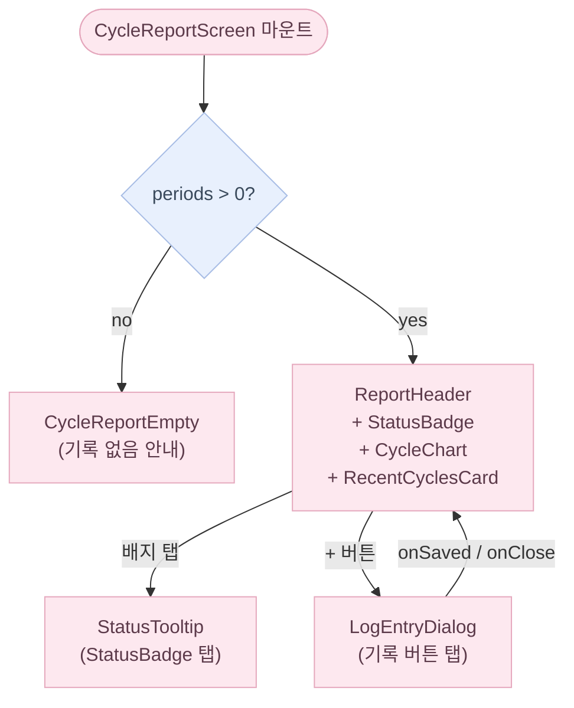

# /log 화면 플로우 — 주기리포트

> 위치: `src/app/(app)/log/page.tsx`, `src/components/report/`

AppShell + BottomTabNav 아래의 `(app)` 라우트 그룹에 속합니다.
하단 탭 레이블: **Diary / 다이어리** (이전: Today / 오늘).

---

## 화면 구조

`/log` 는 `<CycleReportScreen />` 을 렌더합니다. 구성 요소:

1. **ReportHeader** — 화면 제목 + 우상단 새 기록 버튼 (LogEntryDialog 트리거).
2. **StatusBadge** — `classifyCycleStatus()` 결과를 7단계 코드(`stable` / `regular` / `slightlyIrregular` / `irregular` / `shortPeriod` / `longPeriod` / `insufficient`)로 표시. 탭하면 StatusTooltip이 열림.
3. **CycleChart** — 최근 주기 길이 시계열 차트.
4. **RecentCyclesCard** — 최근 생리 기록 목록 (날짜 + 기간).
5. **CycleReportEmpty** — 기록이 없을 때 안내.

---

## 화면 상태 분기

```mermaid
flowchart TD
    Mount(["CycleReportScreen 마운트"])
    HasPeriods{periods > 0?}
    Empty["CycleReportEmpty\n(기록 없음 안내)"]
    Report["ReportHeader\n+ StatusBadge\n+ CycleChart\n+ RecentCyclesCard"]
    Tooltip["StatusTooltip\n(StatusBadge 탭)"]
    Dialog["LogEntryDialog\n(기록 버튼 탭)"]

    Mount --> HasPeriods
    HasPeriods -- no --> Empty
    HasPeriods -- yes --> Report
    Report -->|"배지 탭"| Tooltip
    Report -->|"+ 버튼"| Dialog
    Dialog -->|"onSaved / onClose"| Report

    classDef ui fill:#FDE8EF,stroke:#E5A8BD,color:#5C3A4A;
    classDef logic fill:#E8F0FD,stroke:#A8BDE5,color:#3A4A5C;
    class Mount,Empty,Report,Tooltip,Dialog ui;
    class HasPeriods logic;
```

---

## StatusBadge — 상태 판정 흐름

상태 코드는 `classifyCycleStatus(periods)` 순수 함수가 반환합니다.
표시 문자열은 화면이 `t.report.status[status]` 로 조립하며 도메인은 문자열을 반환하지 않습니다.

판정 우선순위:

| 우선순위 | 코드 | 판정 기준 |
|---|---|---|
| 1 | `insufficient` | 기록 3회 미만 |
| 2 | `shortPeriod` | 최근 완료 기간 ≤ 2일 |
| 3 | `longPeriod` | 최근 완료 기간 ≥ 8일 |
| 4 | `irregular` | 주기 변동폭 ≥ 15일 |
| 5 | `slightlyIrregular` | 주기 변동폭 8~14일 |
| 6 | `stable` | 기간 3~7일, 주기 21~35일, 변동폭 ≤ 7일 |
| 7 | `regular` | 위 조건 외 나머지 |

카피 톤: 의료 단언 금지. 모든 레이블에 "패턴/추정" 뉘앙스 유지.
(상세 기준: [`.claude/rules/cycle-logic.md §8`](../../.claude/rules/cycle-logic.md))

---

## 관련 파일·문서

- `src/app/(app)/log/page.tsx` — 최소 래퍼
- `src/components/report/CycleReportScreen.tsx` — 최상위 화면 컴포넌트
- `src/components/report/ReportHeader.tsx` — 헤더 + 새 기록 버튼
- `src/components/report/StatusBadge.tsx` — 상태 코드 → 뱃지 UI
- `src/components/report/StatusTooltip.tsx` — 상태 설명 툴팁
- `src/components/report/CycleChart.tsx` — 주기 차트
- `src/components/report/RecentCyclesCard.tsx` — 최근 기록 목록
- `src/components/report/CycleReportEmpty.tsx` — 빈 상태 안내
- `src/components/report/CycleReportCard.tsx` — 공용 카드 래퍼
- `src/domain/cycle/status.ts` — `classifyCycleStatus()` 순수 함수
- `src/domain/cycle/status.test.ts` — 10개 Vitest 케이스
- `src/domain/cycle/status.cases.md` — 케이스 테이블
- `docs/domain/cycle.md` — 주기 도메인 전체 로직 (4-phase, recordPolicy, periodEdit, cycleStatus)
