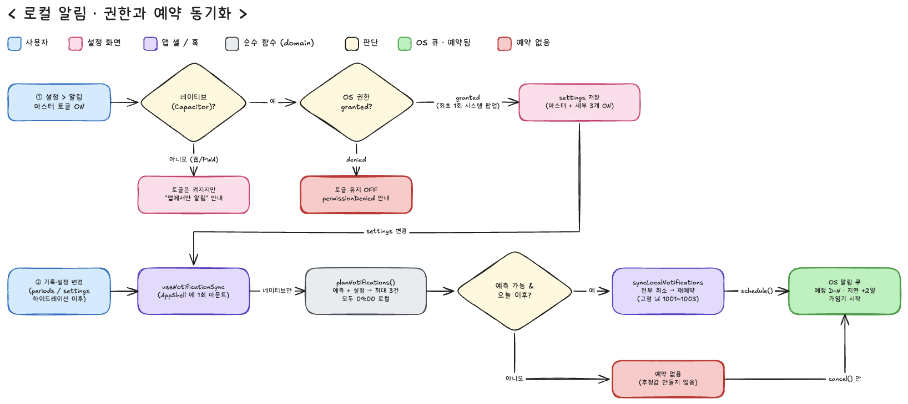

# 로컬 알림 (Local Notifications)

> 위치: `src/domain/notification/schedule.ts`, `src/lib/notifications/localNotifications.ts`, `src/hooks/useNotificationSync.ts`, `src/components/my-page/NotificationsScreen.tsx`
> 설정 화면 UI 자체는 [settings.md → Notifications screen](./settings.md#notifications-screen) 참고. 이 문서는 "알림이 어떻게 계산되고 기기에 예약되는가"를 다룹니다.

## 로컬 알림이란

서버 없이 **기기 자체가 정해진 시각에 띄우는 알림**입니다. 앱이 "9월 30일 09:00에 '생리 예정일이 3일 남았어요'를 보여줘"라고 iOS에 미리 예약해 두면, 그 시각에 앱이 꺼져 있어도 OS가 배너를 띄웁니다. 알람 앱과 같은 원리이고, 구현은 `@capacitor/local-notifications` 플러그인입니다.

| | 로컬 알림 (dwee 채택) | 서버 푸시 (CLAUDE.md 명시적 제외) |
|---|---|---|
| 보내는 주체 | 기기 안의 앱이 스스로 예약 | 우리 서버 → APNs → 기기 |
| 서버·인터넷 | 불필요 | 필요 (푸시 서버, 토큰 관리) |
| 사용자 데이터 | 서버로 가지 않음 — 예측일 계산도 기기 안에서 | 서버가 사용자 기록을 알아야 함 |

dwee 의 알림 3종은 전부 사용자 본인의 기록으로 계산되는 날짜라 서버가 낄 이유가 없습니다. CLAUDE.md 의 "실제 푸시 금지"는 서버 푸시를 뜻하므로 로컬 알림은 범위 안으로 해석했습니다 (출시 계획 Phase 0, 2026-09-15 결정 — [release-plan-v1.md](../product/release-plan-v1.md)).

**웹(PWA)에서는 동작하지 않습니다.** `Capacitor.isNativePlatform()` 이 false 면 예약 코드 전체가 no-op 이고, 설정 화면은 토글 아래에 `webOnlyHint`("앱에서만 알림이 와요")만 보여줍니다.

---

## 알림 종류

| kind | 발송일 | 조건 | 고정 id |
|---|---|---|---|
| `periodDue` 생리 예정 | 예상 시작일 − N일 (N = `notifPeriodDueLeadDays`, 0~14, 설정 화면 휠) | `notifPeriodDueEnabled` | 1001 |
| `periodDelay` 생리 지연 | 예상 시작일 + 2일 (`PERIOD_DELAY_GRACE_DAYS`) | `notifPeriodDelayEnabled` | 1002 |
| `fertile` 가임기 | 가임기 추정 시작일 (`predictFertileWindow`) | `notifFertileEnabled` | 1003 |

- 모두 **기기 로컬 시각 09:00** 에 발송 (`NOTIFICATION_HOUR`).
- 종류당 최대 1건. 지연 알림에 2일 여유를 두는 이유는 예측이 하루 어긋났을 때 바로 재촉하지 않기 위해서입니다.
- 기획 원안(`mvp1-spec.md` §6)에 있던 "매일 저녁 기록 리마인드"는 구현하지 않았습니다.

**카피** (`myPage.notifications.push.*`, en 원본 · ko 번역)

| kind | en | ko |
|---|---|---|
| periodDue | Period coming up — Your next period is expected in N days. Take it easy this week. | 생리가 다가오고 있어요 — 다음 생리가 N일 뒤로 예상돼요. 이번 주는 조금 여유롭게 보내요. |
| periodDue (N=0) | Period expected today — Your next period is expected around today. Log it when it starts. | 오늘 생리가 예상돼요 — 오늘 즈음 생리가 예상돼요. 시작하면 기록해 주세요. |
| periodDelay | Period not logged yet — Your expected date has passed. Has it started? Log it when you can. | 아직 생리 기록이 없어요 — 예상일이 지났어요. 혹시 시작됐나요? 편하실 때 기록해 주세요. |
| fertile | Fertile window — Your fertile window is estimated to start today. | 가임기 예상 시작 — 가임기가 오늘 시작될 것으로 예상돼요. |

`health-copy.md` 규칙 그대로 — 단언 대신 "expected / estimated / 예상 / 추정", 재촉 대신 "when you can / 편하실 때".

---

## 흐름

> 원본: [`docs/diagrams/local-notifications.excalidraw`](../diagrams/local-notifications.excalidraw) (Excalidraw).

### ① 권한 — 마스터 토글을 켤 때

1. 사용자가 설정 > 알림에서 **마스터 토글을 ON**.
2. **네이티브인가?** — 웹/PWA 면 권한 절차 없이 토글만 켜지고 `webOnlyHint` 안내. (설정값은 저장되므로 나중에 앱에서 로그인하면 그대로 예약됨)
3. 네이티브면 `ensureNotificationPermission()` — 이미 `granted` 면 통과, `denied` 면 거부, 아직 물어본 적 없으면 **iOS 시스템 팝업**을 띄움 (iOS 는 이 팝업을 앱당 1회만 보여주고, 이후엔 설정 앱에서만 바꿀 수 있음).
4. **거부** → 토글은 OFF 로 남고 `permissionDenied` 안내가 뜸. 설정값은 바뀌지 않음.
5. **허용** → `settingsStore.update()` 로 마스터 + 세부 3개를 한 번에 ON.

세부 토글은 권한을 다시 묻지 않습니다. 세부 3개를 모두 끄면 마스터도 자동으로 꺼집니다.

### ② 예약 동기화 — 기록이나 설정이 바뀔 때

1. `periodStore.periods` 또는 `settingsStore.settings` 가 바뀜 (두 스토어 모두 하이드레이션이 끝난 뒤에만).
2. `useNotificationSync` 의 `useEffect` 가 깨어남. 네이티브가 아니면 여기서 끝.
3. `planNotifications({ periods, settings, now })` — 순수 함수. `predictNextPeriod` 로 다음 예상일을 구하고, 켜진 종류마다 발송일을 계산해 **오늘 이후인 것만** 남김 (오늘이면 09:00 이전일 때만). 예측이 불가능하면(기록 없음) 빈 배열 — 추정값을 만들지 않음.
4. `syncLocalNotifications(planned, copyFor)` — 고정 id 1001~1003 을 **전부 취소한 뒤** 계획된 것만 다시 `schedule()`. 취소→재예약이라 이전에 뭐가 걸려 있었든(기록 수정, 설정 변경, 앱 재설치) OS 큐는 항상 현재 계획과 같아짐. 권한이 `granted` 가 아니면 취소만 하고 예약하지 않음.
5. 제목·본문은 이 시점에 `useT()` 사전으로 조립 — 도메인 함수는 `kind` 와 날짜만 돌려주고 문자열을 모름 (`cycle-logic.md` "rule 반환값에 표시 문자열 금지").

**"AppShell 에 1회 마운트"의 의미** — `useNotificationSync()` 는 `src/components/app/AppShell.tsx` 에서 한 번 호출됩니다. `AppShell` 은 `(app)` 라우트 그룹 전체를 감싸는 껍데기라, 사용자가 어느 화면에 있든(다이어리에서 기록 추가, 설정에서 토글 변경) 같은 훅 하나가 변경을 감지합니다. 알림 화면 안에 넣었다면 그 화면을 열었을 때만 갱신됐을 것이고, 여러 화면에 넣었다면 같은 변경에 취소→재예약이 겹쳐 실행됐을 겁니다.

### 로그아웃 · 탈퇴

`authStore.signOut()` / `deleteAccount()` 가 `cancelAllLocalNotifications()` 를 호출해 큐를 비웁니다. 다음 사용자(또는 게스트)의 기록으로 다시 계산되기 전까지 이전 계정의 예정일이 울리지 않도록.

---

## 한계와 주의

- **예약은 앱이 실행될 때만 갱신됩니다.** 앱을 오래 안 열면 마지막으로 계산된 예약이 그대로 울립니다. 생리를 기록하지 않은 채 예정일이 지나면 지연 알림이 한 번 울리고, 그 뒤는 앱을 열어 기록해야 다음 주기가 예약됩니다. (백그라운드 재계산은 로드맵 밖)
- 예약 시각은 기기 로컬 09:00 입니다. 시간대를 옮기면 OS 가 새 로컬 09:00 으로 해석합니다.
- 설정값(`notificationsEnabled`, `notif*`, lead days)은 `UserSettings` 에 저장되고, 로그인 사용자는 Supabase `profiles`(`notif_period_due_enabled` 등, migration `0016_profiles_notification_prefs.sql`)로 동기화됩니다 — 다른 기기에서 로그인해도 같은 값을 봅니다. 알림 자체(발송)는 기기별 로컬 알림이라 새 기기에서는 그 기기가 다시 앱을 열어야 예약이 생성됩니다.
- 실기기 발송 검증은 아직 안 됐습니다 — 출시 계획 Phase 4 (TestFlight) 에서 확인.

---

## 관련 규칙과 테스트

- `CLAUDE.md` 명시적 제외 "실제 푸시" — 서버 푸시만 해당.
- `.claude/rules/health-copy.md` — 추정형 카피, 데이터 부족 시 추정값 금지.
- `.claude/rules/cycle-logic.md` — 예측 함수 순수성, `confidence`, 반환값에 표시 문자열 금지.
- 테스트: `src/domain/notification/schedule.test.ts` (Vitest 10건) + [`schedule.cases.md`](../../src/domain/notification/schedule.cases.md).
