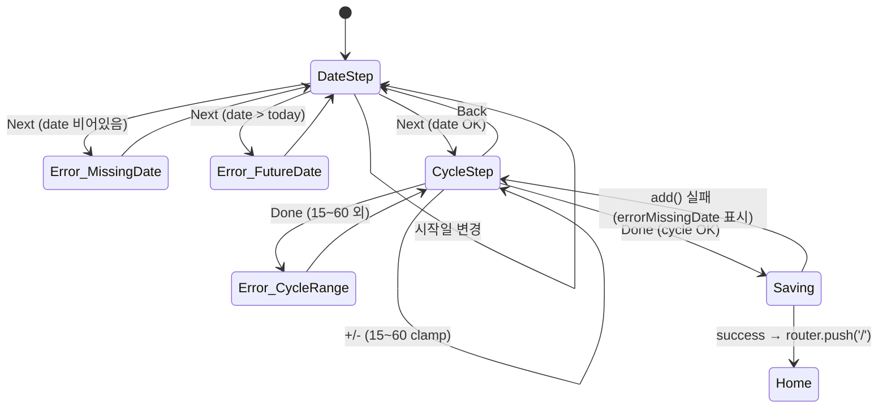
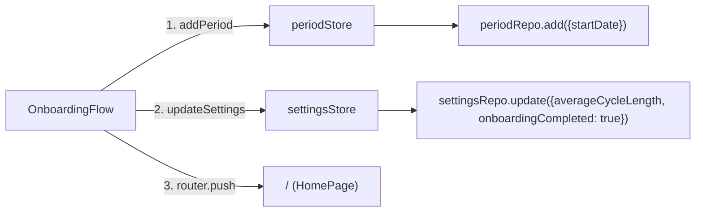

# 온보딩 플로우 (STEP 9.1)

> 위치: `src/components/auth/OnboardingFlow.tsx`, `src/app/(auth)/onboarding/page.tsx`
> 결정 적용: A2 = 평균 주기는 숫자 입력 (+/- 버튼 조정).

## State machine

## 데이터 흐름

## 검증 케이스

- 시작일 미입력 → "시작일을 골라주세요." 표시 후 step 전환 안 됨
- 시작일이 오늘 이후 → "오늘 이전 날짜를 골라주세요." 표시
- cycleLength `<` 15 또는 `>` 60 → +/- 버튼이 clamp하므로 발생 불가, 단 방어 코드는 존재
- Back 버튼 → DateStep 복귀, 입력값 보존
- Done → 저장 중에는 버튼 disabled, 저장 후 `/` 이동
