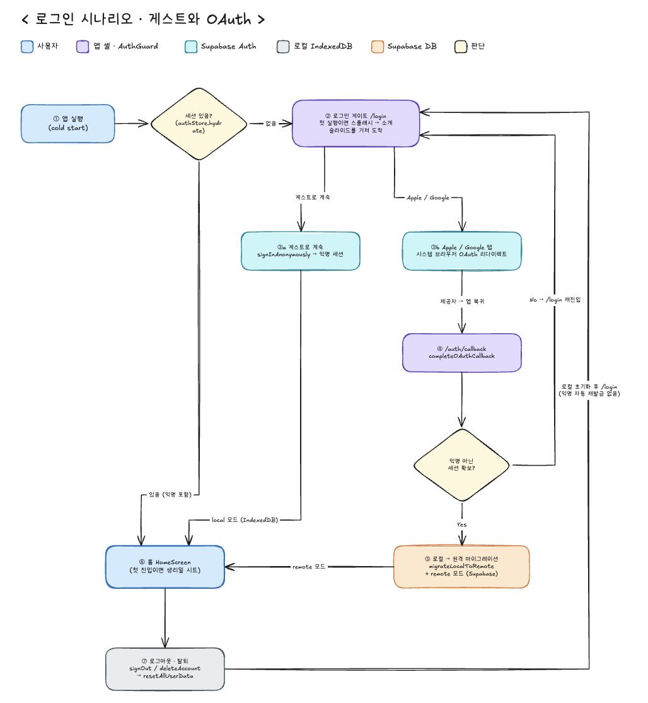
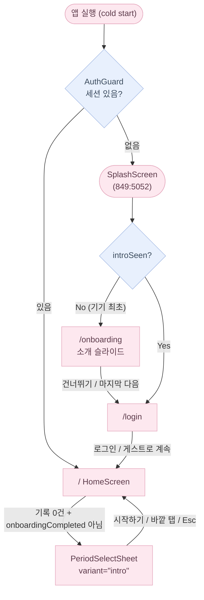
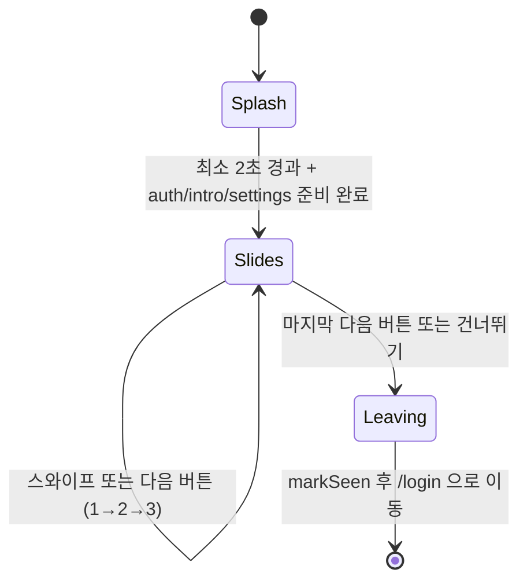

# 온보딩 플로우

> 위치: `src/app/(intro)/{layout,onboarding/page}.tsx`, `src/components/onboarding/{OnboardingScreen,OnboardingSlides,PageIndicator,RecordSlideArt,DiarySlideArt,CareSlideArt}.tsx`, `src/components/auth/{AuthGuard,LoginScreen,LoginHero}.tsx`, `src/components/app/{SplashScreen,PeriodSelectSheet,HomeScreen}.tsx`, `src/components/ui/FitStage.tsx`, `src/store/introStore.ts`, `src/data/repositories/IntroRepository.ts`, `src/data/adapters/indexeddb/IndexedDBIntroAdapter.ts`, `src/hooks/useBootDelay.ts`, `src/lib/loginEntrance.ts`

기기 최초 실행 시: **스플래시(로고) → 온보딩 슬라이드 1·2·3 → 로그인 → (홈 진입 시) 생리일 기입 시트 → 홈**. 이미 소개를 본 기기는 슬라이드를 건너뛰고 곧장 로그인으로 간다.

## 라우팅 흐름

> 원본: [`docs/diagrams/login-flow.excalidraw`](../diagrams/login-flow.excalidraw) (Excalidraw). 로그인 게이트 이후의 분기를 그린 것이고, 첫 실행 라우팅은 아래 Mermaid 참고.

`AuthGuard`는 `(app)`/`(fullscreen)` 레이아웃만 감싼다. `(intro)`/`(auth)` 그룹(즉 `/onboarding`, `/login`)에는 가드가 없어 — `OnboardingScreen`·`LoginScreen` 이 각자 authStore 를 직접 hydrate 하고, 이미 세션이 있으면 스스로 `/`로 돌아간다.

```mermaid
flowchart TD
    Launch(["앱 실행 (cold start)"])
    Guard{"AuthGuard\n세션 있음?"}
    Splash(["SplashScreen\n(849:5052)"])
    IntroSeen{"introSeen?"}
    Onboarding["/onboarding\n소개 슬라이드"]
    Login["/login"]
    Home["/  HomeScreen"]
    IntroSheet["PeriodSelectSheet\nvariant=#quot;intro#quot;"]

    Launch --> Guard
    Guard -->|"있음"| Home
    Guard -->|"없음"| Splash --> IntroSeen
    IntroSeen -->|"No (기기 최초)"| Onboarding -->|"건너뛰기 / 마지막 다음"| Login
    IntroSeen -->|"Yes"| Login
    Login -->|"로그인 / 게스트로 계속"| Home
    Home -->|"기록 0건 + onboardingCompleted 아님"| IntroSheet
    IntroSheet -->|"시작하기 / 바깥 탭 / Esc"| Home

    classDef ui fill:#FDE8EF,stroke:#E5A8BD,color:#5C3A4A;
    classDef logic fill:#E8F0FD,stroke:#A8BDE5,color:#3A4A5C;
    class Launch,Splash,Onboarding,Login,Home,IntroSheet ui;
    class Guard,IntroSeen logic;
```

- `introSeen` 이 아직 없던 세션 보유 기기(온보딩 도입 이전부터 쓰던 기기)는 `AuthGuard` 가 자동으로 `markSeen()` 을 호출한다 — 그래야 로그아웃했을 때 소개 화면이 뒤늦게 뜨지 않는다.
- `introRepo.isSeen()` 읽기가 실패하면(스토리지 오류 등) `introStore` 는 `seen: true` 로 **fail-open** 한다. 스플래시에 갇히는 대신 곧장 `/login` 으로 보내기 위함이다.
- `/magazine/personal-body-type/share/[type]` 등 `AuthGuard`의 `PUBLIC_PREFIXES` 화이트리스트 경로는 이 흐름 전체를 우회한다 (별도 문서: [`diagnose.md`](./diagnose.md) §"공유 (Share)").

## 온보딩 화면 상태

```mermaid
stateDiagram-v2
    [*] --> Splash
    Splash --> Slides : 최소 2초 경과 + auth/intro/settings 준비 완료
    Slides --> Slides : 스와이프 또는 다음 버튼 (1→2→3)
    Slides --> Leaving : 마지막 다음 버튼 또는 건너뛰기
    Leaving --> [*] : markSeen 후 /login 으로 이동
```

- **Splash**: `useBootDelay(2000)` 로 최소 2초 유지 — 로고가 번쩍하고 바로 사라지지 않게 한다. `(intro)` 그룹은 AppShell 밖이라 `OnboardingScreen` 이 auth/intro/settings 스토어를 직접 hydrate 한다.
- **Slides**: `OnboardingSlides` — scroll-snap 캐러셀 3장(`record`/`diary`/`care`, Figma 821:5119 · 832:5209 · 832:5184). 좌우 스와이프 또는 하단 "다음" 버튼으로 이동, 우상단 "건너뛰기"는 어디서든 즉시 종료. `PageIndicator`: 현재 페이지 26×10 gray900, 나머지 10×10 gray400. 각 슬라이드 그림(`RecordSlideArt`/`DiarySlideArt`/`CareSlideArt`)은 앱 화면 목업을 코드로 그리고 문구는 i18n 사전에서 가져오므로 en 기기엔 영어 목업이 뜬다. 공용 `FitStage`가 시안 좌표계(390×562)를 영역에 맞춰 통째로 확대·축소한다.
- **Leaving**: 마지막 "다음" 또는 "건너뛰기" 시 `leaving=true` + `queueLoginEntrance()`(로그인 스티커 연출 예약) + `markSeen()`을 호출한다. `leaving` 이 true 인 동안은 `introSeen` 이 이미 true 로 바뀌어도 스플래시로 되돌아가지 않는다 — 안 그러면 로그인 화면 앞에 로고가 한 번 더 번쩍인다. `/login`은 슬라이드 마운트 시점에 미리 `router.prefetch`된다.
- 이미 세션이 있는 상태로 `/onboarding` 에 진입하면(예: 직접 URL 이동) `OnboardingScreen` 은 곧장 `/`로 리다이렉트한다.

## 로그인 화면 동의 체크 (연령 확인)

`LoginScreen` 은 버튼 위에 `ConsentCheck`("만 14세 이상이며 이용약관과 개인정보처리방침에 동의합니다", 두 문서는 공개 `/legal/terms`·`/legal/privacy` 링크)를 **항상** 띄우고, 체크 전에는 Apple/Google/게스트 버튼을 모두 비활성으로 둔다. 어느 버튼이든 누르는 순간 `settingsStore.confirmAge()` 가 타임스탬프를 먼저 저장한 뒤(OAuth 는 리다이렉트 전에) 로그인을 진행한다. 이 기기에 이미 동의 기록(`settings.ageConfirmedAt`)이 있으면 체크된 채로 시작한다 — 사용자가 체크를 풀면 버튼은 다시 비활성(저장된 기록은 그대로). 예전엔 동의 기록이 있으면 행을 숨겼는데, 로그인 취소 후 돌아오거나 게스트가 마이페이지에서 들어올 때 체크박스가 "어떨 땐 있고 어떨 땐 없는" 것처럼 보여 바꿨다(2026-09-26 TestFlight R3-10). 기록은 로그아웃(`resetAllUserData`)·재설치 때만 지워진다. 기준 연령은 출시 계획 §1.2 의 A안(만 14세).

## 네이티브(Capacitor) OAuth 복귀

앱 안에서는 `window.location.origin` 이 `capacitor://localhost` 라 Supabase 가 돌려보낼 수 없고 Google 은 WebView 안 OAuth 를 막는다. 그래서 `authStore.signInWithOAuth` 는 네이티브에서 `redirectTo: 'dwee://auth/callback'` + `skipBrowserRedirect` 로 URL 만 받아 `@capacitor/browser` 의 시스템 브라우저 시트에서 진행하고, 제공자가 커스텀 스킴으로 돌아오면 `@capacitor/app` 의 `appUrlOpen` 이 그 URL 의 query/hash 를 그대로 `/auth/callback/` 로 넘긴다(`lib/auth/nativeCallback.ts`). 이후는 웹과 동일하게 `AuthCallbackScreen` → `completeOAuthCallback` 이 세션·마이그레이션을 처리한다. 사용자가 시트를 닫아 버리면 `browserFinished` 이벤트로 로딩 상태를 풀어 버튼을 되살린다. Info.plist 의 `dwee` URL 스킴 등록과 Supabase Redirect URL 추가는 출시 계획 Phase 2·3.

## 로그인 화면 진입 연출

`LoginHero`의 스티커 5개(헤드폰·말차·토스트·레몬워터 + 기존 workout.png)가 화면 밖에서 날아 들어오는 연출은 **온보딩 직후 첫 진입에만** 재생된다. `src/lib/loginEntrance.ts`가 `appToast`와 같은 패턴의 모듈 스코프 1회성 신호를 들고 있다 — `queueLoginEntrance()`로 예약, `consumeLoginEntrance()`로 소비 즉시 초기화. 로그아웃 후 재진입, 마이페이지 → 로그인, 앱 재실행 등 다른 모든 경로는 신호가 비어 있어 스티커가 제자리(rest)에 바로 보인다. 이미지 디코드가 끝난 뒤에야 함께 출발하도록 `wait → fly` 두 단계를 거친다(`tailwind.config.ts`의 `stickerFlyIn`). `LoginScreen`은 이제 settingsStore 도 hydrate 한다 — 안 하면 재방문한 ko 기기가 en 기본값으로 보이던 버그가 있었다.

## 생리일 기입 시트 (첫 홈 진입)

`HomeScreen`이 `periodsHydrated && periods.length === 0 && !settings.onboardingCompleted`일 때만 `PeriodSelectSheet`를 `variant="intro"`(Figma 832:5234)로 띄운다. 기존 계정의 원격 기록이 있으면 `periods.length`가 바로 0이 아니게 되어 시트는 자동으로 뜨지 않는다. `default` variant와 달리 헤더 X/✓가 없고 하단 고정 "시작하기" 하나뿐이며(선택 없이도 항상 활성), 홈이 아니라 불투명한 `bg-brand-gray50` 배경 위에 뜬다 — 닫힐 때 시트가 내려가며 배경이 걷혀 홈이 드러난다.

| 사용자 동작 | 결과 |
|---|---|
| 아무 날짜도 선택하지 않고 "시작하기" | 기록 없음. `onboardingCompleted: true`만 저장 |
| 시작일 하나만 탭하고 "시작하기" | `defaultPeriodEndDate(pendingStart, averagePeriodLength)`로 종료일을 자동으로 채워 1건 저장 (기존 정책 재사용) |
| 범위(시작~종료)를 완성하고 "시작하기" | 선택한 범위 그대로 1건 저장 |
| 바깥(backdrop) 탭 / Esc | `onSubmit([])`과 동일 취급 — 기록 없음, `onboardingCompleted: true`만 저장 |

네 경우 모두 `settings.onboardingCompleted`가 `true`로 끝난다. 이 값은 **계정 설정**이라 다른 기기에서 같은 계정으로 로그인해도 다시 묻지 않는다.

## 상태 저장 위치

| 상태 | 저장 위치 | 스코프 | 지워지는 시점 |
|---|---|---|---|
| `introSeen` | IndexedDB `dwee:device:intro_seen` (`IntroRepository`→`indexedDBIntroAdapter`, **로컬 전용** — Supabase 어댑터 없음, 리포 모드와 무관) | 기기 단위 | 지워지지 않음 — `resetAllUserData()` 대상에서 의도적으로 제외 |
| `settings.onboardingCompleted` | `SettingsRepository` (IndexedDB 로컬 또는 로그인 시 Supabase) | 계정 단위 | 로그아웃/`resetAllUserData()` 시 로컬 캐시와 함께 초기화되지만, 로그인된 계정 자체의 원격 값은 남아 다른 기기에서도 그대로 적용 |
| `settings.ageConfirmedAt` | `SettingsRepository` 의 **로컬 필드** — IndexedDB 에만 저장, Supabase `profiles` 컬럼 없음(`SupabaseSettingsAdapter` 가 매핑하지 않음) | 설치(기기) 단위 | 로그아웃/탈퇴의 `resetAllUserData()` 로 지워져 다음 로그인 때 다시 묻는다 — 같은 기기를 다른 사람이 쓸 수 있으므로 의도된 동작 |
| `loginEntrance` 연출 신호 | 모듈 스코프 in-memory 변수(`src/lib/loginEntrance.ts`) — 저장소 아님 | 현재 탭의 이번 세션 | 새로고침하면 사라짐. `consumeLoginEntrance()` 호출 즉시 1회성으로 소비됨 |

## Figma 노드 ID

| 화면 | 노드 |
|---|---|
| 000 스플래시 | 849:5052 |
| 001_1 슬라이드(기록) | 821:5119 |
| 001_2 슬라이드(다이어리) | 832:5209 |
| 001_3 슬라이드(케어) | 832:5184 |
| 001_4 로그인 | 256:16007 |
| 001_5 생리일 기입 시트 | 832:5234 |

## 검증 케이스

- 기기 최초 실행(`introSeen=false`, 세션 없음) → `/onboarding` 진입, 스플래시 최소 2초 후 슬라이드 1 노출
- 슬라이드 1·2에서 "다음" → 다음 슬라이드로 스크롤, `PageIndicator` 이동
- 슬라이드 어디서든 "건너뛰기", 또는 슬라이드 3에서 "다음" → `markSeen()` + `/login` 이동, 로그인 화면에 스티커 fly-in 연출
- 이미 온보딩을 마친 기기(`introSeen=true`) → `/onboarding` 진입 시 스플래시 후 슬라이드 없이 곧장 `/login`
- 세션이 있는 상태로 `/onboarding` 진입 → `/`로 리다이렉트
- `introRepo.isSeen()` 예외 발생 → `seen=true`로 fail-open, `/login`으로 이동 (스플래시에 갇히지 않음)
- 온보딩 도입 이전부터 세션을 가진 기기 → 로그아웃 후에도 소개 슬라이드가 뜨지 않음 (`AuthGuard`가 세션 존재 시 자동 `markSeen`)
- 계정에 기록 0건 + `onboardingCompleted=false` 상태로 첫 홈 진입 → 생리일 기입 시트 노출
- 이미 원격에 기록이 있는 계정으로 로그인 → 시트 노출 안 됨 (`periods.length`가 0이 아님)
- 시트에서 날짜 선택 없이 "시작하기" / 바깥 탭 / Esc 어느 경로든 → 기록 없이 `onboardingCompleted: true`만 저장되고 다시 뜨지 않음
- `pnpm dev` 환경에서 `seedForPhase()`로 시드 후 settings 스토어를 rehydrate — 시드된 홈 스냅샷 위에 intro 시트가 뜨지 않는지 확인 (`src/dev/seedForPhase.ts`)
