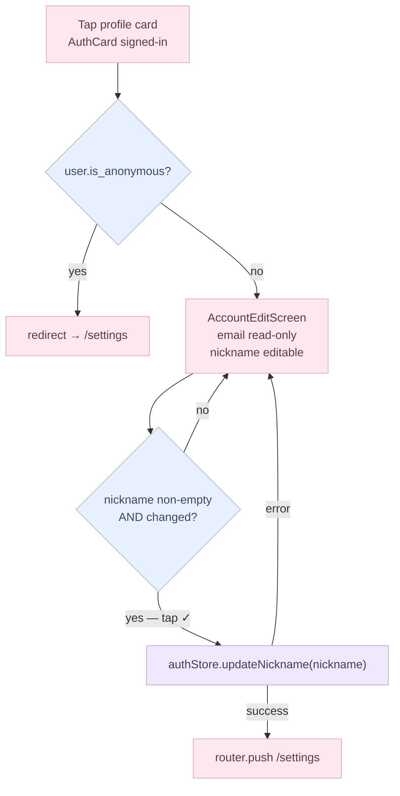
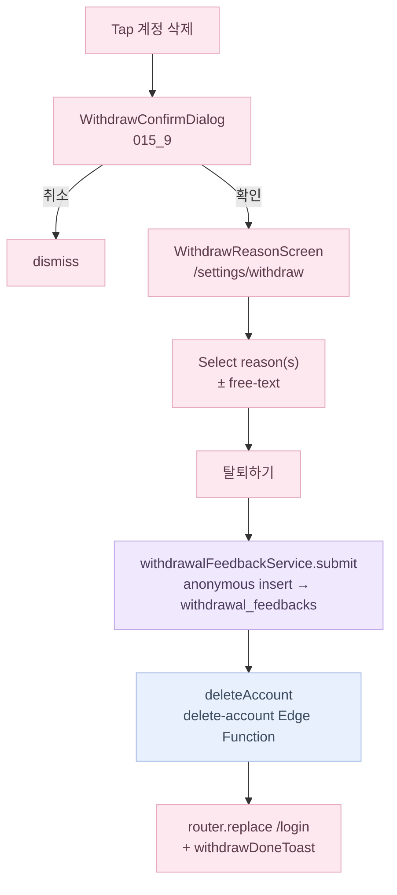

# MyPage (Settings) Flow

Route: `(app)/settings` — rendered by `MyPageScreen` via the thin `settings/page.tsx` wrapper.
Figma refs: 015_1 (signed-out), 015_2 (signed-in), 015_3 (account edit).

---

## Card composition

MyPage renders a fixed stack of cards, some conditionally visible:

| Card                    | Always visible | Condition                                                                                                                                                                                                                                                                                                                |
| ----------------------- | -------------- | ------------------------------------------------------------------------------------------------------------------------------------------------------------------------------------------------------------------------------------------------------------------------------------------------------------------------ |
| `AuthCard`              | yes            | signed-out → login CTA row; signed-in → dark profile card                                                                                                                                                                                                                                                                |
| `CycleSummaryCard`      | yes            | shows status chip when data sufficient; "not enough data" copy otherwise                                                                                                                                                                                                                                                 |
| `MyTestsCard`           | yes            | `나의 테스트` — one row per quiz; body-type row shows "결과" link (→ result page) when `bodyTypeReportStore` has a report (via `BodyTypeReportRepository`, IndexedDB/Supabase), "체형 분석 해보기" CTA (→ article intro) otherwise. Skips render until the store hydrates, to avoid a flash between CTA and result copy. |
| `PreferencesCard`       | yes            | notifications row (→ `/settings/notifications`) + language row + holidays row (→ `/settings/holidays`)                                                                                                                                                                                                                   |
| `SupportCard`           | yes            | notices / Q&A / terms / privacy rows                                                                                                                                                                                                                                                                                     |
| `AccountManagementCard` | signed-in only | sign-out + account deletion rows                                                                                                                                                                                                                                                                                         |

---

## Auth-state variants

---

## Account edit screen (015_3)

Route: `(fullscreen)/settings/account` — rendered by `AccountEditScreen`.

Anonymous users are bounced back to `/settings` via a `useEffect` guard. Only non-anonymous authenticated users can reach the form.

`AccountEditScreen` calls `authStore.updateNickname(nickname)` and never imports the Supabase client directly; the store owns the `supabase.auth.updateUser({ data: { nickname } })` call internally, and its `onAuthStateChange` listener refreshes `user_metadata` automatically after a successful update — no manual store mutation needed in the screen.

---

## Sign-out flow

Tapping "로그아웃" in `AccountManagementCard` opens `LogoutConfirmDialog` (replaces the old `window.confirm`). On confirm:

1. `queueAppToast('myPage.signOutToast')` — queues a cross-route confirmation message.
2. `router.push('/login')` — navigates immediately (no blank-screen wait).
3. `void signOut()` — fires in the background; wipes local cache and resets the auth store.

`HomeScreen` and `LoginScreen` each call `consumeAppToast()` on mount and render a **top-confirm** Toast (dark rounded card, check icon, `animate-slideDownFade`) if a message is queued. This pattern is reusable for any future cross-route confirmation.

---

## Account deletion flow (015_9 → 262:3527)

### Confirm dialog (015_9)

Tapping "계정 삭제" in `AccountManagementCard` opens `WithdrawConfirmDialog` (pink alert badge, same visual language as `LogoutConfirmDialog`). On confirm, the user is pushed to the withdrawal reason screen instead of triggering deletion immediately.

### Reason collection screen (262:3527)

Route: `(fullscreen)/settings/withdraw` — rendered by `WithdrawReasonScreen`.

The user selects one or more reasons from a fixed list (`ReasonKey` union — nine preset keys + `'other'`). Selecting `'other'` reveals a free-text input (capped at 100 chars in UI, 500 chars in the DB). The "탈퇴하기" confirm button is disabled until at least one reason is selected.

**Visual spec (262:3527)**: a floating translucent back button (`bg-brand-gray400/50` + blur, 40px, 262:3532) sits absolutely over a transparent header, so the body scrolls underneath it instead of under a solid bar. Title sits 24px below the button, 16px side padding, reason rows spaced 16px apart. The bottom CTA is a full-width bar rather than an inset button: disabled state is `gray400` background / `gray200` text (262:3524), enabled is `gray900` background / `pink100` text (262:3610), 20px semibold, `pt-5` with `pb` at least 32px plus the safe-area inset.

On confirm:

1. `withdrawalFeedbackService.submit(reasons, otherText)` — inserts an anonymous row into `public.withdrawal_feedbacks` via the Supabase client. The table has no `user_id` column; the row survives the account cascade and is readable only by `service_role`.
2. `deleteAccount()` from `authStore` — calls the `delete-account` Edge Function (storage cleanup → `auth.admin.deleteUser`).
3. On success, `router.replace('/login')` with a `withdrawDoneToast`.

**`withdrawal_feedbacks` table** (migration 0011): anonymous, INSERT-only from authenticated non-anonymous clients (RLS blocks reads via anon key). `reasons text[]`, optional `other_text text`, `created_at timestamptz`. No `user_id` — deliberate; rows survive the account deletion cascade for analytics.

---

## Language settings screen (015_4)

Route: `(app)/settings/language` — rendered by `LanguageSettingsScreen`.

Two radio-style rows (English / 한국어). Tapping a row immediately calls `settings.setLocale(locale)` — no save button. The store persists the selection and the app re-renders in the chosen language on next `useT()` evaluation.

---

## Notifications screen

Route: `(app)/settings/notifications` — rendered by `NotificationsScreen`.

Matches Figma 292:2765. One master toggle expands into three per-topic sub-toggles:

| Toggle key                | Topic                   |
| ------------------------- | ----------------------- |
| `notifPeriodDueEnabled`   | Period due reminder     |
| `notifPeriodDelayEnabled` | Period delay alert      |
| `notifFertileEnabled`     | Fertile window reminder |

**Delivery (STEP 4, native only)** — full write-up with the Excalidraw flow in [notifications.md](./notifications.md). Summary: `hooks/useNotificationSync` (mounted in `AppShell`) turns the records + these settings into `domain/notification/schedule.planNotifications()` — period due = predicted start − lead days, period delay = predicted start + 2 days, fertile = estimated window start, each at 09:00 local; nothing is scheduled without a prediction or for a day already past. `lib/notifications/localNotifications` cancels the three fixed ids and re-schedules via `@capacitor/local-notifications` on every change, and on sign-out/delete. The master toggle asks for OS permission once; a denial keeps it off and shows `permissionDenied`. The web/PWA build shows `webOnlyHint` instead.

`notifPeriodDueLeadDays` (0–14, persisted to `UserSettings`) controls a 3-row wheel picker for lead time when period-due is enabled. The wheel appears inline under the period-due row; it's built on the shared `WheelColumn` (`src/components/ui/WheelColumn.tsx` — the same scroll-snap column the diary's year/month picker uses), so drag/flick scrolling settles a value in the center, and tapping a neighbor row also selects it directly.

Master-toggle semantics: turning ON enables all three subs; turning OFF disables all subs and collapses the sub-toggle section. When the last enabled sub is individually turned off, master auto-clears. Persisted to IndexedDB via `settingsStore.update()` — no push infrastructure yet; Supabase profiles table has no columns for these fields (uses `DEFAULT_USER_SETTINGS` fallback on load).

---

## 공휴일 설정

Route: `(app)/settings/holidays` — rendered by `HolidaysScreen`. Reached from `PreferencesCard`'s holidays row on MyPage.

Two toggle rows (South Korea / United States), built on shared `SettingCard` / `SettingDetailRow` from the new `src/components/my-page/SettingRows.tsx` — the same building blocks `NotificationsScreen` was refactored onto.

- **Resolved value shown**: both this screen's toggles and `PreferencesCard`'s summary label call `resolveHolidayCountries(setting, locale)` from `domain/holiday`.
- **`null` / auto semantics**: `UserSettings.holidayCountries` defaults to `null` — "follow the app language" (ko → KR, en → US). The screen shows an "auto until changed" hint (`c.autoHint`) only while the setting is `null`. Tapping either toggle computes the currently-resolved list and saves an explicit array from that point on — so a later language change no longer touches the choice. An empty array (`[]`, both off) is distinct from `null` and is preserved.
- **Persistence**: `settingsStore.update({ holidayCountries })` — IndexedDB for anonymous/local users; for signed-in users, `SupabaseSettingsAdapter` maps it to the `profiles.holiday_countries text[] null` column (migration `0014_profiles_holiday_countries.sql`, check constraint restricts values to `{KR, US}`).
- **Where it's consumed**: `DiaryMonthGrid` (both the `/log` Diary tab and the `/log/customize` sticker-customize screen) — see [`docs/flows/log.md §공휴일 표시`](./log.md).
- Domain rules (lunar-date table, substitute-holiday policy, supported years): [`docs/domain/holiday.md`](../domain/holiday.md).

---

## Sub-page shared shell

All `/settings/*` sub-pages share `bg-brand-gray200`. Legal/support sub-pages (`terms`, `privacy`, `qna`, and the `notices` stub via `SubPagePlaceholder`) additionally wrap their body in a white card (`rounded-2xl bg-brand-white px-5 py-6 shadow-...`) — previously only `qna` had this treatment, the others sat on `bg-brand-gray50` with a bare-background body.

Every sub-page header uses `MyPageBackLink` (`src/components/my-page/MyPageBackLink.tsx`) instead of a raw `<Link href="/settings">` + inline `BackIcon`. Its click handler is the shared `useHistoryBackClick()` hook (`src/hooks/useHistoryBackClick.ts`, also used by `FoodArticleScreen`'s back button — see `docs/flows/home.md`): it calls `router.back()` when the immediately-preceding history entry is itself an in-app page — checked via the Navigation API's `currentEntry.index > 0` where supported, falling back to `window.history.length > 1` on older WebViews — so `MyPageScreen`'s scroll position survives the round trip, and falls back to the link's `href="/settings"` only when there's no in-app history (a direct deep link). `history.length` alone isn't enough: a tab that arrived from an external site also has `length > 1`, and calling `back()` there would leave the app entirely. Its icon button uses `bg-brand-gray300`, one shade darker than the page background, so it stays visible against `bg-brand-gray200`.

`MyPageScreen` pairs this with `useScrollRestore('mypage')` (`src/hooks/useScrollRestore.ts`): it saves scroll position to `sessionStorage` and re-applies it frame-by-frame after remount, because store hydration keeps growing the card list after paint — past the point where Next's one-shot popstate scroll restore already ran and gave up.

---

## Sub-page routes

| Route                     | Figma    | Status                                                                      |
| ------------------------- | -------- | --------------------------------------------------------------------------- |
| `/settings/language`      | 015_4    | live — `LanguageSettingsScreen`                                             |
| `/settings/withdraw`      | 262:3527 | live — `WithdrawReasonScreen` (fullscreen)                                  |
| `/settings/notifications` | 292:2765 | live — `NotificationsScreen`                                                |
| `/settings/holidays`      | —        | live — `HolidaysScreen`                                                     |
| `/settings/qna`           | 015_5    | live — `QnaScreen` (static support email + copy-to-clipboard)               |
| `/settings/terms`         | 015_16   | live — `TermsScreen` (제1~15조 + 부칙; ko 원문 + en 번역, 앱 locale 따름)   |
| `/settings/privacy`       | 015_17   | live — `PrivacyScreen` (제1~17조 + 부칙; ko 원문 + en 번역, 앱 locale 따름) |
| `/settings/notices`       | 015_4    | stub                                                                        |

같은 본문(`components/legal/TermsArticle`, `PrivacyArticle`)을 공개 라우트 `/legal/terms`, `/legal/privacy`(`(legal)` 그룹, 세션 불필요, `?lang=en|ko` 고정 가능)가 재사용한다 — App Store Privacy Policy URL 과 OAuth 동의 화면 링크용. `/settings/qna` 의 이메일 카드(`components/legal/SupportContactCard`)도 공개 `/legal/support`(App Store Support URL)와 공유한다.

---

## i18n keys

All copy lives under `myPage.*` in `src/i18n/locales/{en,ko}.ts`. Keys by feature:

- `myPage.signOutDialog.*` — logout confirm dialog title, body, confirm button
- `myPage.signOutToast` — post-logout confirmation message shown on `/login`
- `myPage.language.*` — language settings screen title and locale labels
- `myPage.withdrawDialog.*` — withdrawal confirm dialog title, body, confirm button
- `myPage.withdraw.*` — reason-collection screen title, reason labels, free-text placeholder, submit button
- `myPage.withdrawDoneToast` — post-deletion confirmation message shown on `/login`
- `myPage.notifications.*` — notifications screen title, master toggle, per-topic labels/subtitles, wheel picker strings
- `myPage.holidays.*` — holidays screen title/description, per-country title/subtitle, auto hint, `PreferencesCard`'s resolved-value labels
- `myPage.settings.holidays` — the `PreferencesCard` row label
- `holiday.KR.*` / `holiday.US.*` — top-level (not under `myPage`) holiday name strings rendered on the diary calendar cell, plus `KR.substitute` and `US.observedSuffix`
- `myPage.tests.*` — tests card title, body-type CTA label, body-type result label

Nickname fallback logic (email local-part) is in `AuthCard.getNickname()` — not an i18n key.
