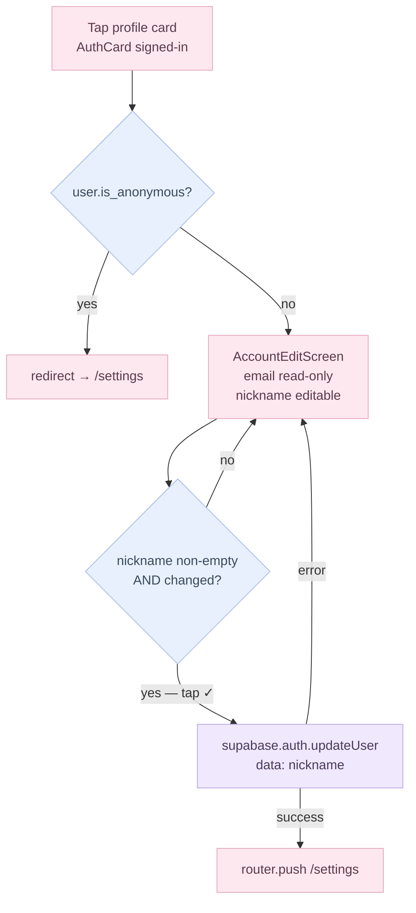

# MyPage (Settings) Flow

Route: `(app)/settings` — rendered by `MyPageScreen` via the thin `settings/page.tsx` wrapper.
Figma refs: 015_1 (signed-out), 015_2 (signed-in), 015_3 (account edit).

---

## Card composition

MyPage renders a fixed stack of cards, some conditionally visible:

| Card | Always visible | Condition |
|---|---|---|
| `AuthCard` | yes | signed-out → login CTA row; signed-in → dark profile card |
| `CycleSummaryCard` | yes | shows status chip when data sufficient; "not enough data" copy otherwise |
| `PreferencesCard` | yes | notification toggle + language row |
| `SupportCard` | yes | notices / Q&A / terms / privacy rows (stub routes) |
| `AccountManagementCard` | signed-in only | sign-out + account deletion rows |

---

## Auth-state variants

---

## Account edit screen (015_3)

Route: `(fullscreen)/settings/account` — rendered by `AccountEditScreen`.

Anonymous users are bounced back to `/settings` via a `useEffect` guard. Only non-anonymous authenticated users can reach the form.

The auth store's `onAuthStateChange` listener refreshes `user_metadata` automatically after a successful update — no manual store mutation needed.

---

## Sign-out flow

Tapping "로그아웃" in `AccountManagementCard` opens `LogoutConfirmDialog` (replaces the old `window.confirm`). On confirm:

1. `queueAppToast('myPage.signOutToast')` — queues a cross-route confirmation message.
2. `router.push('/login')` — navigates immediately (no blank-screen wait).
3. `void signOut()` — fires in the background; wipes local cache and resets the auth store.

`HomeScreen` and `LoginScreen` each call `consumeAppToast()` on mount and render a **top-confirm** Toast (dark rounded card, check icon, `animate-slideDownFade`) if a message is queued. This pattern is reusable for any future cross-route confirmation.

---

## Language settings screen (015_7)

Route: `(app)/settings/language` — rendered by `LanguageSettingsScreen`.

Two radio-style rows (English / 한국어). Tapping a row immediately calls `settings.setLocale(locale)` — no save button. The store persists the selection and the app re-renders in the chosen language on next `useT()` evaluation.

---

## Sub-page routes

| Route | Figma | Status |
|---|---|---|
| `/settings/language` | 015_15 | live — `LanguageSettingsScreen` |
| `/settings/notices` | 015_4 | stub |
| `/settings/qna` | 015_5 | stub |
| `/settings/terms` | 015_16 | stub |
| `/settings/privacy` | 015_17 | stub |

Stub routes render `SubPagePlaceholder` with a back link and `myPage.subPage.comingSoon` copy.

---

## i18n keys

All copy lives under `myPage.*` in `src/i18n/locales/{en,ko}.ts`. New keys from this batch:

- `myPage.signOutDialog.*` — logout confirm dialog title, body, confirm button
- `myPage.signOutToast` — post-logout confirmation message shown on `/login`
- `myPage.language.*` — language settings screen title and locale labels

Nickname fallback logic (email local-part) is in `AuthCard.getNickname()` — not an i18n key.
