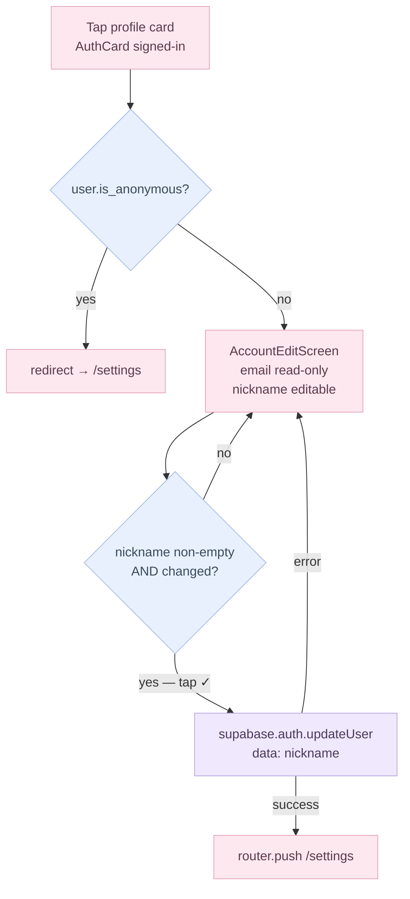
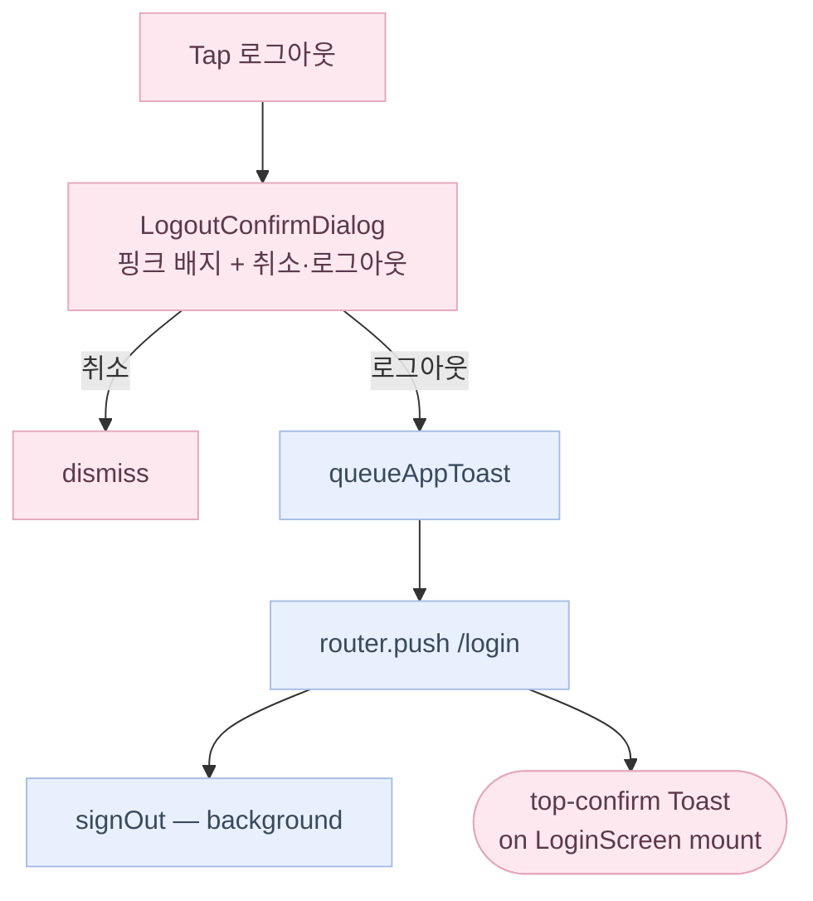

# MyPage (Settings) Flow

Route: `(app)/settings` — rendered by `MyPageScreen` via the thin `settings/page.tsx` wrapper.
Figma refs: 015_1 (signed-out), 015_2 (signed-in), 015_3 (account edit).

---

## Card composition

MyPage renders a fixed stack of cards, some conditionally visible:

| Card | Always visible | Condition |
|---|---|---|
| `AuthCard` | yes | signed-out → login CTA row; signed-in → dark profile card |
| `CycleSummaryCard` | yes | shows status chip when data sufficient; "not enough data" copy otherwise |
| `PreferencesCard` | yes | notification toggle + language row |
| `SupportCard` | yes | notices / Q&A / terms / privacy rows (stub routes) |
| `AccountManagementCard` | signed-in only | sign-out + account deletion rows |

---

## Auth-state variants


---

## Account edit screen (015_3)

Route: `(fullscreen)/settings/account` — rendered by `AccountEditScreen`.

Anonymous users are bounced back to `/settings` via a `useEffect` guard. Only non-anonymous authenticated users can reach the form.



The auth store's `onAuthStateChange` listener refreshes `user_metadata` automatically after a successful update — no manual store mutation needed.

---

## Sign-out flow

Tapping "로그아웃" in `AccountManagementCard` opens `LogoutConfirmDialog` (replaces the old `window.confirm`). On confirm:

1. `queueAppToast('myPage.signOutToast')` — queues a cross-route confirmation message.
2. `router.push('/login')` — navigates immediately (no blank-screen wait).
3. `void signOut()` — fires in the background; wipes local cache and resets the auth store.

`HomeScreen` and `LoginScreen` each call `consumeAppToast()` on mount and render a **top-confirm** Toast (dark rounded card, check icon, `animate-slideDownFade`) if a message is queued. This pattern is reusable for any future cross-route confirmation.



---

## Account deletion flow (015_9 → 015_14)

### Confirm dialog (015_9)

Tapping "계정 삭제" in `AccountManagementCard` opens `WithdrawConfirmDialog` (pink alert badge, same visual language as `LogoutConfirmDialog`). On confirm, the user is pushed to the withdrawal reason screen instead of triggering deletion immediately.

### Reason collection screen (015_10–015_14)

Route: `(fullscreen)/settings/withdraw` — rendered by `WithdrawReasonScreen`.

The user selects one or more reasons from a fixed list (`ReasonKey` union — nine preset keys + `'other'`). Selecting `'other'` reveals a free-text input (capped at 100 chars in UI, 500 chars in the DB). The "탈퇴하기" confirm button is disabled until at least one reason is selected.

On confirm:

1. `withdrawalFeedbackService.submit(reasons, otherText)` — inserts an anonymous row into `public.withdrawal_feedbacks` via the Supabase client. The table has no `user_id` column; the row survives the account cascade and is readable only by `service_role`.
2. `deleteAccount()` from `authStore` — calls the `delete-account` Edge Function (storage cleanup → `auth.admin.deleteUser`).
3. On success, `router.replace('/login')` with a `withdrawDoneToast`.

```mermaid
flowchart TD
    Tap[Tap 계정 삭제]
    Confirm[WithdrawConfirmDialog\n015_9]
    Cancel[dismiss]
    ReasonScreen[WithdrawReasonScreen\n/settings/withdraw]
    Select[Select reason(s)\n± free-text]
    Submit[탈퇴하기]
    Feedback[withdrawalFeedbackService.submit\nanonymous insert → withdrawal_feedbacks]
    Delete[deleteAccount\ndelete-account Edge Function]
    Login[router.replace /login\n+ withdrawDoneToast]

    Tap --> Confirm
    Confirm -->|취소| Cancel
    Confirm -->|확인| ReasonScreen
    ReasonScreen --> Select
    Select --> Submit
    Submit --> Feedback
    Feedback --> Delete
    Delete --> Login

    classDef ui fill:#FDE8EF,stroke:#E5A8BD,color:#5C3A4A;
    classDef logic fill:#E8F0FD,stroke:#A8BDE5,color:#3A4A5C;
    classDef storage fill:#F0E8FD,stroke:#BDA8E5,color:#4A3A5C;
    class Tap,Confirm,Cancel,ReasonScreen,Select,Submit,Login ui;
    class Delete logic;
    class Feedback storage;
```

**`withdrawal_feedbacks` table** (migration 0011): anonymous, INSERT-only from authenticated non-anonymous clients (RLS blocks reads via anon key). `reasons text[]`, optional `other_text text`, `created_at timestamptz`. No `user_id` — deliberate; rows survive the account deletion cascade for analytics.

---

## Language settings screen (015_7)

Route: `(app)/settings/language` — rendered by `LanguageSettingsScreen`.

Two radio-style rows (English / 한국어). Tapping a row immediately calls `settings.setLocale(locale)` — no save button. The store persists the selection and the app re-renders in the chosen language on next `useT()` evaluation.

---

## Sub-page routes

| Route | Figma | Status |
|---|---|---|
| `/settings/language` | 015_15 | live — `LanguageSettingsScreen` |
| `/settings/withdraw` | 015_10–14 | live — `WithdrawReasonScreen` (fullscreen) |
| `/settings/notices` | 015_4 | stub |
| `/settings/qna` | 015_5 | stub |
| `/settings/terms` | 015_16 | stub |
| `/settings/privacy` | 015_17 | stub |

Stub routes render `SubPagePlaceholder` with a back link and `myPage.subPage.comingSoon` copy.

---

## i18n keys

All copy lives under `myPage.*` in `src/i18n/locales/{en,ko}.ts`. New keys from this batch:

- `myPage.signOutDialog.*` — logout confirm dialog title, body, confirm button
- `myPage.signOutToast` — post-logout confirmation message shown on `/login`
- `myPage.language.*` — language settings screen title and locale labels
- `myPage.withdrawDialog.*` — withdrawal confirm dialog title, body, confirm button
- `myPage.withdraw.*` — reason-collection screen title, reason labels, free-text placeholder, submit button
- `myPage.withdrawDoneToast` — post-deletion confirmation message shown on `/login`

Nickname fallback logic (email local-part) is in `AuthCard.getNickname()` — not an i18n key.
