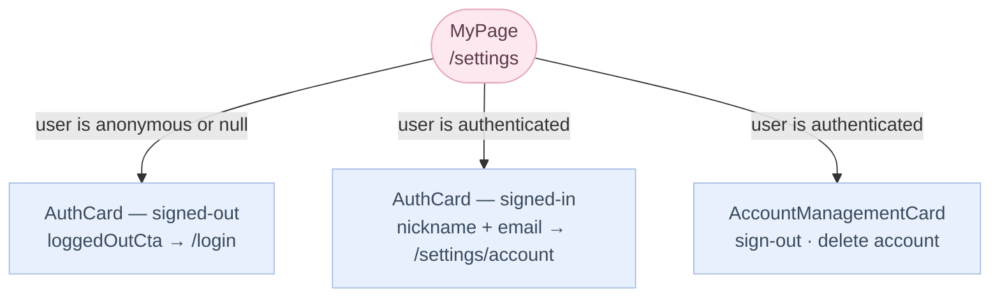
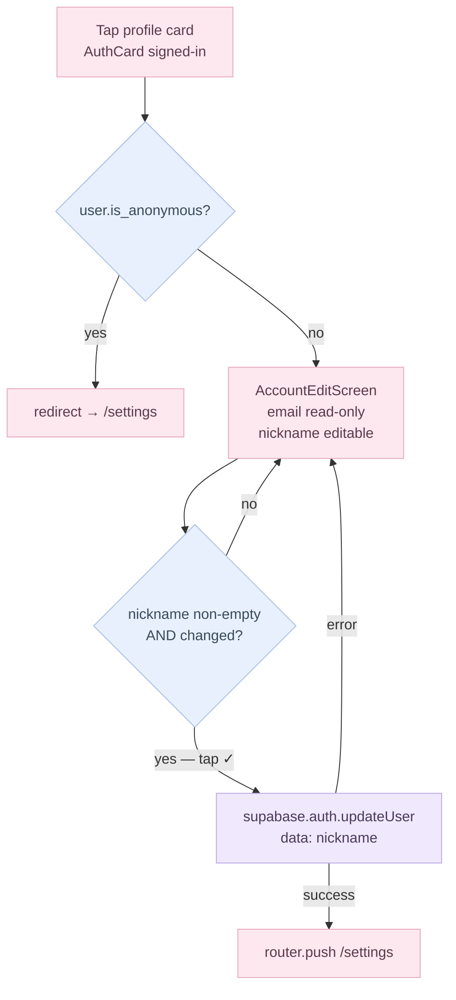

# MyPage (Settings) Flow

Route: `(app)/settings` — rendered by `MyPageScreen` via the thin `settings/page.tsx` wrapper.
Figma refs: 015_1 (signed-out), 015_2 (signed-in), 015_3 (account edit).

---

## Card composition

MyPage renders a fixed stack of cards, some conditionally visible:

| Card | Always visible | Condition |
|---|---|---|
| `AuthCard` | yes | signed-out → login CTA row; signed-in → dark profile card |
| `CycleSummaryCard` | yes | shows status chip when data sufficient; "not enough data" copy otherwise |
| `PreferencesCard` | yes | notification toggle + language row |
| `SupportCard` | yes | notices / Q&A / terms / privacy rows (stub routes) |
| `AccountManagementCard` | signed-in only | sign-out + account deletion rows |

---

## Auth-state variants

---

## Account edit screen (015_3)

Route: `(fullscreen)/settings/account` — rendered by `AccountEditScreen`.

Anonymous users are bounced back to `/settings` via a `useEffect` guard. Only non-anonymous authenticated users can reach the form.

The auth store's `onAuthStateChange` listener refreshes `user_metadata` automatically after a successful update — no manual store mutation needed.

---

## Sub-page stub routes

These routes exist under `(app)/settings/` and render `SubPagePlaceholder` until the next design batch:

| Route | Figma | Status |
|---|---|---|
| `/settings/language` | 015_15 | stub |
| `/settings/notices` | 015_4 | stub |
| `/settings/qna` | 015_5 | stub |
| `/settings/terms` | 015_16 | stub |
| `/settings/privacy` | 015_17 | stub |

All show a back link and the `myPage.subPage.comingSoon` copy.

---

## i18n keys

All copy lives under `myPage.*` in `src/i18n/locales/{en,ko}.ts`. Nickname fallback logic (email local-part) is in `AuthCard.getNickname()` — not a shard i18n key.
