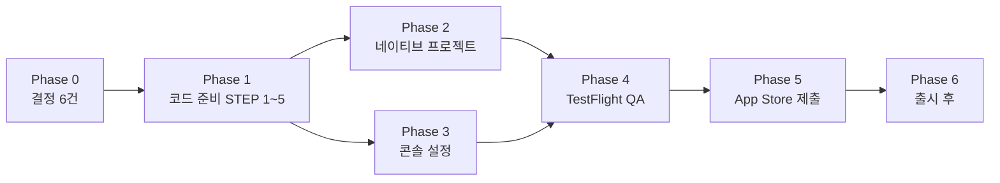

# dwee v1.0 앱 출시 계획 (iOS 우선)

작성일 2026-09-15. 웹(Vercel PWA)으로 검증한 v1.0 을 Capacitor iOS 앱으로 App Store 에 올리기 위한 계획. 단계는 `/commit` 단위로 나눴고, 각 STEP 은 사용자 승인 후 진행한다.

## 0. 현재 상태 진단 (2026-09-15 리포 기준)

| 항목 | 상태 | 영향 |
|---|---|---|
| Capacitor | `@capacitor/core·cli·ios 6.2`, `@capacitor/camera` 만 설치. `capacitor.config.ts` 는 `appId: app.dwee`, `webDir: out` | 플러그인(App·Browser·StatusBar·SplashScreen) 추가 필요 |
| 네이티브 프로젝트 | `ios/`, `android/` 는 `.gitignore` 대상이라 리포에 없음 | 로컬에서 `cap add ios` 로 생성. Info.plist 권한 문구·URL scheme 은 생성 후 매번 수동 반영 → 스크립트화 권장 |
| 빌드 | `output: 'export'` + `trailingSlash` 정적 내보내기, `pnpm cap:sync` 로 `out/` 동기화 | 그대로 사용 가능. 환경변수(`NEXT_PUBLIC_*`)는 빌드 시점에 굳음 |
| OAuth | `authStore` 가 `redirectTo: ${window.location.origin}/auth/callback` | 앱 안에서는 origin 이 `capacitor://localhost` 라 Supabase 가 돌려보낼 수 없음. Google 은 WebView 안 OAuth 를 차단 → 시스템 브라우저 + 커스텀 스킴 복귀 필요 |
| 법적 문서 | `/settings/terms`, `/settings/privacy` 가 앱 안에만 있고 `AuthGuard` 뒤 | App Store 는 **공개 접근 가능한 개인정보처리방침 URL** 필수 → 공개 라우트 필요 |
| 계정 삭제 | `/settings/withdraw` + `delete-account` Edge Function 구현됨 | Apple 요구사항 충족 |
| 알림 | 설정 화면(마스터 + 3항목 + 시기 휠)은 있으나 실제 발송 없음(로컬 저장만) | 심사에서 "동작하지 않는 기능"으로 보일 수 있음 → 아래 결정 필요 |
| 카메라 | 앨범 선택은 네이티브 `Camera.pickImages`, 촬영은 `getUserMedia`(WKWebView) | 둘 다 Info.plist 권한 문구 필요. 촬영은 iOS 14.3+ WKWebView 에서 동작하지만 네이티브 촬영으로 바꾸는 편이 안정적 |
| 서버측 AI | 체형 진단(OpenAI Vision), 누끼(remove.bg) — 사진 미저장, 동의 모달 있음 | App Privacy 라벨에 "사진 → 제3자 처리" 명시 필요 |
| 메타데이터 | `docs/product/app-store-metadata.{ko,en}.md` 작성 완료 | 스크린샷만 미정 |
| Apple 로그인 secret | client_secret JWT 2027-01-14 만료 (`scripts/gen-apple-secret.mjs`) | 출시 전 문제없음, 캘린더에 회전 일정 등록 |
| 버전 | `package.json` 0.1.0 | 1.0.0 / build 1 로 정리 |

## 1. Phase 0 — 결정 (2026-09-15 확정)

| 항목 | 결정 |
|---|---|
| Bundle ID | **`com.innerglow.dwee`** (사업자명 기준 reverse-DNS, Android 패키지명 규칙도 통과). `capacitor.config.ts` 의 `app.dwee` 를 교체 |
| 기기 범위 | **iPhone + iPad** 지원. iPad 스크린샷(12.9″)과 `max-w-md` 셸이 iPad 에서 가운데 정렬로 보이는지 검증 항목 추가 |
| 알림 | **v1.0 에 로컬 알림 포함** — `@capacitor/local-notifications` 로 생리 예정·지연·가임기 알림을 기기 내 예약(서버 푸시 아님). 기존 설정 화면 토글이 실제로 동작하게 연결 |
| 연령 하한 | 사용자 희망: **만 10세부터**. 현황: 약관 제3조⑤·개인정보처리방침 제10조는 만 14세 기준이고 앱 안에 확인 절차 없음. 만 10~13세를 받으려면 한국(만 14세 미만 법정대리인 동의)·미국(COPPA, 13세 미만 검증 가능한 보호자 동의) 요건이 생김 → 아래 §1.2 에서 방식 결정 필요 |
| Android | 이번 릴리스 제외. iOS 안정화 후 별도 계획 |
| 크래시 리포팅 | **Sentry** (`@sentry/nextjs` + `@sentry/capacitor`). 개인정보처리방침에 오류 로그 수집 항목 추가 (아래 §1.1) |

### 1.1 크래시 리포팅 후보

| 도구 | 성격 | dwee 적합성 |
|---|---|---|
| **Sentry** (`@sentry/nextjs` + `@sentry/capacitor`) | 웹 JS 오류·네이티브 크래시·성능 추적. 이 리포에 Sentry 플러그인/스킬이 이미 연결돼 있어 설정이 가장 빠름 | 1순위. 무료 티어(월 5천 오류)로 충분. 개인정보처리방침에 "오류 로그(기기 정보·앱 버전) 수집" 추가 필요 |
| Firebase Crashlytics | 네이티브 크래시에 강함, 무료 | WebView 안 JS 오류는 잡지 못해 dwee 처럼 UI 가 웹인 앱엔 반쪽. Firebase SDK 추가 부담 |
| Bugsnag / Datadog RUM | 상용, 기능 풍부 | 규모 대비 과함 |
| 미도입 | Supabase 로그·앱스토어 크래시 리포트(Xcode Organizer)만 사용 | 출시 초기에 원인 파악이 어려움. 최소 Sentry 권장 |

### 1.2 만 10세 하한을 두는 방법 (결정 대기)

| 방식 | 내용 | 비용·위험 |
|---|---|---|
| A. 만 14세 유지 | 지금 문서 그대로. STEP 1.5 는 "만 14세 이상" 확인만 | 가장 단순. 10~13세는 이용 불가 |
| B. 10~13세는 **로컬 전용 모드** | 연령 확인에서 14세 미만이면 계정 생성·클라우드 동기화·사진 AI(체형 진단·누끼)·오류 로그 전송을 끄고 기기 안 기록만 허용. 개인정보를 서버로 보내지 않으므로 보호자 동의 없이 운영 가능하다는 논리 | 분기 코드(AuthGuard·설정·진단 진입·Sentry 초기화) + 약관·방침 개정 + 법률 검토 권장. 익명 Supabase 세션도 서버 식별자를 남기므로 완전 오프라인으로 설계해야 함 |
| C. 10~13세 **보호자 동의** 플로우 | 보호자 이메일 인증 등 검증 가능한 동의 절차 구현 | COPPA 의 "검증 가능한 동의" 기준이 엄격해 개발·운영 부담 큼. 1.0 범위로는 비추천 |

미국이 주 시장이라 COPPA 를 피하기 어렵고, 한국도 만 14세 미만은 법정대리인 동의가 필요하다. **권장: 1.0 은 A 로 출시하고, 10~13세 허용은 B 방식으로 1.x 에서 법률 검토 후 도입.**

## 2. 코드 준비 (Phase 1)

- **STEP 1 — 공개 법적 페이지**: `/legal/privacy`, `/legal/terms` 를 `(fullscreen)` 밖의 공개 라우트로 추가하고 `AuthGuard.PUBLIC_PREFIXES` 에 등록. 기존 `src/content/legal/*` 재사용. Vercel 배포 URL 이 App Store 의 Privacy Policy URL·Support URL 이 된다. 마이페이지의 기존 화면은 그대로 두거나 공개 페이지로 링크.
- **STEP 1.5 — 연령 확인** ✅ 2026-09-22 (A안, 만 14세): 로그인 화면에 `ConsentCheck`(14세 이상 + 약관·개인정보처리방침 동의, 공개 `/legal/*` 링크). 체크 전 Apple/Google/게스트 버튼 비활성. `settings.ageConfirmedAt` 에 저장 — 로컬 전용(Supabase 컬럼 없음), 로그아웃 시 초기화되어 다시 묻는다. App Store 연령 등급은 별도로 설문(12+ 예상).
- **STEP 1.7 — Sentry**: `@sentry/nextjs`(웹·번들 오류) + `@sentry/capacitor`(네이티브 크래시) 설정. 개인정보(이메일·기록 내용)는 이벤트에서 제외(`beforeSend` 스크럽), 소스맵 업로드는 CI 없이 로컬 빌드 시 `sentry-cli` 로. 개인정보처리방침 en/ko 에 "오류 로그(기기 모델·OS·앱 버전·오류 내용) 수집, 보관 90일" 추가. 연령 정책 B 채택 시 14세 미만은 초기화 건너뜀.
- **STEP 2 — 네이티브 인증 흐름** ✅ 코드 2026-09-22 (콘솔·Xcode 항목은 Phase 2·3에서): `@capacitor/app`·`@capacitor/browser` 추가. 네이티브에서는 `signInWithOAuth({ redirectTo: 'dwee://auth/callback', skipBrowserRedirect: true })` → `Browser.open()` → `appUrlOpen` 수신 시 URL 의 query/hash 를 그대로 `/auth/callback/` 로 넘겨(`lib/auth/nativeCallback.ts`, Vitest 9) 웹과 같은 `AuthCallbackScreen`·`completeOAuthCallback` 이 마무리. 시트를 그냥 닫으면 `browserFinished` 로 로딩 해제. Apple 도 우선 같은 브라우저 방식(네이티브 Sign in with Apple 플러그인은 실기기 검증 가능해질 때 전환 검토). `capacitor.config.ts` appId 를 `com.innerglow.dwee` 로 교체. **남은 것**: Info.plist `CFBundleURLTypes` 에 `dwee` 스킴(Phase 2), Supabase Redirect URLs 에 `dwee://auth/callback`(Phase 3), 실기기 왕복 검증(Phase 4).
  - 원안: `@capacitor/app`, `@capacitor/browser` 추가.
  - 네이티브에서는 `signInWithOAuth({ skipBrowserRedirect: true, redirectTo: 'dwee://auth/callback' })` → `Browser.open()` 으로 시스템 브라우저에서 진행 → `App.addListener('appUrlOpen')` 으로 돌아온 URL 에서 세션 복원(`exchangeCodeForSession` 또는 해시 토큰 처리).
  - Apple 은 네이티브 Sign in with Apple(`@capacitor-community/apple-sign-in`) + `signInWithIdToken` 으로 전환하면 심사·UX 모두 유리. Google 은 시스템 브라우저 방식 유지.
  - 웹(PWA)은 기존 `window.location.origin` 경로 유지 — 플랫폼 분기는 `Capacitor.isNativePlatform()`.
  - 로그아웃 후 `/login` 복귀, 익명→로그인 마이그레이션이 네이티브에서도 도는지 확인.
- **STEP 3 — 카메라·앨범**: `CameraSheet` 촬영을 네이티브에서는 `Camera.getPhoto({ source: Camera })` 로 분기(웹은 지금 `getUserMedia` 유지). 권한 거부 시 안내 카피(이미 `camera.permissionDenied` 존재) 확인.
- **STEP 4 — 로컬 알림**: `@capacitor/local-notifications` 추가. 예측 결과(`predictNextPeriod`)와 설정(예정 D-N일, 지연, 가임기)으로 알림 시각을 계산하는 순수 함수를 `domain/notification/` 에 두고(Vitest), 기록·설정이 바뀔 때마다 예약을 전부 취소 후 재예약. 권한 요청은 마스터 토글을 켤 때 1회. 웹(PWA)에서는 토글을 두되 "앱에서만 알림이 와요" 안내. 카피는 en 원본·ko 번역.
- **STEP 5 — 앱 껍데기 정리**: `@capacitor/status-bar`(밝은 배경 → 어두운 아이콘), `@capacitor/splash-screen`, `NEXT_PUBLIC_SITE_URL` 프로덕션 값, `package.json` 버전 1.0.0, 개발용 `DevBridge` 가 프로덕션 번들에서 비활성인지 확인(현재 `NODE_ENV` 가드 있음), 키보드가 올라올 때 시트·입력창 동작 점검.

## 3. 네이티브 프로젝트 (Phase 2)

- `pnpm add @capacitor/app @capacitor/browser @capacitor/status-bar @capacitor/splash-screen` → `npx cap add ios` → `pnpm cap:sync`.
- `capacitor.config.ts`: `appId` 확정값, `ios.contentInset`, `server.iosScheme`(필요 시) 정리.
- Xcode 설정:
  - Info.plist: `NSCameraUsageDescription`, `NSPhotoLibraryUsageDescription`(+ 저장 시 `NSPhotoLibraryAddUsageDescription`), `CFBundleURLTypes` 에 `dwee` 스킴, 한국어·영어 `InfoPlist.strings` 로 권한 문구 현지화.
  - Signing & Capabilities: **Sign in with Apple**, (로컬 알림 채택 시) Background Modes 불필요, Push 는 사용 안 함.
  - 앱 아이콘 1024px, 스플래시(LaunchScreen) 배경은 `#F5F3F4` 로 통일.
  - 배포 타깃 iOS 15 이상 권장(WKWebView `dvh`, `getUserMedia` 안정).
- `ios/` 는 gitignore 상태라 재생성 가능하도록 `scripts/` 에 Info.plist 패치 스크립트를 두고 README 의 iOS 절을 갱신.

## 4. 백엔드·콘솔 설정 (Phase 3)

- **Supabase Auth**: Site URL 은 Vercel 프로덕션, Redirect URLs 에 `dwee://auth/callback` 과 `https://<프로덕션>/auth/callback` 추가. 익명 로그인 활성 유지.
- **Apple Developer**: App ID 에 Sign in with Apple 켜기, Services ID 의 Return URL 에 Supabase 콜백 확인, 2027-01-14 전 client_secret 회전 일정 등록.
- **Google Cloud**: OAuth 동의 화면을 "프로덕션"으로 게시(앱 이름·로고·개인정보처리방침 URL 필요 → STEP 1 산출물), iOS 클라이언트 ID 는 브라우저 방식이면 기존 웹 클라이언트로 충분.
- **Edge Functions**: `body-type-analyze`(갱신된 프롬프트 재배포 필요), `sticker-cutout`, `delete-account` 배포 상태와 시크릿(OPENAI_API_KEY, remove.bg 키, service role) 확인. 일일 한도(10회 / 누끼 한도)가 심사 시 막히지 않도록 리뷰 계정은 한도 여유 확인.
- **DB**: 마이그레이션 0001~0015 가 프로덕션에 모두 적용됐는지 대시보드에서 확인(CLI 이력은 비어 있음).
- **Vercel**: 프로덕션 도메인 확정(현재 `dwee-neon.vercel.app`), 환경변수 3종, OG 이미지 URL.

## 5. QA (Phase 4)

- **TestFlight 내부 테스트** → 외부 테스트(가족·지인 5~10명).
- 기기 체크리스트: 노치/다이내믹 아일랜드 기기와 홈버튼 기기 각 1대 이상, iPad 1대(세로·가로, 셸 가운데 정렬). 확인 항목:
  - 첫 진입 `/login` 게이트, 익명 시작, Apple/Google 로그인, 로그아웃, 탈퇴
  - 오프라인 첫 실행(익명 세션 발급 실패 시 안내)
  - 다이어리: 스와이프, 일정 시트(키보드 포함), 스티커 꾸미기(앨범·촬영·누끼), 공휴일 표시
  - 홈 꾸미기 사진 편집, 매거진·체형 진단(동의 → 촬영/앨범 → 결과 → 공유 링크)
  - 상태바·안전영역·당겨서 새로고침 배경색, 다크모드 강제 해제 여부
  - 언어 전환(en 기본, ko)
- 자동 검증: `pnpm test` + `pnpm test:e2e` 는 그대로 유지. 네이티브 전용 흐름(OAuth 복귀·카메라)은 수동 체크리스트로 기록.

## 6. App Store Connect 제출 (Phase 5)

- 앱 레코드 생성(Bundle ID `com.innerglow.dwee`, SKU, iPhone + iPad), 카테고리 Lifestyle / Health & Fitness(en) 결정.
- 메타데이터: `docs/product/app-store-metadata.en.md`(기본 로케일 en-US) + `.ko.md`(한국어 로케일). 스크린샷 iPhone 6.7″·6.5″ + iPad 12.9″ 필수, 프로모션 텍스트·키워드 그대로.
- **App Privacy**: 수집 항목 — 연락처(이메일·이름, 인증), 건강(주기·컨디션 기록, 계정 연결), 사용자 콘텐츠(사진·일정·메모), 식별자(사용자 ID). 사진은 기능 수행을 위해 제3자(OpenAI, remove.bg)에 전송되나 저장하지 않음을 명시. 추적 없음.
- 연령 등급 설문(의료/치료 정보 "드묾/가벼움" → 12+ 예상), 수출 규정(HTTPS 만 사용 → 면제).
- 리뷰 노트: 로그인 게이트가 있으므로 "로그인 없이 계속" 경로 안내 + 테스트 계정(Apple/Google 아닌 익명 경로로 전 기능 접근 가능함) 설명, AI 기능은 참고용이며 진단이 아님을 명시, 일일 호출 한도 안내.
- 필수 URL: Privacy Policy(STEP 1 공개 페이지), Support(Q&A 이메일 페이지 또는 사이트).

## 7. 출시 후 (Phase 6)

- 심사 피드백 대응 → 승인 → 단계적 출시(7일 phased release 권장).
- 모니터링: Supabase 로그(Edge Function 오류·한도), 크래시 리포팅(채택 시).
- 1.0.1 후보: Android, 공휴일 표 2031년 이후 확장.
- 2027-01-14 이전 Apple client_secret 회전.

## 8. 흐름 요약

## 9. 예상 순서와 규모

| Phase | 내용 | 규모(대략) |
|---|---|---|
| 0 | 결정 | 대화 1회 |
| 1 | STEP 1~5 코드 | STEP 당 반나절, 인증(STEP 2)이 가장 큼 |
| 2 | Xcode 프로젝트·권한·아이콘 | 반나절 |
| 3 | Supabase·Apple·Google 콘솔 | 반나절 |
| 4 | TestFlight 2회 라운드 | 1주 |
| 5 | 제출·심사 | 심사 1~3일, 반려 시 라운드 추가 |
